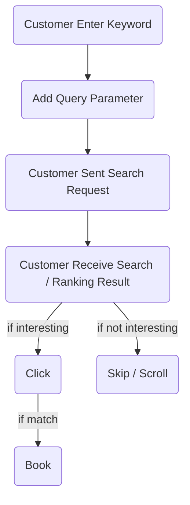
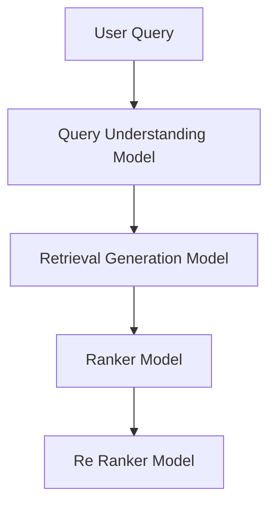
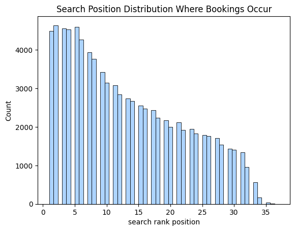
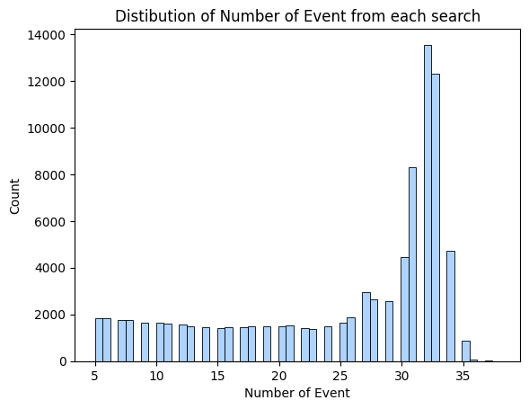

## Hotel Search Ranking System 


Photo by <a href="https://unsplash.com/@sumup?utm_content=creditCopyText&utm_medium=referral&utm_source=unsplash">SumUp</a> on <a href="https://unsplash.com/photos/a-person-is-cutting-a-piece-of-paper-with-a-knife-mK6upImi-qQ?utm_content=creditCopyText&utm_medium=referral&utm_source=unsplash">Unsplash</a>

## Background

## OTA Business Nature


OTA Company has two business models : 

1. Merchant Model 
  
    The company own what they sell. They have some flexibility in changing price. Their Revenues mostly from profit margin. 
  

2. Agency Model 
  
    More like broker. Revenue from commision and fees. 


Some of OTA Company which apply  **Merchant Model** : 

  - KAI 
  - AirAsia 
  - etc 


Some of OTA Company which apply **Agency Model** : 

  - AirBnB
  - Booking.com 
  - Expedia
  - Traveloka
  - Tiket.com

Let say there is OTA company , you can name `T.LLC`, their  problem is that : 

- The Conversion has dropped 10% from last month 

As data scientist we should help business teams to fix the issue. After some analysis for example session replay + interview with product manager they said the customer does not convert when the recommendation show. 

There are several touchpoint of consumer conversion : 

1. Home Feed Recommendation 
2. Search Feature 


To provide which one to prioritize we should check the data where most of the conversion take place. Via Home Feed Recommendation or Search Feature. 


There is distinction between homefeed and search result. People which go to the search bar has already have intent to find hotel. Hypothetically the coversion should be bigger in search. 


Hence solving bigger portion cover bigger problem. 

## Objectives

Our objectives is to build ranking system / services that satisfy both business and ml objectives

### Business Objective

After all this ML Approach is initiative that aim to solve / optimize business metrics. 


What type of metrics we are going to optimize ? 

We need to know what is our business models. Its commision based model. 

- If number of bookings increase --> company income increase 


- So number of bookings right ? Why dont use conversion. 

Of course we can. But we are not using conversion because it can be mislead if we dont mention the numerator 

**Metrics** : Total Bookings Increase by 20%

$\textbf{Total Booking} = \text{Number of bookings from search activity}$

### ML Objective

Its about what you expect from your ML System. 

*Model Wise* : 

1. Model Performance : 
    1. Can Beat Baseline Model in terms of NDCG (Previously 0.30)


*Model Serving* : 

1. Max Latency 50ms 
  - Search Experience is time sensitive
  - A company like google already estimated that they apps latency increase by 100ms it affects to their revenue 

## User Flow 

It's Important to Understand User Flow 




## System Design 




In [Eugene Yan's Blog Post](https://eugeneyan.com/writing/system-design-for-discovery/) Some Common System Design for Search and Recommendation could be decomposed into two components : 

- Retrieval / Candidate Generation 

    Job : Filtering Out many items from 10.000 items to 1.000 items for example

- Ranking Stage 

    Job : Ordering the rank , this is the heavy duty job. 


Does all the the system design for search and recommender system should contain both ? No. Its depend on number of item you have in catalogue. The concern on this article is to highlight on **Ranker Model** Part

## Model Development

### Problem Formulation

Given User Query give ordered list of hotels that maximized chance user will book the hotel 

### Solution 1 : No Model Approach 


The first stage is no ML at all. because if we just launch a product / company we dont have enough data, hence we can use simple heuristic such as : 

  1. Sort by Name 
  2. Sort by Price 
  3. Ranking Randomly

The goal is to obtain enough data to collect data to move on to the next step 

### Solution 2 : Modelling Approach 

Our end task is ranking or to create ordering. 

Now let's do some first principle breakdown : 

`How can we create ranking` : 

  1. Predict the score of each item
  2. Then Order the item based on the score 


To produce the score is straight forward, to produce the ordering we want each item to be different in score not in discrete. 

For example we could use predicted probability or ranking as starter. 


<a href="https://lucidworks.com/wp-content/uploads/2019/11/list_wise_lucidworks-1024x527.png">Source : LucidWorks</a>

## Data Description 

### Data Source 


The Data is obtained from [Personalize Expedia Hotel Searches - ICDM 2013 Kaggle Competition](https://www.kaggle.com/c/expedia-personalized-sort)

So in ml based solution it requires data. What type of Information we show. Air BnB in their [Article](https://medium.com/airbnb-engineering/machine-learning-powered-search-ranking-of-airbnb-experiences-110b4b1a0789)  can classify the feature as : 

  1. Hotels / Listing Feature
  2. User / Personalized Features 
  3. Query Features  

Here is the idea : 


  1. If we use Hotel Features Only --> it can produce ranking but we cannot expect variation in user level. If we compare recommendation of two users. Say A and B the recommendation would be the same. 
  2. To add more personalization we can add feature that unique to user level 
  3. To what extend its unique, if user characteristics does not change then the recommendation would be the same. However that is not ideal because user intention may be different at different search session 


### Listing / Hotel Features 

- It could be feature that describe facility , for example : 

    - Number of rooms available between dates 
    - Price 
    - Location 
    - etc 

- For now there are lot of companies using embeddings to express the feature of an entity 

- Usually embeddings are resulted from pretrained model (neural nets for example)


There are lot of variables that classify as Listing / Property Features, however several consideration is that : 

- The feature should survive cold start problem 


### Cold Start Problem 

Why we care about new item / new user ? 

**New Item / Property** 

  - It affects revenue of property, 
  - We want our search / recommendation is fair towards property 

**New User** : 

- Help user build interaction 
- Have great search experience by providing relevant property 


To properly handle the cold start problem, we research on how to handle it. To do so , we survey several reference (cited in References Section)
We can divide solution into : 

- Feature Based  Solution  : 
  
  - Add Feature that are robust to Cold Start Feature , for example : 
     - User Demographic Features e.g. Age, Gender , etc
     - Listing Demographic Features e.g. price, lot size , facilities, etc 
  
  - Fill Default Values from Local / Geographic 
  - Estimate Property Features from Similar Property (AirBnB)

  - Estimate Property Engagement Features (AirBnB)

- Model Based Solution : 
    
    - Develop 2 Model for User : 
       - New User 
         Need to define what is new user, for example, new user could be user that has not booked any property 
       - Old User 
    


| Column                         | Type    | Description                                                          |Cold Start| Cold Start Strategy 
|--------------------------------|---------|----------------------------------------------------------------------|------------|------------|
| `prop_id`                      | Int     | Hotel property identifier                                            |
| `prop_starrating`              | Float   | Hotel star rating                                                    | 
| `prop_log_historical_price`              | Float   | Log Historical Price                                                   |
| `price_usd`                    | Float   | Display price in USD                                                 | 
| `promotion_flag`               | Bool    | 1 if the hotel was under promotion                                   |  


```python
PROPERTY_FEATURES = [
    'prop_starrating', 
    'price_usd',
    'prop_log_historical_price',
    'promotion_flag'
] 
```

### User Personal Features

More Like User Preferences (Could be Implicit or Explicit), Past Bookings(If Available) for examples : 
- Past Bookings (1w,1month,3month,etc)
- Average Stay 
- etc 

Okay, you might say what would happen if user is new ? AirBnB in their paper build separate model for login user and logout user. We could categorize new user as logout user due to the fact that the data is not available enough 

| Column                         | Type    | Description                                                          |
|--------------------------------|---------|----------------------------------------------------------------------|
| `visitor_location_country_id`  | Int     | Customer’s country ID                                                |
| `visitor_hist_starrating`      | Float   | User’s historical average hotel star‑rating                          |
| `visitor_hist_adr_usd`         | Float   | User’s historical average daily rate (USD)                           |


```python

```


```python
USER_FEATURES = [
    'visitor_hist_starrating', 
    'visitor_hist_adr_usd'
] 
```

### Search Features

What does Query Features Mean ? [article](https://medium.com/airbnb-engineering/embedding-based-retrieval-for-airbnb-search-aabebfc85839)
Features that describe criteria for hotels we are looking for , for example : 

  - Number of guests 
  - Number of Stay 
  - etc 


The same goes with expedia in their [article](https://medium.com/expedia-group-tech/learning-to-rank-at-expedia-group-how-to-adapt-the-property-search-result-page-based-on-f4ebef78c94b)

which include : 
- checkin_date 
- checkout_date 


- We could also  represent this as embedding

Here is the feature definition from dataset

| Column                         | Type    | Description                                                          |
|--------------------------------|---------|----------------------------------------------------------------------|
| `srch_destination_id`          | Int     | Destination ID for the search                                        |
| `srch_length_of_stay`          | Int     | Number of nights (check‑out minus check‑in)                          |
| `srch_adults_count`              | Int     | Number of adults                                                     |
| `srch_children_count`            | Int     | Number of children                                                   |
| `srch_room_count`                | Int     | Number of rooms                                                      |
| `srch_saturday_night_bool`     | Bool    | 1 if stay includes a Saturday night                                  |
| `orig_destination_distance`    | Float   | Distance between user and hotel (km)                                 |


```python
SEARCH_FEATURES = [
    'srch_length_of_stay', 
    'srch_adults_count',
    'srch_room_count', 
    'srch_saturday_night_bool',
    'orig_destination_distance',
    'search_rank' # need to be generated 
] 
```

### Click Log 

Last but not least we need the data from search activity the purpose is to train model to maximize the chance of booking happened.  The search process happen in whats called as **Session**. Each User can have multiple session 


| Column                         | Type    | Description                                                          |
|--------------------------------|---------|----------------------------------------------------------------------|
| `click_bool`                   | Bool    | 1 if the listing was clicked                                         |
| `booking_bool`                 | Bool    | 1 if the listing was booked                                          |


## Load Data  


```python
import pandas as pd 
import numpy as np

from IPython.display import display

import seaborn as sns 
import matplotlib.pyplot as plt 


plt.style.use('seaborn-v0_8-pastel')


```

Due to the huge size of original data, we decide to sample the data based on  search id. We sampled only 50% of search data resulting 1.3 GB of data. 


```python
dataset = pd.read_csv('expedia_search_sampled.csv')
dataset.head()
```


??? note "Show Code Output"

    <div style="overflow-x:scroll">
    <table border="1" class="dataframe">
        <thead>
          <tr style="text-align: right;">
            <th></th>
            <th>srch_id</th>
            <th>date_time</th>
            <th>site_id</th>
            <th>visitor_location_country_id</th>
            <th>visitor_hist_starrating</th>
            <th>visitor_hist_adr_usd</th>
            <th>prop_country_id</th>
            <th>prop_id</th>
            <th>prop_starrating</th>
            <th>prop_review_score</th>
            <th>...</th>
            <th>comp6_rate_percent_diff</th>
            <th>comp7_rate</th>
            <th>comp7_inv</th>
            <th>comp7_rate_percent_diff</th>
            <th>comp8_rate</th>
            <th>comp8_inv</th>
            <th>comp8_rate_percent_diff</th>
            <th>click_bool</th>
            <th>gross_bookings_usd</th>
            <th>booking_bool</th>
          </tr>
        </thead>
        <tbody>
          <tr>
            <th>0</th>
            <td>4</td>
            <td>2012-12-31 08:59:22</td>
            <td>5</td>
            <td>219</td>
            <td>NaN</td>
            <td>NaN</td>
            <td>219</td>
            <td>3625</td>
            <td>4</td>
            <td>4.0</td>
            <td>...</td>
            <td>NaN</td>
            <td>NaN</td>
            <td>NaN</td>
            <td>NaN</td>
            <td>NaN</td>
            <td>NaN</td>
            <td>NaN</td>
            <td>0</td>
            <td>NaN</td>
            <td>0</td>
          </tr>
          <tr>
            <th>1</th>
            <td>4</td>
            <td>2012-12-31 08:59:22</td>
            <td>5</td>
            <td>219</td>
            <td>NaN</td>
            <td>NaN</td>
            <td>219</td>
            <td>11622</td>
            <td>4</td>
            <td>4.0</td>
            <td>...</td>
            <td>NaN</td>
            <td>NaN</td>
            <td>NaN</td>
            <td>NaN</td>
            <td>NaN</td>
            <td>NaN</td>
            <td>NaN</td>
            <td>0</td>
            <td>NaN</td>
            <td>0</td>
          </tr>
          <tr>
            <th>2</th>
            <td>4</td>
            <td>2012-12-31 08:59:22</td>
            <td>5</td>
            <td>219</td>
            <td>NaN</td>
            <td>NaN</td>
            <td>219</td>
            <td>11826</td>
            <td>5</td>
            <td>4.5</td>
            <td>...</td>
            <td>NaN</td>
            <td>NaN</td>
            <td>NaN</td>
            <td>NaN</td>
            <td>NaN</td>
            <td>NaN</td>
            <td>NaN</td>
            <td>0</td>
            <td>NaN</td>
            <td>0</td>
          </tr>
          <tr>
            <th>3</th>
            <td>4</td>
            <td>2012-12-31 08:59:22</td>
            <td>5</td>
            <td>219</td>
            <td>NaN</td>
            <td>NaN</td>
            <td>219</td>
            <td>22824</td>
            <td>3</td>
            <td>4.0</td>
            <td>...</td>
            <td>NaN</td>
            <td>NaN</td>
            <td>NaN</td>
            <td>NaN</td>
            <td>NaN</td>
            <td>NaN</td>
            <td>NaN</td>
            <td>0</td>
            <td>NaN</td>
            <td>0</td>
          </tr>
          <tr>
            <th>4</th>
            <td>4</td>
            <td>2012-12-31 08:59:22</td>
            <td>5</td>
            <td>219</td>
            <td>NaN</td>
            <td>NaN</td>
            <td>219</td>
            <td>37581</td>
            <td>5</td>
            <td>4.5</td>
            <td>...</td>
            <td>NaN</td>
            <td>NaN</td>
            <td>NaN</td>
            <td>NaN</td>
            <td>NaN</td>
            <td>NaN</td>
            <td>NaN</td>
            <td>0</td>
            <td>NaN</td>
            <td>0</td>
          </tr>
        </tbody>
      </table>
      <p>5 rows × 54 columns</p>
      </div>


## Generate Event

What the data should look like:

| search_session_id | listing_id | event_time           | event_type |
|:-----------------:|:----------:|:--------------------:|:----------:|
| 1                 | 3914       | 2022-10-01 17:04:19  | click      |
| 1                 | 3352       | 2022-10-01 17:04:30  | click      |
| 1                 | 2575       | 2022-10-01 17:04:36  | click      |
| 1                 | 4257       | 2022-10-01 17:04:46  | click      |
| 1                 | 3071       | 2022-10-01 17:05:03  | click      |
| 1                 | 1757       | 2022-10-01 17:05:22  | click      |
| 1                 | 1828       | 2022-10-01 17:05:34  | scroll     |
| 1                 | 3492       | 2022-10-01 17:05:53  | click      |


Each unique session : 
  
   1. occur at a particular time 
   2. has n interactions 
   3. the interactions should be ordered chronologically 

We should order the data first , based on : 

  1. search session 
  2. event time 


    
```python
dataset = dataset.sort_values( 
    ['srch_id','date_time']
)
dataset.head(2)
```


??? note "Show Code Output"

    <div style="overflow-x:scroll;">
    <style scoped>
        .dataframe tbody tr th:only-of-type {
            vertical-align: middle;
        }

        .dataframe tbody tr th {
            vertical-align: top;
        }

        .dataframe thead th {
            text-align: right;
        }
    </style>
    <table border="1" class="dataframe">
      <thead>
        <tr style="text-align: right;">
          <th></th>
          <th>srch_id</th>
          <th>date_time</th>
          <th>site_id</th>
          <th>visitor_location_country_id</th>
          <th>visitor_hist_starrating</th>
          <th>visitor_hist_adr_usd</th>
          <th>prop_country_id</th>
          <th>prop_id</th>
          <th>prop_starrating</th>
          <th>prop_review_score</th>
          <th>...</th>
          <th>comp6_rate_percent_diff</th>
          <th>comp7_rate</th>
          <th>comp7_inv</th>
          <th>comp7_rate_percent_diff</th>
          <th>comp8_rate</th>
          <th>comp8_inv</th>
          <th>comp8_rate_percent_diff</th>
          <th>click_bool</th>
          <th>gross_bookings_usd</th>
          <th>booking_bool</th>
        </tr>
      </thead>
      <tbody>
        <tr>
          <th>0</th>
          <td>4</td>
          <td>2012-12-31 08:59:22</td>
          <td>5</td>
          <td>219</td>
          <td>NaN</td>
          <td>NaN</td>
          <td>219</td>
          <td>3625</td>
          <td>4</td>
          <td>4.0</td>
          <td>...</td>
          <td>NaN</td>
          <td>NaN</td>
          <td>NaN</td>
          <td>NaN</td>
          <td>NaN</td>
          <td>NaN</td>
          <td>NaN</td>
          <td>0</td>
          <td>NaN</td>
          <td>0</td>
        </tr>
        <tr>
          <th>1</th>
          <td>4</td>
          <td>2012-12-31 08:59:22</td>
          <td>5</td>
          <td>219</td>
          <td>NaN</td>
          <td>NaN</td>
          <td>219</td>
          <td>11622</td>
          <td>4</td>
          <td>4.0</td>
          <td>...</td>
          <td>NaN</td>
          <td>NaN</td>
          <td>NaN</td>
          <td>NaN</td>
          <td>NaN</td>
          <td>NaN</td>
          <td>NaN</td>
          <td>0</td>
          <td>NaN</td>
          <td>0</td>
        </tr>
      </tbody>
    </table>
    <p>2 rows × 54 columns</p>
    </div>


```python
session_id = 4

sample_session = dataset.loc[
    dataset['srch_id']==session_id,
    ['date_time','prop_id','click_bool','booking_bool']
]

sample_session
```

??? note "Show Code Output"

    <div style="overflow-x:scroll;">
    <style scoped>
        .dataframe tbody tr th:only-of-type {
            vertical-align: middle;
        }

        .dataframe tbody tr th {
            vertical-align: top;
        }

        .dataframe thead th {
            text-align: right;
        }
    </style>
    <table border="1" class="dataframe">
      <thead>
        <tr style="text-align: right;">
          <th></th>
          <th>date_time</th>
          <th>prop_id</th>
          <th>click_bool</th>
          <th>booking_bool</th>
        </tr>
      </thead>
      <tbody>
        <tr>
          <th>0</th>
          <td>2012-12-31 08:59:22</td>
          <td>3625</td>
          <td>0</td>
          <td>0</td>
        </tr>
        <tr>
          <th>1</th>
          <td>2012-12-31 08:59:22</td>
          <td>11622</td>
          <td>0</td>
          <td>0</td>
        </tr>
        <tr>
          <th>2</th>
          <td>2012-12-31 08:59:22</td>
          <td>11826</td>
          <td>0</td>
          <td>0</td>
        </tr>
        <tr>
          <th>3</th>
          <td>2012-12-31 08:59:22</td>
          <td>22824</td>
          <td>0</td>
          <td>0</td>
        </tr>
        <tr>
          <th>4</th>
          <td>2012-12-31 08:59:22</td>
          <td>37581</td>
          <td>0</td>
          <td>0</td>
        </tr>
        <tr>
          <th>5</th>
          <td>2012-12-31 08:59:22</td>
          <td>39993</td>
          <td>0</td>
          <td>0</td>
        </tr>
        <tr>
          <th>6</th>
          <td>2012-12-31 08:59:22</td>
          <td>46162</td>
          <td>0</td>
          <td>0</td>
        </tr>
        <tr>
          <th>7</th>
          <td>2012-12-31 08:59:22</td>
          <td>49152</td>
          <td>0</td>
          <td>0</td>
        </tr>
        <tr>
          <th>8</th>
          <td>2012-12-31 08:59:22</td>
          <td>56063</td>
          <td>0</td>
          <td>0</td>
        </tr>
        <tr>
          <th>9</th>
          <td>2012-12-31 08:59:22</td>
          <td>56472</td>
          <td>0</td>
          <td>0</td>
        </tr>
        <tr>
          <th>10</th>
          <td>2012-12-31 08:59:22</td>
          <td>58696</td>
          <td>0</td>
          <td>0</td>
        </tr>
        <tr>
          <th>11</th>
          <td>2012-12-31 08:59:22</td>
          <td>64344</td>
          <td>0</td>
          <td>0</td>
        </tr>
        <tr>
          <th>12</th>
          <td>2012-12-31 08:59:22</td>
          <td>65984</td>
          <td>0</td>
          <td>0</td>
        </tr>
        <tr>
          <th>13</th>
          <td>2012-12-31 08:59:22</td>
          <td>71258</td>
          <td>0</td>
          <td>0</td>
        </tr>
        <tr>
          <th>14</th>
          <td>2012-12-31 08:59:22</td>
          <td>75491</td>
          <td>0</td>
          <td>0</td>
        </tr>
        <tr>
          <th>15</th>
          <td>2012-12-31 08:59:22</td>
          <td>81172</td>
          <td>0</td>
          <td>0</td>
        </tr>
        <tr>
          <th>16</th>
          <td>2012-12-31 08:59:22</td>
          <td>83045</td>
          <td>0</td>
          <td>0</td>
        </tr>
        <tr>
          <th>17</th>
          <td>2012-12-31 08:59:22</td>
          <td>83430</td>
          <td>0</td>
          <td>0</td>
        </tr>
        <tr>
          <th>18</th>
          <td>2012-12-31 08:59:22</td>
          <td>83806</td>
          <td>0</td>
          <td>0</td>
        </tr>
        <tr>
          <th>19</th>
          <td>2012-12-31 08:59:22</td>
          <td>85567</td>
          <td>0</td>
          <td>0</td>
        </tr>
        <tr>
          <th>20</th>
          <td>2012-12-31 08:59:22</td>
          <td>85742</td>
          <td>0</td>
          <td>0</td>
        </tr>
        <tr>
          <th>21</th>
          <td>2012-12-31 08:59:22</td>
          <td>89119</td>
          <td>0</td>
          <td>0</td>
        </tr>
        <tr>
          <th>22</th>
          <td>2012-12-31 08:59:22</td>
          <td>97099</td>
          <td>0</td>
          <td>0</td>
        </tr>
        <tr>
          <th>23</th>
          <td>2012-12-31 08:59:22</td>
          <td>109185</td>
          <td>0</td>
          <td>0</td>
        </tr>
        <tr>
          <th>24</th>
          <td>2012-12-31 08:59:22</td>
          <td>110813</td>
          <td>0</td>
          <td>0</td>
        </tr>
        <tr>
          <th>25</th>
          <td>2012-12-31 08:59:22</td>
          <td>116696</td>
          <td>0</td>
          <td>0</td>
        </tr>
        <tr>
          <th>26</th>
          <td>2012-12-31 08:59:22</td>
          <td>125069</td>
          <td>0</td>
          <td>0</td>
        </tr>
        <tr>
          <th>27</th>
          <td>2012-12-31 08:59:22</td>
          <td>127808</td>
          <td>0</td>
          <td>0</td>
        </tr>
        <tr>
          <th>28</th>
          <td>2012-12-31 08:59:22</td>
          <td>129278</td>
          <td>0</td>
          <td>0</td>
        </tr>
        <tr>
          <th>29</th>
          <td>2012-12-31 08:59:22</td>
          <td>134162</td>
          <td>0</td>
          <td>0</td>
        </tr>
        <tr>
          <th>30</th>
          <td>2012-12-31 08:59:22</td>
          <td>137826</td>
          <td>0</td>
          <td>0</td>
        </tr>
        <tr>
          <th>31</th>
          <td>2012-12-31 08:59:22</td>
          <td>139893</td>
          <td>1</td>
          <td>0</td>
        </tr>
      </tbody>
    </table>
    </div>


What we can infer or how to read the dataset ? 

- a user in a search session scrolled from `prop_id=3625` and clicked at `prop_id=139893`. However the user did not end up booking the property.

Our dataset is not look like what we are expected its because the click and bookings are still in different columns hence we need to make single column responsible for managing event_type


```python
def generate_event(dataset:pd.DataFrame) -> pd.DataFrame : 
    # if booking = 1 --> event_type --> 'booked' 
    # if click == 1 --> event_type --> 'clicked' 
    # else : --> 'scrolled'

    if dataset['booking_bool'] == 1 : 
        return 'booked'
    elif dataset['click_bool'] == 1 : 
        return 'clicked'
    else : 
        return 'scrolled'
```


```python
dataset['event'] = dataset.apply(generate_event,axis=1)

```

Okay, next sanity check 


```python
dataset['event'].unique()
```


    array(['scrolled', 'clicked', 'booked'], dtype=object)


no missing values, meaning successfully mapped


```python
sample_session = dataset.loc[
    dataset['srch_id']==session_id,
    ['date_time','prop_id','click_bool','booking_bool','event']
]

sample_session
```


??? note "Show Code Output"

    <div style="overflow-x:scroll;">
    <style scoped>
        .dataframe tbody tr th:only-of-type {
            vertical-align: middle;
        }

        .dataframe tbody tr th {
            vertical-align: top;
        }

        .dataframe thead th {
            text-align: right;
        }
    </style>
    <table border="1" class="dataframe">
      <thead>
        <tr style="text-align: right;">
          <th></th>
          <th>date_time</th>
          <th>prop_id</th>
          <th>click_bool</th>
          <th>booking_bool</th>
          <th>event</th>
        </tr>
      </thead>
      <tbody>
        <tr>
          <th>0</th>
          <td>2012-12-31 08:59:22</td>
          <td>3625</td>
          <td>0</td>
          <td>0</td>
          <td>scrolled</td>
        </tr>
        <tr>
          <th>1</th>
          <td>2012-12-31 08:59:22</td>
          <td>11622</td>
          <td>0</td>
          <td>0</td>
          <td>scrolled</td>
        </tr>
        <tr>
          <th>2</th>
          <td>2012-12-31 08:59:22</td>
          <td>11826</td>
          <td>0</td>
          <td>0</td>
          <td>scrolled</td>
        </tr>
        <tr>
          <th>3</th>
          <td>2012-12-31 08:59:22</td>
          <td>22824</td>
          <td>0</td>
          <td>0</td>
          <td>scrolled</td>
        </tr>
        <tr>
          <th>4</th>
          <td>2012-12-31 08:59:22</td>
          <td>37581</td>
          <td>0</td>
          <td>0</td>
          <td>scrolled</td>
        </tr>
        <tr>
          <th>5</th>
          <td>2012-12-31 08:59:22</td>
          <td>39993</td>
          <td>0</td>
          <td>0</td>
          <td>scrolled</td>
        </tr>
        <tr>
          <th>6</th>
          <td>2012-12-31 08:59:22</td>
          <td>46162</td>
          <td>0</td>
          <td>0</td>
          <td>scrolled</td>
        </tr>
        <tr>
          <th>7</th>
          <td>2012-12-31 08:59:22</td>
          <td>49152</td>
          <td>0</td>
          <td>0</td>
          <td>scrolled</td>
        </tr>
        <tr>
          <th>8</th>
          <td>2012-12-31 08:59:22</td>
          <td>56063</td>
          <td>0</td>
          <td>0</td>
          <td>scrolled</td>
        </tr>
        <tr>
          <th>9</th>
          <td>2012-12-31 08:59:22</td>
          <td>56472</td>
          <td>0</td>
          <td>0</td>
          <td>scrolled</td>
        </tr>
        <tr>
          <th>10</th>
          <td>2012-12-31 08:59:22</td>
          <td>58696</td>
          <td>0</td>
          <td>0</td>
          <td>scrolled</td>
        </tr>
        <tr>
          <th>11</th>
          <td>2012-12-31 08:59:22</td>
          <td>64344</td>
          <td>0</td>
          <td>0</td>
          <td>scrolled</td>
        </tr>
        <tr>
          <th>12</th>
          <td>2012-12-31 08:59:22</td>
          <td>65984</td>
          <td>0</td>
          <td>0</td>
          <td>scrolled</td>
        </tr>
        <tr>
          <th>13</th>
          <td>2012-12-31 08:59:22</td>
          <td>71258</td>
          <td>0</td>
          <td>0</td>
          <td>scrolled</td>
        </tr>
        <tr>
          <th>14</th>
          <td>2012-12-31 08:59:22</td>
          <td>75491</td>
          <td>0</td>
          <td>0</td>
          <td>scrolled</td>
        </tr>
        <tr>
          <th>15</th>
          <td>2012-12-31 08:59:22</td>
          <td>81172</td>
          <td>0</td>
          <td>0</td>
          <td>scrolled</td>
        </tr>
        <tr>
          <th>16</th>
          <td>2012-12-31 08:59:22</td>
          <td>83045</td>
          <td>0</td>
          <td>0</td>
          <td>scrolled</td>
        </tr>
        <tr>
          <th>17</th>
          <td>2012-12-31 08:59:22</td>
          <td>83430</td>
          <td>0</td>
          <td>0</td>
          <td>scrolled</td>
        </tr>
        <tr>
          <th>18</th>
          <td>2012-12-31 08:59:22</td>
          <td>83806</td>
          <td>0</td>
          <td>0</td>
          <td>scrolled</td>
        </tr>
        <tr>
          <th>19</th>
          <td>2012-12-31 08:59:22</td>
          <td>85567</td>
          <td>0</td>
          <td>0</td>
          <td>scrolled</td>
        </tr>
        <tr>
          <th>20</th>
          <td>2012-12-31 08:59:22</td>
          <td>85742</td>
          <td>0</td>
          <td>0</td>
          <td>scrolled</td>
        </tr>
        <tr>
          <th>21</th>
          <td>2012-12-31 08:59:22</td>
          <td>89119</td>
          <td>0</td>
          <td>0</td>
          <td>scrolled</td>
        </tr>
        <tr>
          <th>22</th>
          <td>2012-12-31 08:59:22</td>
          <td>97099</td>
          <td>0</td>
          <td>0</td>
          <td>scrolled</td>
        </tr>
        <tr>
          <th>23</th>
          <td>2012-12-31 08:59:22</td>
          <td>109185</td>
          <td>0</td>
          <td>0</td>
          <td>scrolled</td>
        </tr>
        <tr>
          <th>24</th>
          <td>2012-12-31 08:59:22</td>
          <td>110813</td>
          <td>0</td>
          <td>0</td>
          <td>scrolled</td>
        </tr>
        <tr>
          <th>25</th>
          <td>2012-12-31 08:59:22</td>
          <td>116696</td>
          <td>0</td>
          <td>0</td>
          <td>scrolled</td>
        </tr>
        <tr>
          <th>26</th>
          <td>2012-12-31 08:59:22</td>
          <td>125069</td>
          <td>0</td>
          <td>0</td>
          <td>scrolled</td>
        </tr>
        <tr>
          <th>27</th>
          <td>2012-12-31 08:59:22</td>
          <td>127808</td>
          <td>0</td>
          <td>0</td>
          <td>scrolled</td>
        </tr>
        <tr>
          <th>28</th>
          <td>2012-12-31 08:59:22</td>
          <td>129278</td>
          <td>0</td>
          <td>0</td>
          <td>scrolled</td>
        </tr>
        <tr>
          <th>29</th>
          <td>2012-12-31 08:59:22</td>
          <td>134162</td>
          <td>0</td>
          <td>0</td>
          <td>scrolled</td>
        </tr>
        <tr>
          <th>30</th>
          <td>2012-12-31 08:59:22</td>
          <td>137826</td>
          <td>0</td>
          <td>0</td>
          <td>scrolled</td>
        </tr>
        <tr>
          <th>31</th>
          <td>2012-12-31 08:59:22</td>
          <td>139893</td>
          <td>1</td>
          <td>0</td>
          <td>clicked</td>
        </tr>
      </tbody>
    </table>
    </div>


Okay the result correct, next we should check on the session that is in booking


```python
booked_session_id = dataset.loc[ 
    dataset['booking_bool'] == 1 ,'srch_id'
].unique()[0]
print('Sample of Booked Session, srch_id = ',booked_session_id)
```

    Sample of Booked Session, srch_id =  8


```python
booked_session = dataset.loc[
    dataset['srch_id']==booked_session_id,
    ['date_time','prop_id','click_bool','booking_bool','event']
]

booked_session
```


??? note "Show Code Output"

    <div style="overflow-x:scroll;">
    <style scoped>
        .dataframe tbody tr th:only-of-type {
            vertical-align: middle;
        }

        .dataframe tbody tr th {
            vertical-align: top;
        }

        .dataframe thead th {
            text-align: right;
        }
    </style>
    <table border="1" class="dataframe">
      <thead>
        <tr style="text-align: right;">
          <th></th>
          <th>date_time</th>
          <th>prop_id</th>
          <th>click_bool</th>
          <th>booking_bool</th>
          <th>event</th>
        </tr>
      </thead>
      <tbody>
        <tr>
          <th>32</th>
          <td>2013-03-20 17:50:44</td>
          <td>10250</td>
          <td>0</td>
          <td>0</td>
          <td>scrolled</td>
        </tr>
        <tr>
          <th>33</th>
          <td>2013-03-20 17:50:44</td>
          <td>13252</td>
          <td>0</td>
          <td>0</td>
          <td>scrolled</td>
        </tr>
        <tr>
          <th>34</th>
          <td>2013-03-20 17:50:44</td>
          <td>22756</td>
          <td>0</td>
          <td>0</td>
          <td>scrolled</td>
        </tr>
        <tr>
          <th>35</th>
          <td>2013-03-20 17:50:44</td>
          <td>27669</td>
          <td>1</td>
          <td>1</td>
          <td>booked</td>
        </tr>
        <tr>
          <th>36</th>
          <td>2013-03-20 17:50:44</td>
          <td>30630</td>
          <td>0</td>
          <td>0</td>
          <td>scrolled</td>
        </tr>
        <tr>
          <th>37</th>
          <td>2013-03-20 17:50:44</td>
          <td>32491</td>
          <td>0</td>
          <td>0</td>
          <td>scrolled</td>
        </tr>
        <tr>
          <th>38</th>
          <td>2013-03-20 17:50:44</td>
          <td>33805</td>
          <td>0</td>
          <td>0</td>
          <td>scrolled</td>
        </tr>
        <tr>
          <th>39</th>
          <td>2013-03-20 17:50:44</td>
          <td>35397</td>
          <td>0</td>
          <td>0</td>
          <td>scrolled</td>
        </tr>
        <tr>
          <th>40</th>
          <td>2013-03-20 17:50:44</td>
          <td>39137</td>
          <td>0</td>
          <td>0</td>
          <td>scrolled</td>
        </tr>
        <tr>
          <th>41</th>
          <td>2013-03-20 17:50:44</td>
          <td>41497</td>
          <td>0</td>
          <td>0</td>
          <td>scrolled</td>
        </tr>
        <tr>
          <th>42</th>
          <td>2013-03-20 17:50:44</td>
          <td>54403</td>
          <td>0</td>
          <td>0</td>
          <td>scrolled</td>
        </tr>
        <tr>
          <th>43</th>
          <td>2013-03-20 17:50:44</td>
          <td>58176</td>
          <td>0</td>
          <td>0</td>
          <td>scrolled</td>
        </tr>
        <tr>
          <th>44</th>
          <td>2013-03-20 17:50:44</td>
          <td>63511</td>
          <td>0</td>
          <td>0</td>
          <td>scrolled</td>
        </tr>
        <tr>
          <th>45</th>
          <td>2013-03-20 17:50:44</td>
          <td>66444</td>
          <td>0</td>
          <td>0</td>
          <td>scrolled</td>
        </tr>
        <tr>
          <th>46</th>
          <td>2013-03-20 17:50:44</td>
          <td>67150</td>
          <td>0</td>
          <td>0</td>
          <td>scrolled</td>
        </tr>
        <tr>
          <th>47</th>
          <td>2013-03-20 17:50:44</td>
          <td>73738</td>
          <td>0</td>
          <td>0</td>
          <td>scrolled</td>
        </tr>
        <tr>
          <th>48</th>
          <td>2013-03-20 17:50:44</td>
          <td>83293</td>
          <td>0</td>
          <td>0</td>
          <td>scrolled</td>
        </tr>
        <tr>
          <th>49</th>
          <td>2013-03-20 17:50:44</td>
          <td>90151</td>
          <td>0</td>
          <td>0</td>
          <td>scrolled</td>
        </tr>
        <tr>
          <th>50</th>
          <td>2013-03-20 17:50:44</td>
          <td>119302</td>
          <td>0</td>
          <td>0</td>
          <td>scrolled</td>
        </tr>
        <tr>
          <th>51</th>
          <td>2013-03-20 17:50:44</td>
          <td>125655</td>
          <td>0</td>
          <td>0</td>
          <td>scrolled</td>
        </tr>
        <tr>
          <th>52</th>
          <td>2013-03-20 17:50:44</td>
          <td>134607</td>
          <td>0</td>
          <td>0</td>
          <td>scrolled</td>
        </tr>
      </tbody>
    </table>
    </div>


Okay, it correctly annotate the `booked` event . Something interesting is that event after the booked happen the result still appear. We should check if the data also display recommended item but not clicked


```python
dataset.groupby('srch_id').agg({'prop_id':'count'}).sort_values('prop_id')
```


??? note "Show Code Output"

    <div style="overflow-x:scroll;">
    <style scoped>
        .dataframe tbody tr th:only-of-type {
            vertical-align: middle;
        }

        .dataframe tbody tr th {
            vertical-align: top;
        }

        .dataframe thead th {
            text-align: right;
        }
    </style>
    <table border="1" class="dataframe">
      <thead>
        <tr style="text-align: right;">
          <th></th>
          <th>prop_id</th>
        </tr>
        <tr>
          <th>srch_id</th>
          <th></th>
        </tr>
      </thead>
      <tbody>
        <tr>
          <th>144590</th>
          <td>5</td>
        </tr>
        <tr>
          <th>327375</th>
          <td>5</td>
        </tr>
        <tr>
          <th>159295</th>
          <td>5</td>
        </tr>
        <tr>
          <th>474323</th>
          <td>5</td>
        </tr>
        <tr>
          <th>66599</th>
          <td>5</td>
        </tr>
        <tr>
          <th>...</th>
          <td>...</td>
        </tr>
        <tr>
          <th>560306</th>
          <td>37</td>
        </tr>
        <tr>
          <th>60367</th>
          <td>37</td>
        </tr>
        <tr>
          <th>394061</th>
          <td>38</td>
        </tr>
        <tr>
          <th>524634</th>
          <td>38</td>
        </tr>
        <tr>
          <th>597375</th>
          <td>38</td>
        </tr>
      </tbody>
    </table>
    <p>157267 rows × 1 columns</p>
    </div>


```python
display(dataset.loc[ 
    dataset['srch_id'] ==144590,['date_time','prop_id','click_bool','booking_bool','event']
])
display(dataset.loc[ 
    dataset['srch_id'] ==597375,['date_time','prop_id','click_bool','booking_bool','event']
])
```

??? note "Show Code Output"

    <div style="overflow-x:scroll;">
    <style scoped>
        .dataframe tbody tr th:only-of-type {
            vertical-align: middle;
        }

        .dataframe tbody tr th {
            vertical-align: top;
        }

        .dataframe thead th {
            text-align: right;
        }
    </style>
    <table border="1" class="dataframe">
      <thead>
        <tr style="text-align: right;">
          <th></th>
          <th>date_time</th>
          <th>prop_id</th>
          <th>click_bool</th>
          <th>booking_bool</th>
          <th>event</th>
        </tr>
      </thead>
      <tbody>
        <tr>
          <th>847859</th>
          <td>2013-03-24 15:34:50</td>
          <td>34327</td>
          <td>0</td>
          <td>0</td>
          <td>scrolled</td>
        </tr>
        <tr>
          <th>847860</th>
          <td>2013-03-24 15:34:50</td>
          <td>45505</td>
          <td>0</td>
          <td>0</td>
          <td>scrolled</td>
        </tr>
        <tr>
          <th>847861</th>
          <td>2013-03-24 15:34:50</td>
          <td>49597</td>
          <td>1</td>
          <td>1</td>
          <td>booked</td>
        </tr>
        <tr>
          <th>847862</th>
          <td>2013-03-24 15:34:50</td>
          <td>61770</td>
          <td>1</td>
          <td>0</td>
          <td>clicked</td>
        </tr>
        <tr>
          <th>847863</th>
          <td>2013-03-24 15:34:50</td>
          <td>79426</td>
          <td>1</td>
          <td>0</td>
          <td>clicked</td>
        </tr>
      </tbody>
    </table>
    </div>


    <div style="overflow-x:scroll;">
    <style scoped>
        .dataframe tbody tr th:only-of-type {
            vertical-align: middle;
        }

        .dataframe tbody tr th {
            vertical-align: top;
        }

        .dataframe thead th {
            text-align: right;
        }
    </style>
    <table border="1" class="dataframe">
      <thead>
        <tr style="text-align: right;">
          <th></th>
          <th>date_time</th>
          <th>prop_id</th>
          <th>click_bool</th>
          <th>booking_bool</th>
          <th>event</th>
        </tr>
      </thead>
      <tbody>
        <tr>
          <th>3508390</th>
          <td>2013-06-26 22:33:27</td>
          <td>499</td>
          <td>0</td>
          <td>0</td>
          <td>scrolled</td>
        </tr>
        <tr>
          <th>3508391</th>
          <td>2013-06-26 22:33:27</td>
          <td>2998</td>
          <td>0</td>
          <td>0</td>
          <td>scrolled</td>
        </tr>
        <tr>
          <th>3508392</th>
          <td>2013-06-26 22:33:27</td>
          <td>6268</td>
          <td>0</td>
          <td>0</td>
          <td>scrolled</td>
        </tr>
        <tr>
          <th>3508393</th>
          <td>2013-06-26 22:33:27</td>
          <td>21838</td>
          <td>1</td>
          <td>1</td>
          <td>booked</td>
        </tr>
        <tr>
          <th>3508394</th>
          <td>2013-06-26 22:33:27</td>
          <td>26195</td>
          <td>0</td>
          <td>0</td>
          <td>scrolled</td>
        </tr>
        <tr>
          <th>3508395</th>
          <td>2013-06-26 22:33:27</td>
          <td>29233</td>
          <td>0</td>
          <td>0</td>
          <td>scrolled</td>
        </tr>
        <tr>
          <th>3508396</th>
          <td>2013-06-26 22:33:27</td>
          <td>38587</td>
          <td>0</td>
          <td>0</td>
          <td>scrolled</td>
        </tr>
        <tr>
          <th>3508397</th>
          <td>2013-06-26 22:33:27</td>
          <td>40117</td>
          <td>0</td>
          <td>0</td>
          <td>scrolled</td>
        </tr>
        <tr>
          <th>3508398</th>
          <td>2013-06-26 22:33:27</td>
          <td>45094</td>
          <td>0</td>
          <td>0</td>
          <td>scrolled</td>
        </tr>
        <tr>
          <th>3508399</th>
          <td>2013-06-26 22:33:27</td>
          <td>45834</td>
          <td>0</td>
          <td>0</td>
          <td>scrolled</td>
        </tr>
        <tr>
          <th>3508400</th>
          <td>2013-06-26 22:33:27</td>
          <td>62095</td>
          <td>0</td>
          <td>0</td>
          <td>scrolled</td>
        </tr>
        <tr>
          <th>3508401</th>
          <td>2013-06-26 22:33:27</td>
          <td>67553</td>
          <td>0</td>
          <td>0</td>
          <td>scrolled</td>
        </tr>
        <tr>
          <th>3508402</th>
          <td>2013-06-26 22:33:27</td>
          <td>68293</td>
          <td>0</td>
          <td>0</td>
          <td>scrolled</td>
        </tr>
        <tr>
          <th>3508403</th>
          <td>2013-06-26 22:33:27</td>
          <td>71357</td>
          <td>0</td>
          <td>0</td>
          <td>scrolled</td>
        </tr>
        <tr>
          <th>3508404</th>
          <td>2013-06-26 22:33:27</td>
          <td>75017</td>
          <td>0</td>
          <td>0</td>
          <td>scrolled</td>
        </tr>
        <tr>
          <th>3508405</th>
          <td>2013-06-26 22:33:27</td>
          <td>79474</td>
          <td>0</td>
          <td>0</td>
          <td>scrolled</td>
        </tr>
        <tr>
          <th>3508406</th>
          <td>2013-06-26 22:33:27</td>
          <td>82547</td>
          <td>0</td>
          <td>0</td>
          <td>scrolled</td>
        </tr>
        <tr>
          <th>3508407</th>
          <td>2013-06-26 22:33:27</td>
          <td>83018</td>
          <td>0</td>
          <td>0</td>
          <td>scrolled</td>
        </tr>
        <tr>
          <th>3508408</th>
          <td>2013-06-26 22:33:27</td>
          <td>85294</td>
          <td>0</td>
          <td>0</td>
          <td>scrolled</td>
        </tr>
        <tr>
          <th>3508409</th>
          <td>2013-06-26 22:33:27</td>
          <td>86224</td>
          <td>0</td>
          <td>0</td>
          <td>scrolled</td>
        </tr>
        <tr>
          <th>3508410</th>
          <td>2013-06-26 22:33:27</td>
          <td>86511</td>
          <td>0</td>
          <td>0</td>
          <td>scrolled</td>
        </tr>
        <tr>
          <th>3508411</th>
          <td>2013-06-26 22:33:27</td>
          <td>88144</td>
          <td>1</td>
          <td>0</td>
          <td>clicked</td>
        </tr>
        <tr>
          <th>3508412</th>
          <td>2013-06-26 22:33:27</td>
          <td>91550</td>
          <td>0</td>
          <td>0</td>
          <td>scrolled</td>
        </tr>
        <tr>
          <th>3508413</th>
          <td>2013-06-26 22:33:27</td>
          <td>94975</td>
          <td>0</td>
          <td>0</td>
          <td>scrolled</td>
        </tr>
        <tr>
          <th>3508414</th>
          <td>2013-06-26 22:33:27</td>
          <td>102111</td>
          <td>0</td>
          <td>0</td>
          <td>scrolled</td>
        </tr>
        <tr>
          <th>3508415</th>
          <td>2013-06-26 22:33:27</td>
          <td>102135</td>
          <td>0</td>
          <td>0</td>
          <td>scrolled</td>
        </tr>
        <tr>
          <th>3508416</th>
          <td>2013-06-26 22:33:27</td>
          <td>102943</td>
          <td>0</td>
          <td>0</td>
          <td>scrolled</td>
        </tr>
        <tr>
          <th>3508417</th>
          <td>2013-06-26 22:33:27</td>
          <td>103972</td>
          <td>0</td>
          <td>0</td>
          <td>scrolled</td>
        </tr>
        <tr>
          <th>3508418</th>
          <td>2013-06-26 22:33:27</td>
          <td>104198</td>
          <td>0</td>
          <td>0</td>
          <td>scrolled</td>
        </tr>
        <tr>
          <th>3508419</th>
          <td>2013-06-26 22:33:27</td>
          <td>106449</td>
          <td>0</td>
          <td>0</td>
          <td>scrolled</td>
        </tr>
        <tr>
          <th>3508420</th>
          <td>2013-06-26 22:33:27</td>
          <td>110143</td>
          <td>0</td>
          <td>0</td>
          <td>scrolled</td>
        </tr>
        <tr>
          <th>3508421</th>
          <td>2013-06-26 22:33:27</td>
          <td>117992</td>
          <td>0</td>
          <td>0</td>
          <td>scrolled</td>
        </tr>
        <tr>
          <th>3508422</th>
          <td>2013-06-26 22:33:27</td>
          <td>123354</td>
          <td>0</td>
          <td>0</td>
          <td>scrolled</td>
        </tr>
        <tr>
          <th>3508423</th>
          <td>2013-06-26 22:33:27</td>
          <td>123978</td>
          <td>0</td>
          <td>0</td>
          <td>scrolled</td>
        </tr>
        <tr>
          <th>3508424</th>
          <td>2013-06-26 22:33:27</td>
          <td>124413</td>
          <td>0</td>
          <td>0</td>
          <td>scrolled</td>
        </tr>
        <tr>
          <th>3508425</th>
          <td>2013-06-26 22:33:27</td>
          <td>131611</td>
          <td>0</td>
          <td>0</td>
          <td>scrolled</td>
        </tr>
        <tr>
          <th>3508426</th>
          <td>2013-06-26 22:33:27</td>
          <td>132136</td>
          <td>0</td>
          <td>0</td>
          <td>scrolled</td>
        </tr>
        <tr>
          <th>3508427</th>
          <td>2013-06-26 22:33:27</td>
          <td>139340</td>
          <td>0</td>
          <td>0</td>
          <td>scrolled</td>
        </tr>
      </tbody>
    </table>
    </div>


We can see number of property in each session is different meaning it fully represent user behaviour in recommendation. If the records only 5 property means user only interact (scroll , click , book ) up to 5th position.  Another case is that after booking user still can possibly click item. 

Next, what we should do is to calculate **Generate Search Rank**

### Adding Search Rank 

Next step is to create search ranking feature from recommendation to mitigae positional bias 

we will add new column `search_rank` to define ranking result from recommendation. 

However we have to sure our data really reflect the ordering from current search system. when outputing search result the rank also should be logged. 


The assumption is that : 
- In Company `T.LLC` System if we jump from 1st search result  to 5th position the rank 1 to 4 regarded as `scroll` 

|   listing_id | event_time          | event_type   |search rank   |
|-------------:|:--------------------|:-------------|:-------------|
|         3914 | 2022-10-01 17:04:19 | click        | 1 | 
|         3352 | 2022-10-01 17:04:30 | click        |2 |
|         2575 | 2022-10-01 17:04:36 | click        |3 |
|         4257 | 2022-10-01 17:04:46 | click        |4 |
|         3071 | 2022-10-01 17:05:03 | click        |5 |
|         1757 | 2022-10-01 17:05:22 | click        |6 | 
|         1828 | 2022-10-01 17:05:34 | scroll       |7 | 
|         3494 | 2022-10-01 17:05:53 | click        |8 |
|         2341 | 2022-10-01 17:06:05 | click        |9 |
|          438 | 2022-10-01 17:06:11 | scroll       |10 |
|         1757 | 2022-10-01 17:06:27 | book         |11 |

Next, we need to create those label 


```python
dataset['search_rank'] = dataset.groupby('srch_id').cumcount() + 1

```


```python
display(dataset.loc[ 
    dataset['srch_id'] ==144590,['date_time','prop_id','click_bool','booking_bool','event','search_rank']
])
```

??? note "Show Code Output"

    <div style="overflow-x:scroll;">
    <style scoped>
        .dataframe tbody tr th:only-of-type {
            vertical-align: middle;
        }

        .dataframe tbody tr th {
            vertical-align: top;
        }

        .dataframe thead th {
            text-align: right;
        }
    </style>
    <table border="1" class="dataframe">
      <thead>
        <tr style="text-align: right;">
          <th></th>
          <th>date_time</th>
          <th>prop_id</th>
          <th>click_bool</th>
          <th>booking_bool</th>
          <th>event</th>
          <th>search_rank</th>
        </tr>
      </thead>
      <tbody>
        <tr>
          <th>847859</th>
          <td>2013-03-24 15:34:50</td>
          <td>34327</td>
          <td>0</td>
          <td>0</td>
          <td>scrolled</td>
          <td>1</td>
        </tr>
        <tr>
          <th>847860</th>
          <td>2013-03-24 15:34:50</td>
          <td>45505</td>
          <td>0</td>
          <td>0</td>
          <td>scrolled</td>
          <td>2</td>
        </tr>
        <tr>
          <th>847861</th>
          <td>2013-03-24 15:34:50</td>
          <td>49597</td>
          <td>1</td>
          <td>1</td>
          <td>booked</td>
          <td>3</td>
        </tr>
        <tr>
          <th>847862</th>
          <td>2013-03-24 15:34:50</td>
          <td>61770</td>
          <td>1</td>
          <td>0</td>
          <td>clicked</td>
          <td>4</td>
        </tr>
        <tr>
          <th>847863</th>
          <td>2013-03-24 15:34:50</td>
          <td>79426</td>
          <td>1</td>
          <td>0</td>
          <td>clicked</td>
          <td>5</td>
        </tr>
      </tbody>
    </table>
    </div>


After that we need to create / calculate **Relevance Score**

### Calculate Relevance Score 

Purpose --> To evaluate how well our search model produce the ordering 

The score could be created in a way such that some interaction scored higher. According to original kaggle competition the score for each event type is : 

- `Book` : `5`
- `Click` : `1` 
- `Scroll` : `0` 


```python
dataset['relevance_score'] = dataset['event'].map({
    'scrolled' : 0 , 
    'clicked' : 1 , 
    'booked'  : 5 
})

```

Sanity Check 


```python
dataset['relevance_score'].value_counts()
```


    relevance_score
    0    3732736
    5     108884
    1      65565
    Name: count, dtype: int64


## Crafting Training Data 

How to construct training pair : 
- We need to ensure there is book in a query to make sure the model learn the labels / relevance score 
- We need to substract the training pair which does not contain `event_type = book`. 
- Why ? Some of the learning models work in query level. 


Here is a glimpse of how our data would look like

| srch_id | X (features)   | y (relevance score) |
|----------|----------------|---------------------|
|          |  |                     |

There are variety of design type to construct dataset. Choosing this method also will affect how model learn : 

- Filter only search id contain at least 1 booking 
- Not Filtering search id 


```python
# get query id which contain `event==book`
book_session_id = dataset.loc[ 
    dataset['event'] == 'booked','srch_id'
].unique()

print('Before filtering search_id with bookings, Num of search id = ',dataset.srch_id.nunique())
print('After filtering search_id with bookings, Num of search id = ',len(book_session_id))
```

    Before filtering search_id with bookings, Num of search id =  157267
    After filtering search_id with bookings, Num of search id =  108884


```python
prev_shape = dataset.shape 
dataset = dataset.loc[ 
    dataset['srch_id'].isin(book_session_id)
]
print('Before filtering search_id with bookings, Num of Records = ',prev_shape[0])
print('After filtering search_id with bookings, Num of Records = ',dataset.shape[0])
```

    Before filtering search_id with bookings, Num of Records =  3907185
    After filtering search_id with bookings, Num of Records =  2727065


To create training data, we should list all feature combination 


```python
ALL_FEATURES = USER_FEATURES + PROPERTY_FEATURES + SEARCH_FEATURES 

print('Number of Features = ',len(ALL_FEATURES) )

```

    Number of Features =  11


### Split Data

How to split data ? 


It depends on ranking metrics. Our ranking metrics compare relevance score in actual vs predicted (from our model). 

to obtain actual ranking , we need to obtain to each query. Hence our split process is quite different from random subsetting where we pick random for example 80% of data. 

Our split unit is search id 


```python
book_session_id
```


    array([     8,     25,     28, ..., 665554, 665562, 665574],
          shape=(108884,))


```python
# Split training data into Train and Test Data
train_idx = int(0.8 * (len(book_session_id)))
valid_idx = int(0.9 * (len(book_session_id)))

search_id_train = book_session_id[:train_idx]
search_id_val = book_session_id[train_idx:valid_idx]
search_id_test = book_session_id[valid_idx:]

print('Number of Training search_id : ',len(search_id_train))
print('Number of Validation search_id : ',len(search_id_val))
print('Number of Test search_id : ',len(search_id_test))
```

    Number of Training search_id :  87107
    Number of Validation search_id :  10888
    Number of Test search_id :  10889


```python
# split X & y 
X_train_relevance = dataset.loc[dataset['srch_id'].isin(search_id_train)]
qid_train = dataset.loc[dataset['srch_id'].isin(search_id_train),
                          'srch_id' ]


y_train_relevance = dataset.loc[dataset['srch_id'].isin(search_id_train),
                          'relevance_score']

X_val_relevance = dataset.loc[dataset['srch_id'].isin(search_id_val)]
qid_val = dataset.loc[dataset['srch_id'].isin(search_id_val),
                          'srch_id' ]
y_val_relevance = dataset.loc[dataset['srch_id'].isin(search_id_val),
                          'relevance_score']

X_test_relevance = dataset.loc[dataset['srch_id'].isin(search_id_test)]
qid_test = dataset.loc[dataset['srch_id'].isin(search_id_test),
                          'srch_id'  ]
y_test_relevance = dataset.loc[dataset['srch_id'].isin(search_id_test),
                          'relevance_score']
```


```python
def split_data(dataset,
                train_frac,
                unique_query_id,
                query_col,
                relevance_col) :
    
    """
    Function to split data 

    
    Returns:
        _type_: _description_
    """
    # obtain index 
    train_idx = int(train_frac * (len(unique_query_id)))
    val_pos = (1 - train_frac)/2
    valid_idx = int( val_pos* (len(unique_query_id))) + train_idx


    # obtain unique query 
    query_id_train = unique_query_id[:train_idx]
    query_id_val = unique_query_id[train_idx:valid_idx]
    query_id_test = unique_query_id[valid_idx:]


    X_train_relevance = dataset.loc[dataset[query_col].isin(query_id_train), :  ]
    query_train = dataset.loc[dataset[query_col].isin(query_id_train),
    query_col ]

    y_train_relevance = dataset.loc[dataset[query_col].isin(query_id_train),
    relevance_col]

    X_val_relevance = dataset.loc[dataset[query_col].isin(query_id_val),
    :]
    query_val = dataset.loc[dataset[query_col].isin(query_id_val),
    query_col ]
    y_val_relevance = dataset.loc[dataset[query_col].isin(query_id_val),
    relevance_col]

    X_test_relevance = dataset.loc[dataset[query_col].isin(query_id_test),
    :]

    query_test = dataset.loc[dataset[query_col].isin(query_id_test),
    query_col ]
    y_test_relevance = dataset.loc[dataset[query_col].isin(query_id_test),
    relevance_col]

    split = {
    'train' : (X_train_relevance,y_train_relevance,query_train),
    'val' : (X_val_relevance,y_val_relevance,query_val),
    'test' : (X_test_relevance,y_test_relevance,query_test)
    }

    return split
```

### EDA 

Some EDA wont hurt , right ? 

Question / Focus of EDA : 

- Number of event per search activity
- Check Position that most booking occur 
- Check whether there is missing value in each feature 


#### Number of Missing Values


```python
display((X_train_relevance.isnull().sum() / X_train_relevance.shape[0] ).sort_values(ascending=False))
```
??? note "Show Code Output"


    - comp1_rate_percent_diff        0.981806
    - comp6_rate_percent_diff        0.979394
    - comp1_rate                     0.976894
    - comp1_inv                      0.975163
    - comp4_rate_percent_diff        0.973210
    - comp7_rate_percent_diff        0.970401
    - gross_bookings_usd             0.960052
    - comp6_rate                     0.948188
    - comp6_inv                      0.943810
    - comp4_rate                     0.937723
    - visitor_hist_starrating        0.936747
    - visitor_hist_adr_usd           0.936399
    - comp7_rate                     0.932321
    - comp4_inv                      0.930634
    - comp7_inv                      0.923850
    - srch_query_affinity_score      0.921880
    - comp3_rate_percent_diff        0.896652
    - comp2_rate_percent_diff        0.880073
    - comp8_rate_percent_diff        0.865494
    - comp5_rate_percent_diff        0.820446
    - comp3_rate                     0.669075
    - comp3_inv                      0.644406
    - comp8_rate                     0.584797
    - comp8_inv                      0.569799
    - comp2_rate                     0.568846
    - comp2_inv                      0.546673
    - comp5_rate                     0.529495
    - comp5_inv                      0.501489
    - orig_destination_distance      0.314939
    - prop_location_score2           0.217862
    - prop_review_score              0.001281
    - event                          0.000000
    - booking_bool                   0.000000
    - search_rank                    0.000000
    - click_bool                     0.000000
    - srch_id                        0.000000
    - date_time                      0.000000
    - position                       0.000000
    - site_id                        0.000000
    - visitor_location_country_id    0.000000
    - prop_country_id                0.000000
    - prop_id                        0.000000
    - prop_starrating                0.000000
    - prop_brand_bool                0.000000
    - prop_location_score1           0.000000
    - prop_log_historical_price      0.000000
    - price_usd                      0.000000
    - random_bool                    0.000000
    - promotion_flag                 0.000000
    - srch_destination_id            0.000000
    - srch_length_of_stay            0.000000
    - srch_booking_window            0.000000
    - srch_adults_count              0.000000
    - srch_children_count            0.000000
    - srch_room_count                0.000000
    - srch_saturday_night_bool       0.000000
    - relevance_score                0.000000
    dtype: float64


We can see that most of the user feature is not available, hence we can update the decision not to include the feature. For now we are not interested in imputation technique. you can check other blogs. This article point out the wholistic pipeline of learning to rank in application to OTA search particularly in hotel / property ranking

#### Position that most booking occur 


```python
bookings_event_train = X_train_relevance.loc[ 
    X_train_relevance['event'] == 'booked'
]
```


```python
sns.histplot(data = bookings_event_train,
             x = 'search_rank')
plt.xlabel('search rank position')
plt.title('Search Position Distribution Where Bookings Occur')
```


    Text(0.5, 1.0, 'Search Position Distribution Where Bookings Occur')


    

    


There is bias in bookings, where most of bookings occur at top position, hence we need to add position as feature 

#### Number of Activity Occur Within Search 


```python
search_activity_count = X_train_relevance.groupby('srch_id',as_index=False).agg({
    'prop_id' : 'count'
})
search_activity_count = search_activity_count.rename(columns={'prop_id':'event_count'})
search_activity_count


sns.histplot(data = search_activity_count,
             x = 'event_count')
plt.xlabel('Number of Event')
plt.title('Distibution of Number of Event from each search')
```


    Text(0.5, 1.0, 'Distibution of Number of Event from each search')


    

    


## Training Model 

Previously we checked some features and we decide to remove some of them. 


```python
display((X_train_relevance.isnull().sum() / X_train_relevance.shape[0] ).sort_values(ascending=False))
```

??? note "Show Code Output"

    - comp1_rate_percent_diff        0.981806
    - comp6_rate_percent_diff        0.979394
    - comp1_rate                     0.976894
    - comp1_inv                      0.975163
    - comp4_rate_percent_diff        0.973210
    - comp7_rate_percent_diff        0.970401
    - gross_bookings_usd             0.960052
    - comp6_rate                     0.948188
    - comp6_inv                      0.943810
    - comp4_rate                     0.937723
    - visitor_hist_starrating        0.936747
    - visitor_hist_adr_usd           0.936399
    - comp7_rate                     0.932321
    - comp4_inv                      0.930634
    - comp7_inv                      0.923850
    - srch_query_affinity_score      0.921880
    - comp3_rate_percent_diff        0.896652
    - comp2_rate_percent_diff        0.880073
    - comp8_rate_percent_diff        0.865494
    - comp5_rate_percent_diff        0.820446
    - comp3_rate                     0.669075
    - comp3_inv                      0.644406
    - comp8_rate                     0.584797
    - comp8_inv                      0.569799
    - comp2_rate                     0.568846
    - comp2_inv                      0.546673
    - comp5_rate                     0.529495
    - comp5_inv                      0.501489
    - orig_destination_distance      0.314939
    - prop_location_score2           0.217862
    - prop_review_score              0.001281
    - event                          0.000000
    - booking_bool                   0.000000
    - search_rank                    0.000000
    - click_bool                     0.000000
    - srch_id                        0.000000
    - date_time                      0.000000
    - position                       0.000000
    - site_id                        0.000000
    - visitor_location_country_id    0.000000
    - prop_country_id                0.000000
    - prop_id                        0.000000
    - prop_starrating                0.000000
    - prop_brand_bool                0.000000
    - prop_location_score1           0.000000
    - prop_log_historical_price      0.000000
    - price_usd                      0.000000
    - random_bool                    0.000000
    - promotion_flag                 0.000000
    - srch_destination_id            0.000000
    - srch_length_of_stay            0.000000
    - srch_booking_window            0.000000
    - srch_adults_count              0.000000
    - srch_children_count            0.000000
    - srch_room_count                0.000000
    - srch_saturday_night_bool       0.000000
    - relevance_score                0.000000
    dtype: float64


```python
PROPERTY_FEATURES = [
    'prop_starrating', 
    'price_usd',
    'prop_log_historical_price',
    'promotion_flag'
] 

SEARCH_FEATURES = [
    'srch_length_of_stay', 
    'srch_adults_count',
    'srch_booking_window',
    'srch_room_count', 
    'srch_saturday_night_bool',
] 

POSITIONAL_FEATURES = [ 
    'search_rank'
]

ALL_FEATURES = PROPERTY_FEATURES + SEARCH_FEATURES + POSITIONAL_FEATURES
```

### Pointwise Model 

We can train model to predict directly relevance score, but only minimizing error on relevance score prediction. We dont need the query id information since we are not performing swapping. 

For example we could use Regression as **LinearRegression** and **RandomForest**


```python
from sklearn.linear_model import LinearRegression 
from sklearn.ensemble import RandomForestRegressor 


lr_pointwise = LinearRegression(n_jobs=-1)
rf_pointwise = RandomForestRegressor(n_estimators=100,
                                     n_jobs=-1,verbose=3,
                                     random_state=2) # random state control the bootstrapping process 


# train model 
print('Training Linear Regression')
lr_pointwise.fit(X_train_relevance[ALL_FEATURES],y_train_relevance)
print('Training Random Forest')
rf_pointwise.fit(X_train_relevance[ALL_FEATURES],y_train_relevance)
```

??? note "Show Code Output"

    - Training Linear Regression
    - Training Random Forest
    - building tree 1 of 100
    - building tree 2 of 100
    - building tree 3 of 100
    - building tree 4 of 100
    - building tree 5 of 100
    - building tree 6 of 100
    - building tree 7 of 100
    - building tree 8 of 100
    - [Parallel(n_jobs=-1)]: Using backend ThreadingBackend with 8 concurrent workers.
    - building tree 9 of 100
    - building tree 10 of 100
    - building tree 11 of 100
    - building tree 12 of 100
    - building tree 13 of 100
    - building tree 14 of 100
    - building tree 15 of 100
    - building tree 16 of 100
    - building tree 17 of 100
    - building tree 18 of 100
    - building tree 19 of 100
    - building tree 20 of 100
    - building tree 21 of 100
    - building tree 22 of 100
    - building tree 23 of 100
    - building tree 24 of 100
    - [Parallel(n_jobs=-1)]: Done  16 tasks      | elapsed:   32.3s
    - building tree 25 of 100
    - building tree 26 of 100
    - building tree 27 of 100
    - building tree 28 of 100
    - building tree 29 of 100
    - building tree 30 of 100
    - building tree 31 of 100
    - building tree 32 of 100
    - building tree 33 of 100
    - building tree 34 of 100
    - building tree 35 of 100
    - building tree 36 of 100
    - building tree 37 of 100
    - building tree 38 of 100
    - building tree 39 of 100
    - building tree 40 of 100
    - building tree 41 of 100
    - building tree 42 of 100
    - building tree 43 of 100
    - building tree 44 of 100
    - building tree 45 of 100
    - building tree 46 of 100
    - building tree 47 of 100
    - building tree 48 of 100
    - building tree 49 of 100
    - building tree 50 of 100
    - building tree 51 of 100
    - building tree 52 of 100
    - building tree 53 of 100
    - building tree 54 of 100
    - building tree 55 of 100
    - building tree 56 of 100
    - building tree 57 of 100
    - building tree 58 of 100
    - building tree 59 of 100
    - building tree 60 of 100
    - building tree 61 of 100
    - building tree 62 of 100
    - building tree 63 of 100
    - building tree 64 of 100
    - building tree 65 of 100
    - building tree 66 of 100
    - building tree 67 of 100
    - building tree 68 of 100
    - building tree 69 of 100
    - building tree 70 of 100
    - building tree 71 of 100
    - building tree 72 of 100
    - building tree 73 of 100
    - building tree 74 of 100
    - building tree 75 of 100
    - building tree 76 of 100
    - building tree 77 of 100
    - building tree 78 of 100
    - building tree 79 of 100
    - building tree 80 of 100
    - building tree 81 of 100
    - building tree 82 of 100
    - building tree 83 of 100
    - building tree 84 of 100
    - building tree 85 of 100
    - building tree 86 of 100
    - building tree 87 of 100
    - building tree 88 of 100
    - building tree 89 of 100
    - building tree 90 of 100
    - building tree 91 of 100
    - building tree 92 of 100
    - building tree 93 of 100
    - building tree 94 of 100
    - building tree 95 of 100
    - building tree 96 of 100
    - building tree 97 of 100
    - building tree 98 of 100
    - building tree 99 of 100
    - building tree 100 of 100

    - [Parallel(n_jobs=-1)]: Done 100 out of 100 | elapsed:  3.4min finished


<style>#sk-container-id-1 {
  /* Definition of color scheme common for light and dark mode */
  --sklearn-color-text: #000;
  --sklearn-color-text-muted: #666;
  --sklearn-color-line: gray;
  /* Definition of color scheme for unfitted estimators */
  --sklearn-color-unfitted-level-0: #fff5e6;
  --sklearn-color-unfitted-level-1: #f6e4d2;
  --sklearn-color-unfitted-level-2: #ffe0b3;
  --sklearn-color-unfitted-level-3: chocolate;
  /* Definition of color scheme for fitted estimators */
  --sklearn-color-fitted-level-0: #f0f8ff;
  --sklearn-color-fitted-level-1: #d4ebff;
  --sklearn-color-fitted-level-2: #b3dbfd;
  --sklearn-color-fitted-level-3: cornflowerblue;

  /* Specific color for light theme */
  --sklearn-color-text-on-default-background: var(--sg-text-color, var(--theme-code-foreground, var(--jp-content-font-color1, black)));
  --sklearn-color-background: var(--sg-background-color, var(--theme-background, var(--jp-layout-color0, white)));
  --sklearn-color-border-box: var(--sg-text-color, var(--theme-code-foreground, var(--jp-content-font-color1, black)));
  --sklearn-color-icon: #696969;

  @media (prefers-color-scheme: dark) {
    /* Redefinition of color scheme for dark theme */
    --sklearn-color-text-on-default-background: var(--sg-text-color, var(--theme-code-foreground, var(--jp-content-font-color1, white)));
    --sklearn-color-background: var(--sg-background-color, var(--theme-background, var(--jp-layout-color0, #111)));
    --sklearn-color-border-box: var(--sg-text-color, var(--theme-code-foreground, var(--jp-content-font-color1, white)));
    --sklearn-color-icon: #878787;
  }
}

#sk-container-id-1 {
  color: var(--sklearn-color-text);
}

#sk-container-id-1 pre {
  padding: 0;
}

#sk-container-id-1 input.sk-hidden--visually {
  border: 0;
  clip: rect(1px 1px 1px 1px);
  clip: rect(1px, 1px, 1px, 1px);
  height: 1px;
  margin: -1px;
  overflow: hidden;
  padding: 0;
  position: absolute;
  width: 1px;
}

#sk-container-id-1 div.sk-dashed-wrapped {
  border: 1px dashed var(--sklearn-color-line);
  margin: 0 0.4em 0.5em 0.4em;
  box-sizing: border-box;
  padding-bottom: 0.4em;
  background-color: var(--sklearn-color-background);
}

#sk-container-id-1 div.sk-container {
  /* jupyter's `normalize.less` sets `[hidden] { display: none; }`
     but bootstrap.min.css set `[hidden] { display: none !important; }`
     so we also need the `!important` here to be able to override the
     default hidden behavior on the sphinx rendered scikit-learn.org.
     See: https://github.com/scikit-learn/scikit-learn/issues/21755 */
  display: inline-block !important;
  position: relative;
}

#sk-container-id-1 div.sk-text-repr-fallback {
  display: none;
}

div.sk-parallel-item,
div.sk-serial,
div.sk-item {
  /* draw centered vertical line to link estimators */
  background-image: linear-gradient(var(--sklearn-color-text-on-default-background), var(--sklearn-color-text-on-default-background));
  background-size: 2px 100%;
  background-repeat: no-repeat;
  background-position: center center;
}

/* Parallel-specific style estimator block */

#sk-container-id-1 div.sk-parallel-item::after {
  content: "";
  width: 100%;
  border-bottom: 2px solid var(--sklearn-color-text-on-default-background);
  flex-grow: 1;
}

#sk-container-id-1 div.sk-parallel {
  display: flex;
  align-items: stretch;
  justify-content: center;
  background-color: var(--sklearn-color-background);
  position: relative;
}

#sk-container-id-1 div.sk-parallel-item {
  display: flex;
  flex-direction: column;
}

#sk-container-id-1 div.sk-parallel-item:first-child::after {
  align-self: flex-end;
  width: 50%;
}

#sk-container-id-1 div.sk-parallel-item:last-child::after {
  align-self: flex-start;
  width: 50%;
}

#sk-container-id-1 div.sk-parallel-item:only-child::after {
  width: 0;
}

/* Serial-specific style estimator block */

#sk-container-id-1 div.sk-serial {
  display: flex;
  flex-direction: column;
  align-items: center;
  background-color: var(--sklearn-color-background);
  padding-right: 1em;
  padding-left: 1em;
}


/* Toggleable style: style used for estimator/Pipeline/ColumnTransformer box that is
clickable and can be expanded/collapsed.
- Pipeline and ColumnTransformer use this feature and define the default style
- Estimators will overwrite some part of the style using the `sk-estimator` class
*/

/* Pipeline and ColumnTransformer style (default) */

#sk-container-id-1 div.sk-toggleable {
  /* Default theme specific background. It is overwritten whether we have a
  specific estimator or a Pipeline/ColumnTransformer */
  background-color: var(--sklearn-color-background);
}

/* Toggleable label */
#sk-container-id-1 label.sk-toggleable__label {
  cursor: pointer;
  display: flex;
  width: 100%;
  margin-bottom: 0;
  padding: 0.5em;
  box-sizing: border-box;
  text-align: center;
  align-items: start;
  justify-content: space-between;
  gap: 0.5em;
}

#sk-container-id-1 label.sk-toggleable__label .caption {
  font-size: 0.6rem;
  font-weight: lighter;
  color: var(--sklearn-color-text-muted);
}

#sk-container-id-1 label.sk-toggleable__label-arrow:before {
  /* Arrow on the left of the label */
  content: "▸";
  float: left;
  margin-right: 0.25em;
  color: var(--sklearn-color-icon);
}

#sk-container-id-1 label.sk-toggleable__label-arrow:hover:before {
  color: var(--sklearn-color-text);
}

/* Toggleable content - dropdown */

#sk-container-id-1 div.sk-toggleable__content {
  max-height: 0;
  max-width: 0;
  overflow: hidden;
  text-align: left;
  /* unfitted */
  background-color: var(--sklearn-color-unfitted-level-0);
}

#sk-container-id-1 div.sk-toggleable__content.fitted {
  /* fitted */
  background-color: var(--sklearn-color-fitted-level-0);
}

#sk-container-id-1 div.sk-toggleable__content pre {
  margin: 0.2em;
  border-radius: 0.25em;
  color: var(--sklearn-color-text);
  /* unfitted */
  background-color: var(--sklearn-color-unfitted-level-0);
}

#sk-container-id-1 div.sk-toggleable__content.fitted pre {
  /* unfitted */
  background-color: var(--sklearn-color-fitted-level-0);
}

#sk-container-id-1 input.sk-toggleable__control:checked~div.sk-toggleable__content {
  /* Expand drop-down */
  max-height: 200px;
  max-width: 100%;
  overflow: auto;
}

#sk-container-id-1 input.sk-toggleable__control:checked~label.sk-toggleable__label-arrow:before {
  content: "▾";
}

/* Pipeline/ColumnTransformer-specific style */

#sk-container-id-1 div.sk-label input.sk-toggleable__control:checked~label.sk-toggleable__label {
  color: var(--sklearn-color-text);
  background-color: var(--sklearn-color-unfitted-level-2);
}

#sk-container-id-1 div.sk-label.fitted input.sk-toggleable__control:checked~label.sk-toggleable__label {
  background-color: var(--sklearn-color-fitted-level-2);
}

/* Estimator-specific style */

/* Colorize estimator box */
#sk-container-id-1 div.sk-estimator input.sk-toggleable__control:checked~label.sk-toggleable__label {
  /* unfitted */
  background-color: var(--sklearn-color-unfitted-level-2);
}

#sk-container-id-1 div.sk-estimator.fitted input.sk-toggleable__control:checked~label.sk-toggleable__label {
  /* fitted */
  background-color: var(--sklearn-color-fitted-level-2);
}

#sk-container-id-1 div.sk-label label.sk-toggleable__label,
#sk-container-id-1 div.sk-label label {
  /* The background is the default theme color */
  color: var(--sklearn-color-text-on-default-background);
}

/* On hover, darken the color of the background */
#sk-container-id-1 div.sk-label:hover label.sk-toggleable__label {
  color: var(--sklearn-color-text);
  background-color: var(--sklearn-color-unfitted-level-2);
}

/* Label box, darken color on hover, fitted */
#sk-container-id-1 div.sk-label.fitted:hover label.sk-toggleable__label.fitted {
  color: var(--sklearn-color-text);
  background-color: var(--sklearn-color-fitted-level-2);
}

/* Estimator label */

#sk-container-id-1 div.sk-label label {
  font-family: monospace;
  font-weight: bold;
  display: inline-block;
  line-height: 1.2em;
}

#sk-container-id-1 div.sk-label-container {
  text-align: center;
}

/* Estimator-specific */
#sk-container-id-1 div.sk-estimator {
  font-family: monospace;
  border: 1px dotted var(--sklearn-color-border-box);
  border-radius: 0.25em;
  box-sizing: border-box;
  margin-bottom: 0.5em;
  /* unfitted */
  background-color: var(--sklearn-color-unfitted-level-0);
}

#sk-container-id-1 div.sk-estimator.fitted {
  /* fitted */
  background-color: var(--sklearn-color-fitted-level-0);
}

/* on hover */
#sk-container-id-1 div.sk-estimator:hover {
  /* unfitted */
  background-color: var(--sklearn-color-unfitted-level-2);
}

#sk-container-id-1 div.sk-estimator.fitted:hover {
  /* fitted */
  background-color: var(--sklearn-color-fitted-level-2);
}

/* Specification for estimator info (e.g. "i" and "?") */

/* Common style for "i" and "?" */

.sk-estimator-doc-link,
a:link.sk-estimator-doc-link,
a:visited.sk-estimator-doc-link {
  float: right;
  font-size: smaller;
  line-height: 1em;
  font-family: monospace;
  background-color: var(--sklearn-color-background);
  border-radius: 1em;
  height: 1em;
  width: 1em;
  text-decoration: none !important;
  margin-left: 0.5em;
  text-align: center;
  /* unfitted */
  border: var(--sklearn-color-unfitted-level-1) 1pt solid;
  color: var(--sklearn-color-unfitted-level-1);
}

.sk-estimator-doc-link.fitted,
a:link.sk-estimator-doc-link.fitted,
a:visited.sk-estimator-doc-link.fitted {
  /* fitted */
  border: var(--sklearn-color-fitted-level-1) 1pt solid;
  color: var(--sklearn-color-fitted-level-1);
}

/* On hover */
div.sk-estimator:hover .sk-estimator-doc-link:hover,
.sk-estimator-doc-link:hover,
div.sk-label-container:hover .sk-estimator-doc-link:hover,
.sk-estimator-doc-link:hover {
  /* unfitted */
  background-color: var(--sklearn-color-unfitted-level-3);
  color: var(--sklearn-color-background);
  text-decoration: none;
}

div.sk-estimator.fitted:hover .sk-estimator-doc-link.fitted:hover,
.sk-estimator-doc-link.fitted:hover,
div.sk-label-container:hover .sk-estimator-doc-link.fitted:hover,
.sk-estimator-doc-link.fitted:hover {
  /* fitted */
  background-color: var(--sklearn-color-fitted-level-3);
  color: var(--sklearn-color-background);
  text-decoration: none;
}

/* Span, style for the box shown on hovering the info icon */
.sk-estimator-doc-link span {
  display: none;
  z-index: 9999;
  position: relative;
  font-weight: normal;
  right: .2ex;
  padding: .5ex;
  margin: .5ex;
  width: min-content;
  min-width: 20ex;
  max-width: 50ex;
  color: var(--sklearn-color-text);
  box-shadow: 2pt 2pt 4pt #999;
  /* unfitted */
  background: var(--sklearn-color-unfitted-level-0);
  border: .5pt solid var(--sklearn-color-unfitted-level-3);
}

.sk-estimator-doc-link.fitted span {
  /* fitted */
  background: var(--sklearn-color-fitted-level-0);
  border: var(--sklearn-color-fitted-level-3);
}

.sk-estimator-doc-link:hover span {
  display: block;
}

/* "?"-specific style due to the `<a>` HTML tag */

#sk-container-id-1 a.estimator_doc_link {
  float: right;
  font-size: 1rem;
  line-height: 1em;
  font-family: monospace;
  background-color: var(--sklearn-color-background);
  border-radius: 1rem;
  height: 1rem;
  width: 1rem;
  text-decoration: none;
  /* unfitted */
  color: var(--sklearn-color-unfitted-level-1);
  border: var(--sklearn-color-unfitted-level-1) 1pt solid;
}

#sk-container-id-1 a.estimator_doc_link.fitted {
  /* fitted */
  border: var(--sklearn-color-fitted-level-1) 1pt solid;
  color: var(--sklearn-color-fitted-level-1);
}

/* On hover */
#sk-container-id-1 a.estimator_doc_link:hover {
  /* unfitted */
  background-color: var(--sklearn-color-unfitted-level-3);
  color: var(--sklearn-color-background);
  text-decoration: none;
}

#sk-container-id-1 a.estimator_doc_link.fitted:hover {
  /* fitted */
  background-color: var(--sklearn-color-fitted-level-3);
}
</style><div id="sk-container-id-1" class="sk-top-container"><div class="sk-text-repr-fallback"><pre>RandomForestRegressor(n_jobs=-1, random_state=2, verbose=3)</pre><b>In a Jupyter environment, please rerun this cell to show the HTML representation or trust the notebook. <br />On GitHub, the HTML representation is unable to render, please try loading this page with nbviewer.org.</b></div><div class="sk-container" hidden><div class="sk-item"><div class="sk-estimator fitted sk-toggleable"><input class="sk-toggleable__control sk-hidden--visually" id="sk-estimator-id-1" type="checkbox" checked><label for="sk-estimator-id-1" class="sk-toggleable__label fitted sk-toggleable__label-arrow"><div style="overflow-x:scroll;"><div style="overflow-x:scroll;">RandomForestRegressor</div></div><div style="overflow-x:scroll;"><a class="sk-estimator-doc-link fitted" rel="noreferrer" target="_blank" href="https://scikit-learn.org/1.6/modules/generated/sklearn.ensemble.RandomForestRegressor.html">?<span>Documentation for RandomForestRegressor</span></a><span class="sk-estimator-doc-link fitted">i<span>Fitted</span></span></div></label><div class="sk-toggleable__content fitted"><pre>RandomForestRegressor(n_jobs=-1, random_state=2, verbose=3)</pre></div> </div></div></div></div>


### Pairwise Model

There are lot of model that are used objective to maximize pairwise learning. 

for example let say user A has search in e commerce "shiny bag" and it returns 3 items 

1. Item A (click)
2. Item B (click)
3. Item C (bought)

the idea is that our model should optimize maximizing pairwise objective Item C > Item A and Item C > B 


Some of them model that have pairwise objective : 
- RankNet 
- LambdaMART (Logistic Loss / RankNet Loss)

#### RankNet 


- Training Data Construction : 

    - Given query result , each item in result has relevance score depends on how user interact (for example book should have bigger relevance score)
    

- Objective : 
    - $P_{i,j} = P(U_i > U_j) = \cfrac{1}{1 + e^{-\sigma(s_i-s_j)}}$

    - Where : 
        - $P_{i,j}$ : Probability that item i is scored higher than item j

    - In plain words we want our model giving higher score to item that are having higher score. 

    - the $s_i$ comes from model prediction / output : 

    - $s_i = f(x_i|\theta)$

    - $s_i - s_j$ : 

        - $s_i - s_j = 1 $ if $s_i > s_j$ 
        - $s_i - s_j = 0 $ if $s_i = s_j$ 
        - $s_i - s_j = -1 $ if $s_i < s_j$

    - To obtain optimal parameter $\theta$ : 
        - Minimizing negative log likelihood from all training data (Similar to Classification)  : 

        - $$
          \mathcal{L} = - \sum_{(i,j) \in \mathcal{P}} \left( y_{ij}\,\log \left(\frac{1}{1+\exp\left(-\sigma\,(s_i-s_j)\right)}\right)
          (1-y_{ij})\,\log \left(1 - \frac{1}{1+\exp\left(-\sigma\,(s_i-s_j)\right)}\right) \right)
          $$

        - $y_{ij}$ : Pairwise label , 1 if item i > item j 

- The objective could be solved through gradient descent 

- The goal is to learn relevance scoring function. 
    

#### Lambda Rank 

- Why  : 
  - Previous Approach does not directly optimize information retrieval metrics such as : NDCG
  - NDCG is not convex function. 

- Solution : 
  - We can optimize the NDCG but with sneaky trick , we can optimize the NDCG by seeing if we switch position between two item (i,j) how the NDCG changes (that similar  to gradient). 

  $\lambda_{i,j} = \Delta NDCG_{\text{swap}_{i,j}}$

- After swapping position we can find which item if we swap the position has the biggest change in NDCG, after swapping each query result combination 


now our task is predicting lambda 


| query_id | X (features)   | y (lambda) |
|----------|----------------|---------------------|
|          |  |                     |

#### LambdaMART 


- Basically LambdaMART ~ Work the same way as Lambda Rank only that the model in Lambda MART use Decision Tree (Multiple Additive Regression Trees)


```python
import xgboost as xgb
ranker_pairwise = xgb.XGBRanker(n_estimators = 500,
                                n_jobs = -1, random_state = 2, 
                                verbose = 2,
                                tree_method="hist", 
                                objective="rank:pairwise")
ranker_pairwise.fit(X_train_relevance[ALL_FEATURES], y_train_relevance,qid=qid_train)
```

??? note "Show Code Output"
    /Users/sintamulyawati/Documents/rovos/venv/lib/python3.11/site-packages/xgboost/training.py:183: UserWarning: [23:38:21] WARNING: /Users/runner/work/xgboost/xgboost/src/learner.cc:738: 
    Parameters: { "verbose" } are not used.
    
      bst.update(dtrain, iteration=i, fobj=obj)


### Listwise Model 

  Some of them model that have pairwise objective : 
  - RankNet 
  - LambdaMART (Logistic Loss / RankNet Loss)


  ```python
  ranker_listwise = xgb.XGBRanker(n_estimators = 500,
                                  n_jobs = -1, random_state = 2, 
                                  tree_method="hist", 
                                  objective="rank:ndcg")
  ranker_listwise.fit(X_train_relevance[ALL_FEATURES], y_train_relevance,qid=qid_train,
          verbose=True)
  ```


### Holdout Set Evaluation 

The goal is to check whether model learn or not 

There are lot of Ranking / Information Retrieval Metrics. we can divide into : 

- Binary Relevance Metrics 
    - Precision @ K 
    - Mean Average Precision @ K 
    - Mean Reciprocal Rank 

- Rank Aware Metrics 
    - Normalized Discounted Cumulative Gain (NDCG)

What is Ideal Ranking Metrics ?

- If we predict correctly the relevance score at top position is better than correctly predicting relevance score in lower position. 

#### Metrics : NDCG

$$
\begin{align*}\\
\begin{split}\\
\text{DCG}= \sum_{i=1}^{k} \frac{ 2^{\text{rel}[i]}-1}{\log_{2}([i]+2)} \\
\end{split}\\
\end{align*}\\
$$

Where : 

  - $\text{DCG}$ = Discounted Cumulative Gain 
  - $k= \text{number of items in recommendation}$\\
  - $\text{rel}[i]$ = relevance score at item in position i th
  - Relevance score itself usually relevance score based on ground truth 

So what is the NDCG ? Why do we even need NDCG ? the analogy similar to correlation and covariance matrix. We can measure covariance matrix to asses comovement between two Random Variables. However the value is incomparable hence we need to scale to some finite space such as probability score, ranging from 0 to 1. 


The Idea of DCG is that position does matter, if our model can predict the highest relevance score at top position is better compared to lower position


In NDCG we can scale the DCG by maximum value of DCG or we call it as 
**Ideal DCG**

$$
  \begin{align*}\\
  \begin{split}\\
  \text{NDCG}= \frac{\text{DCG}}{\text{Ideal DCG}}\\
  \end{split}\\
  \end{align*}\\
$$

So what is the ideal DCG in this case ? 

There are some flavor, citing Doug TurnBull in His Blogpost 

- Local Ideal --> Sorted based on ground truth relevance --> 
- Global Ideal --> using whole score from judgement list as ground truth , the previous one only use the response from search only 
- Max Label --> Considering each position has maximum score, for example in our case the book event type has relevance of 2. 


The fact is that if we use Max Label the NDCG Score will decrease, its because the view is pessimistic.

for example we will use validation to measure ndcg. 

#### Validation Set

The purpose on this set mainly **selecting model** : 

- Selecting best hyperparameter 
- Selecting approach 
- pipeline etc 

We could do through **Cross Validation** which have better estimate of model performance.  In this article we only implement the **Validation Set** approach . We  wont cover **Hyperparameter Tuning** in this article.

Next, we should add our model prediction. So, how can we predict ?First this model focus on ranking, which means, does not focus on **candidate generation step**. Hence the model predict all item in given search id. the model doesnot predict relevance score for all item. 

Before we perform prediction we have our positional feature needs to be adjusted , because we dont know the positional features in validation dataset, we can set to the first rank.


```python
X_val_relevance['search_rank'] = 1
```


**Pointwise**


```python
# pointwise score 
y_val_pred_pointwise = rf_pointwise.predict(X_val_relevance[ALL_FEATURES])

# save as separate df which contain 
val_prediction_pointwise = dataset.loc[dataset['srch_id'].isin(search_id_val),
                         ['prop_id' , 'srch_id']]
val_prediction_pointwise['y_true'] = y_val_relevance
val_prediction_pointwise['pred_lambda'] = y_val_pred_pointwise


# sort based on query id and pred_lambda 
val_prediction_pointwise = val_prediction_pointwise.sort_values(['srch_id',
                                                               'pred_lambda'],ascending=[
                                                                   True,False
                                                               ])
val_prediction_pointwise['rank'] = val_prediction_pointwise.groupby('srch_id').cumcount() + 1
val_prediction_pointwise
```
??? note "Show Code Output"

    [Parallel(n_jobs=8)]: Using backend ThreadingBackend with 8 concurrent workers.
    [Parallel(n_jobs=8)]: Done  16 tasks      | elapsed:    0.3s
    [Parallel(n_jobs=8)]: Done 100 out of 100 | elapsed:    1.7s finished


    <div style="overflow-x:scroll;">
    <style scoped>
        .dataframe tbody tr th:only-of-type {
            vertical-align: middle;
        }

        .dataframe tbody tr th {
            vertical-align: top;
        }

        .dataframe thead th {
            text-align: right;
        }
    </style>
    <table border="1" class="dataframe">
      <thead>
        <tr style="text-align: right;">
          <th></th>
          <th>prop_id</th>
          <th>srch_id</th>
          <th>y_true</th>
          <th>pred_lambda</th>
          <th>rank</th>
        </tr>
      </thead>
      <tbody>
        <tr>
          <th>3123447</th>
          <td>105305</td>
          <td>532288</td>
          <td>5</td>
          <td>1.275</td>
          <td>1</td>
        </tr>
        <tr>
          <th>3123444</th>
          <td>90139</td>
          <td>532288</td>
          <td>0</td>
          <td>0.650</td>
          <td>2</td>
        </tr>
        <tr>
          <th>3123455</th>
          <td>136621</td>
          <td>532288</td>
          <td>0</td>
          <td>0.530</td>
          <td>3</td>
        </tr>
        <tr>
          <th>3123433</th>
          <td>25017</td>
          <td>532288</td>
          <td>0</td>
          <td>0.500</td>
          <td>4</td>
        </tr>
        <tr>
          <th>3123436</th>
          <td>35962</td>
          <td>532288</td>
          <td>0</td>
          <td>0.400</td>
          <td>5</td>
        </tr>
        <tr>
          <th>...</th>
          <td>...</td>
          <td>...</td>
          <td>...</td>
          <td>...</td>
          <td>...</td>
        </tr>
        <tr>
          <th>3516328</th>
          <td>53300</td>
          <td>598662</td>
          <td>0</td>
          <td>0.100</td>
          <td>28</td>
        </tr>
        <tr>
          <th>3516344</th>
          <td>107244</td>
          <td>598662</td>
          <td>0</td>
          <td>0.100</td>
          <td>29</td>
        </tr>
        <tr>
          <th>3516327</th>
          <td>48186</td>
          <td>598662</td>
          <td>0</td>
          <td>0.050</td>
          <td>30</td>
        </tr>
        <tr>
          <th>3516341</th>
          <td>101066</td>
          <td>598662</td>
          <td>0</td>
          <td>0.050</td>
          <td>31</td>
        </tr>
        <tr>
          <th>3516340</th>
          <td>96306</td>
          <td>598662</td>
          <td>0</td>
          <td>0.000</td>
          <td>32</td>
        </tr>
      </tbody>
    </table>
    <p>273242 rows × 5 columns</p>
    </div>


**Pairwise**


```python

# pairwise score 
y_val_pred_pairwise = ranker_pairwise.predict(X_val_relevance[ALL_FEATURES])

# save as separate df which contain 
val_prediction_pairwise = dataset.loc[dataset['srch_id'].isin(search_id_val),
                         ['prop_id' , 'srch_id']]
val_prediction_pairwise['y_true'] = y_val_relevance
val_prediction_pairwise['pred_lambda'] = y_val_pred_pairwise


# sort based on query id and pred_lambda 
val_prediction_pairwise = val_prediction_pairwise.sort_values(['srch_id',
                                                               'pred_lambda'],ascending=[
                                                                   True,False
                                                               ])
val_prediction_pairwise['rank'] = val_prediction_pairwise.groupby('srch_id').cumcount() + 1
val_prediction_pairwise
```


??? note "Show Code Output"


    <div style="overflow-x:scroll;">
    <style scoped>
        .dataframe tbody tr th:only-of-type {
            vertical-align: middle;
        }

        .dataframe tbody tr th {
            vertical-align: top;
        }

        .dataframe thead th {
            text-align: right;
        }
    </style>
    <table border="1" class="dataframe">
      <thead>
        <tr style="text-align: right;">
          <th></th>
          <th>prop_id</th>
          <th>srch_id</th>
          <th>y_true</th>
          <th>pred_lambda</th>
          <th>rank</th>
        </tr>
      </thead>
      <tbody>
        <tr>
          <th>3123433</th>
          <td>25017</td>
          <td>532288</td>
          <td>0</td>
          <td>0.170013</td>
          <td>1</td>
        </tr>
        <tr>
          <th>3123448</th>
          <td>105787</td>
          <td>532288</td>
          <td>0</td>
          <td>0.161488</td>
          <td>2</td>
        </tr>
        <tr>
          <th>3123436</th>
          <td>35962</td>
          <td>532288</td>
          <td>0</td>
          <td>0.082060</td>
          <td>3</td>
        </tr>
        <tr>
          <th>3123454</th>
          <td>136377</td>
          <td>532288</td>
          <td>0</td>
          <td>-0.105323</td>
          <td>4</td>
        </tr>
        <tr>
          <th>3123447</th>
          <td>105305</td>
          <td>532288</td>
          <td>5</td>
          <td>-0.230895</td>
          <td>5</td>
        </tr>
        <tr>
          <th>...</th>
          <td>...</td>
          <td>...</td>
          <td>...</td>
          <td>...</td>
          <td>...</td>
        </tr>
        <tr>
          <th>3516343</th>
          <td>104950</td>
          <td>598662</td>
          <td>0</td>
          <td>-0.857398</td>
          <td>28</td>
        </tr>
        <tr>
          <th>3516339</th>
          <td>95810</td>
          <td>598662</td>
          <td>0</td>
          <td>-1.003210</td>
          <td>29</td>
        </tr>
        <tr>
          <th>3516342</th>
          <td>102352</td>
          <td>598662</td>
          <td>0</td>
          <td>-1.123185</td>
          <td>30</td>
        </tr>
        <tr>
          <th>3516341</th>
          <td>101066</td>
          <td>598662</td>
          <td>0</td>
          <td>-1.618251</td>
          <td>31</td>
        </tr>
        <tr>
          <th>3516328</th>
          <td>53300</td>
          <td>598662</td>
          <td>0</td>
          <td>-1.923931</td>
          <td>32</td>
        </tr>
      </tbody>
    </table>
    <p>273242 rows × 5 columns</p>
    </div>


**Listwise**


```python
# listwise score 
val_prediction_listwise = dataset.loc[dataset['srch_id'].isin(search_id_val),
                          ['prop_id' , 'srch_id']]

y_val_pred_listwise = ranker_listwise.predict(X_val_relevance[ALL_FEATURES])
val_prediction_listwise['pred_lambda'] = y_val_pred_listwise
val_prediction_listwise['y_true'] = y_val_relevance
# sort based on query id and pred_lambda 
val_prediction_listwise = val_prediction_listwise.sort_values(['srch_id',
                                                               'pred_lambda'],ascending=[
                                                                   True,False
                                                               ])

val_prediction_listwise['rank'] = val_prediction_listwise.groupby('srch_id').cumcount() + 1
val_prediction_listwise
```


??? note "Show Code Output"

    <div style="overflow-x:scroll;">
    <style scoped>
        .dataframe tbody tr th:only-of-type {
            vertical-align: middle;
        }

        .dataframe tbody tr th {
            vertical-align: top;
        }

        .dataframe thead th {
            text-align: right;
        }
    </style>
    <table border="1" class="dataframe">
      <thead>
        <tr style="text-align: right;">
          <th></th>
          <th>prop_id</th>
          <th>srch_id</th>
          <th>pred_lambda</th>
          <th>y_true</th>
          <th>rank</th>
        </tr>
      </thead>
      <tbody>
        <tr>
          <th>3123433</th>
          <td>25017</td>
          <td>532288</td>
          <td>0.144549</td>
          <td>0</td>
          <td>1</td>
        </tr>
        <tr>
          <th>3123436</th>
          <td>35962</td>
          <td>532288</td>
          <td>0.136666</td>
          <td>0</td>
          <td>2</td>
        </tr>
        <tr>
          <th>3123447</th>
          <td>105305</td>
          <td>532288</td>
          <td>-0.069895</td>
          <td>5</td>
          <td>3</td>
        </tr>
        <tr>
          <th>3123451</th>
          <td>111825</td>
          <td>532288</td>
          <td>-0.170109</td>
          <td>0</td>
          <td>4</td>
        </tr>
        <tr>
          <th>3123439</th>
          <td>49185</td>
          <td>532288</td>
          <td>-0.170845</td>
          <td>0</td>
          <td>5</td>
        </tr>
        <tr>
          <th>...</th>
          <td>...</td>
          <td>...</td>
          <td>...</td>
          <td>...</td>
          <td>...</td>
        </tr>
        <tr>
          <th>3516349</th>
          <td>120070</td>
          <td>598662</td>
          <td>-0.440107</td>
          <td>0</td>
          <td>28</td>
        </tr>
        <tr>
          <th>3516331</th>
          <td>62444</td>
          <td>598662</td>
          <td>-0.501732</td>
          <td>0</td>
          <td>29</td>
        </tr>
        <tr>
          <th>3516339</th>
          <td>95810</td>
          <td>598662</td>
          <td>-0.638550</td>
          <td>0</td>
          <td>30</td>
        </tr>
        <tr>
          <th>3516328</th>
          <td>53300</td>
          <td>598662</td>
          <td>-0.875726</td>
          <td>0</td>
          <td>31</td>
        </tr>
        <tr>
          <th>3516341</th>
          <td>101066</td>
          <td>598662</td>
          <td>-1.246449</td>
          <td>0</td>
          <td>32</td>
        </tr>
      </tbody>
    </table>
    <p>273242 rows × 5 columns</p>
    </div>


lets make a function to prepare the prediction on ground truth 


```python
def prepare_for_eval(dataset,model,X_test,y_test,query_id,search_col='srch_id',prop_col = 'prop_id') : 
    pred_df = dataset.loc[dataset[search_col].isin(query_id),
                            [prop_col , search_col]]

    y_pred = model.predict(X_test)
    pred_df['pred_lambda'] = y_pred
    pred_df['y_true'] = y_test
    # sort based on query id and pred_lambda 
    pred_df = pred_df.sort_values([search_col,
                                   'pred_lambda'],ascending=[ True,False])
    pred_df['rank'] = pred_df.groupby(search_col).cumcount() + 1
    return pred_df
```

Simple NDCG Calculation on a query 


```python

sample_dcg = val_prediction_listwise.loc[ 
    val_prediction_listwise['srch_id'] == np.random.choice(val_prediction_listwise['srch_id']) 
]
```

$$
\text{DCG}= \sum_{i=1}^{k} \frac{ 2^{\text{rel}[i]}-1}{\log_{2}([i]+2)}
$$


```python
# 
sample_dcg.loc[:,'gain'] = 2 ** sample_dcg.loc[:,'y_true'] - 1
# 
sample_dcg.loc[:,'dcg'] = sample_dcg.loc[:,'gain'] / np.log2(sample_dcg.loc[:,'rank'] + 1)

```

    /var/folders/zt/dkkszv0n5bd8nq9dywcdj7pc0000gn/T/ipykernel_743/404199756.py:2: SettingWithCopyWarning: 
    A value is trying to be set on a copy of a slice from a DataFrame.
    Try using .loc[row_indexer,col_indexer] = value instead
    
    See the caveats in the documentation: https://pandas.pydata.org/pandas-docs/stable/user_guide/indexing.html#returning-a-view-versus-a-copy
      sample_dcg.loc[:,'gain'] = 2 ** sample_dcg.loc[:,'y_true'] - 1
    /var/folders/zt/dkkszv0n5bd8nq9dywcdj7pc0000gn/T/ipykernel_743/404199756.py:4: SettingWithCopyWarning: 
    A value is trying to be set on a copy of a slice from a DataFrame.
    Try using .loc[row_indexer,col_indexer] = value instead
    
    See the caveats in the documentation: https://pandas.pydata.org/pandas-docs/stable/user_guide/indexing.html#returning-a-view-versus-a-copy
      sample_dcg.loc[:,'dcg'] = sample_dcg.loc[:,'gain'] / np.log2(sample_dcg.loc[:,'rank'] + 1)


```python
dcg = sample_dcg.groupby('srch_id').agg({'dcg':'sum'})
dcg.head(5)
```


<div style="overflow-x:scroll;">
<style scoped>
    .dataframe tbody tr th:only-of-type {
        vertical-align: middle;
    }

    .dataframe tbody tr th {
        vertical-align: top;
    }

    .dataframe thead th {
        text-align: right;
    }
</style>
<table border="1" class="dataframe">
  <thead>
    <tr style="text-align: right;">
      <th></th>
      <th>dcg</th>
    </tr>
    <tr>
      <th>srch_id</th>
      <th></th>
    </tr>
  </thead>
  <tbody>
    <tr>
      <th>587980</th>
      <td>10.333333</td>
    </tr>
  </tbody>
</table>
</div>


```python
# calculate ideal dcg , ideal sorting based on y_true 
ideal_dcg = sample_dcg.copy()
ideal_dcg = sample_dcg.sort_values(['srch_id',
                                                               'y_true'],ascending=[
                                                                   True,False
                                                               ])
ideal_dcg['rank'] = ideal_dcg.groupby('srch_id').cumcount() + 1
ideal_dcg
```


??? note "Show Code Output"


      <div style="overflow-x:scroll;">
      <style scoped>
          .dataframe tbody tr th:only-of-type {
              vertical-align: middle;
          }

          .dataframe tbody tr th {
              vertical-align: top;
          }

          .dataframe thead th {
              text-align: right;
          }
      </style>
      <table border="1" class="dataframe">
        <thead>
          <tr style="text-align: right;">
            <th></th>
            <th>prop_id</th>
            <th>srch_id</th>
            <th>pred_lambda</th>
            <th>y_true</th>
            <th>rank</th>
            <th>gain</th>
            <th>dcg</th>
          </tr>
        </thead>
        <tbody>
          <tr>
            <th>3453954</th>
            <td>109147</td>
            <td>587980</td>
            <td>-0.388572</td>
            <td>5</td>
            <td>1</td>
            <td>31</td>
            <td>10.333333</td>
          </tr>
          <tr>
            <th>3453941</th>
            <td>3904</td>
            <td>587980</td>
            <td>0.085224</td>
            <td>0</td>
            <td>2</td>
            <td>0</td>
            <td>0.000000</td>
          </tr>
          <tr>
            <th>3453951</th>
            <td>82171</td>
            <td>587980</td>
            <td>0.080693</td>
            <td>0</td>
            <td>3</td>
            <td>0</td>
            <td>0.000000</td>
          </tr>
          <tr>
            <th>3453948</th>
            <td>57499</td>
            <td>587980</td>
            <td>-0.161591</td>
            <td>0</td>
            <td>4</td>
            <td>0</td>
            <td>0.000000</td>
          </tr>
          <tr>
            <th>3453955</th>
            <td>131812</td>
            <td>587980</td>
            <td>-0.281207</td>
            <td>0</td>
            <td>5</td>
            <td>0</td>
            <td>0.000000</td>
          </tr>
          <tr>
            <th>3453953</th>
            <td>101045</td>
            <td>587980</td>
            <td>-0.313309</td>
            <td>0</td>
            <td>6</td>
            <td>0</td>
            <td>0.000000</td>
          </tr>
          <tr>
            <th>3453946</th>
            <td>33678</td>
            <td>587980</td>
            <td>-0.374939</td>
            <td>0</td>
            <td>7</td>
            <td>0</td>
            <td>0.000000</td>
          </tr>
          <tr>
            <th>3453947</th>
            <td>55787</td>
            <td>587980</td>
            <td>-0.388951</td>
            <td>0</td>
            <td>8</td>
            <td>0</td>
            <td>0.000000</td>
          </tr>
          <tr>
            <th>3453949</th>
            <td>68081</td>
            <td>587980</td>
            <td>-0.528888</td>
            <td>0</td>
            <td>9</td>
            <td>0</td>
            <td>0.000000</td>
          </tr>
          <tr>
            <th>3453950</th>
            <td>68414</td>
            <td>587980</td>
            <td>-0.581832</td>
            <td>0</td>
            <td>10</td>
            <td>0</td>
            <td>0.000000</td>
          </tr>
          <tr>
            <th>3453943</th>
            <td>10085</td>
            <td>587980</td>
            <td>-0.616705</td>
            <td>0</td>
            <td>11</td>
            <td>0</td>
            <td>0.000000</td>
          </tr>
          <tr>
            <th>3453944</th>
            <td>24104</td>
            <td>587980</td>
            <td>-0.616705</td>
            <td>0</td>
            <td>12</td>
            <td>0</td>
            <td>0.000000</td>
          </tr>
          <tr>
            <th>3453942</th>
            <td>3910</td>
            <td>587980</td>
            <td>-0.698352</td>
            <td>0</td>
            <td>13</td>
            <td>0</td>
            <td>0.000000</td>
          </tr>
          <tr>
            <th>3453952</th>
            <td>92278</td>
            <td>587980</td>
            <td>-0.813638</td>
            <td>0</td>
            <td>14</td>
            <td>0</td>
            <td>0.000000</td>
          </tr>
          <tr>
            <th>3453945</th>
            <td>24966</td>
            <td>587980</td>
            <td>-0.872794</td>
            <td>0</td>
            <td>15</td>
            <td>0</td>
            <td>0.000000</td>
          </tr>
        </tbody>
      </table>
    </div>


```python
# 
ideal_dcg.loc[:,'gain'] = 2 ** ideal_dcg.loc[:,'y_true'] - 1
# 
ideal_dcg.loc[:,'dcg'] = ideal_dcg.loc[:,'gain'] / np.log2(ideal_dcg.loc[:,'rank'] + 1)
ideal_dcg = ideal_dcg.groupby('srch_id').agg({'dcg':'sum'})

```


```python
dcg / ideal_dcg
```


??? note "Show Code Output"


      <div style="overflow-x:scroll;">
      <style scoped>
          .dataframe tbody tr th:only-of-type {
              vertical-align: middle;
          }

          .dataframe tbody tr th {
              vertical-align: top;
          }

          .dataframe thead th {
              text-align: right;
          }
      </style>
      <table border="1" class="dataframe">
        <thead>
          <tr style="text-align: right;">
            <th></th>
            <th>dcg</th>
          </tr>
          <tr>
            <th>srch_id</th>
            <th></th>
          </tr>
        </thead>
        <tbody>
          <tr>
            <th>587980</th>
            <td>0.333333</td>
          </tr>
        </tbody>
      </table>
      </div>


```python
def calculate_dcg(prediction_result,
                  target_col,
                  sorting_col,
                  search_col='srch_id') :
     dcg = prediction_result.copy()

     # order based on relevance score 
     dcg = dcg.sort_values(
          [search_col,sorting_col],ascending=[True,False]
     )

     
     # calculate ranking
     dcg['rank'] = dcg.groupby(search_col).cumcount() + 1


     # calculate gain 
     dcg['gain'] = 2 ** dcg[target_col] - 1

     # calculate dcg 
     dcg['dcg'] = dcg['gain'] / np.log2(dcg['rank'] + 1)

     # sum 
     dcg = dcg.groupby(search_col).agg({'dcg':'sum'})

     return dcg
```

we usually calculate using Top N Position of ranking, not full item. 


```python
def calculate_dcg_topk(prediction_result,
                  target_col,
                  sorting_col,
                  search_col,k=None) :
     dcg = prediction_result.copy()

     # order based on relevance score 
     dcg = dcg.sort_values(
          [search_col,sorting_col],ascending=[True,False]
     )

     
     # calculate ranking
     dcg['rank'] = dcg.groupby(search_col).cumcount() + 1

     # filter only up to k 
     
     if k is not None : 
          dcg = dcg.loc[ 
               dcg['rank']<= k
          ]

     # calculate gain 
     dcg['gain'] = 2 ** dcg[target_col] - 1

     # calculate dcg 
     dcg['dcg'] = dcg['gain'] / np.log2(dcg['rank'] + 1)

     # sum 
     dcg = dcg.groupby(search_col).agg({'dcg':'sum'})

     return dcg
```


```python
dcg_listwise = calculate_dcg(prediction_result=val_prediction_listwise,
                             target_col='y_true',
                             sorting_col='pred_lambda',
                             search_col='srch_id')
ideal_dcg_listwise = calculate_dcg(prediction_result=val_prediction_listwise,
                             target_col='y_true',
                             sorting_col='y_true',
                             search_col='srch_id')

ndcg = dcg_listwise / ideal_dcg_listwise

ndcg.mean()
```


    dcg    0.439791
    dtype: float64


Top 5


```python
dcg_listwise_top5 = calculate_dcg_topk(prediction_result=val_prediction_listwise,
                             target_col='y_true',
                             sorting_col='pred_lambda',
                             search_col='srch_id',k=5)
ideal_dcg_listwise_top5 = calculate_dcg_topk(prediction_result=val_prediction_listwise,
                             target_col='y_true',
                             sorting_col='y_true',
                             search_col='srch_id',k=5)

ndcg5 = dcg_listwise_top5 / ideal_dcg_listwise_top5

ndcg5.mean()
```


    dcg    0.289173
    dtype: float64


Top 10 


```python
dcg_listwise_top10 = calculate_dcg_topk(prediction_result=val_prediction_listwise,
                             target_col='y_true',
                             sorting_col='pred_lambda',
                             search_col='srch_id',k=10)
ideal_dcg_listwise_top10 = calculate_dcg_topk(prediction_result=val_prediction_listwise,
                             target_col='y_true',
                             sorting_col='y_true',
                             search_col='srch_id',k=10)

ndcg10 = dcg_listwise_top10 / ideal_dcg_listwise_top10

ndcg10.mean()
```


    dcg    0.357547
    dtype: float64


```python
dcg_listwise_top50 = calculate_dcg_topk(prediction_result=val_prediction_listwise,
                             target_col='y_true',
                             sorting_col='pred_lambda',
                             search_col='srch_id',k=50)
ideal_dcg_listwise_top50 = calculate_dcg_topk(prediction_result=val_prediction_listwise,
                             target_col='y_true',
                             sorting_col='y_true',
                             search_col='srch_id',k=50)

ndcg50 = dcg_listwise_top50 / ideal_dcg_listwise_top50

ndcg50.mean()
```


    dcg    0.439791
    dtype: float64


We can see as number of Top N increase NDCG gets bigger. 

Wrapping Up into a function  to calculate ndcg


```python
def calculate_ndcg_ideal(prediction_result,
                         target_col,sorting_col,
                         search_col,k=None) : 
    dcg = calculate_dcg_topk(prediction_result=prediction_result,
                             target_col='y_true',
                             sorting_col=sorting_col,
                             search_col=search_col,k=k)
    ideal_dcg = calculate_dcg_topk(prediction_result=prediction_result,
                                target_col=target_col,
                                sorting_col=target_col,
                                search_col=search_col,k=k)
    
    ndcg = dcg['dcg'].values / ideal_dcg['dcg'].values

    return ndcg
```

Comparing Model Performance on Validation Set

**NDCG@5**


```python
# pointwise 
pointwise_ndcg5 = calculate_ndcg_ideal(prediction_result = val_prediction_pointwise ,
                         target_col = 'y_true',
                         sorting_col = 'pred_lambda',
                         search_col='srch_id',
                         k=5).mean()

# pairwise
pairwise_ndcg5 = calculate_ndcg_ideal(prediction_result = val_prediction_pairwise ,
                         target_col = 'y_true',
                         sorting_col = 'pred_lambda',
                         search_col= 'srch_id',
                         k=5).mean()
# listwise
listwise_ndcg5 = calculate_ndcg_ideal(prediction_result = val_prediction_listwise ,
                         target_col = 'y_true',
                         sorting_col = 'pred_lambda',
                         search_col= 'srch_id',
                         k=5).mean()

val_ndcg5 = pd.DataFrame({
    'NDCG@5' : [pointwise_ndcg5,pairwise_ndcg5,listwise_ndcg5]
},index=['pointwise','pairwise','listwise'])
val_ndcg5
```


<div style="overflow-x:scroll;">
<style scoped>
    .dataframe tbody tr th:only-of-type {
        vertical-align: middle;
    }

    .dataframe tbody tr th {
        vertical-align: top;
    }

    .dataframe thead th {
        text-align: right;
    }
</style>
<table border="1" class="dataframe">
  <thead>
    <tr style="text-align: right;">
      <th></th>
      <th>NDCG@5</th>
    </tr>
  </thead>
  <tbody>
    <tr>
      <th>pointwise</th>
      <td>0.191748</td>
    </tr>
    <tr>
      <th>pairwise</th>
      <td>0.295687</td>
    </tr>
    <tr>
      <th>listwise</th>
      <td>0.289173</td>
    </tr>
  </tbody>
</table>
</div>


**NDCG@10**


```python
# pointwise 
pointwise_ndcg10 = calculate_ndcg_ideal(prediction_result = val_prediction_pointwise ,
                         target_col = 'y_true',
                         sorting_col = 'pred_lambda',
                         search_col= 'srch_id',
                         k=10).mean()

# pairwise
pairwise_ndcg10 = calculate_ndcg_ideal(prediction_result = val_prediction_pairwise ,
                         target_col = 'y_true',
                         sorting_col = 'pred_lambda',
                         search_col= 'srch_id',
                         k=10).mean()
# listwise
listwise_ndcg10 = calculate_ndcg_ideal(prediction_result = val_prediction_listwise ,
                         target_col = 'y_true',
                         sorting_col = 'pred_lambda',
                         search_col= 'srch_id',
                         k=10).mean()

val_ndcg10 = pd.DataFrame({
    'NDCG@10' : [pointwise_ndcg10,pairwise_ndcg10,listwise_ndcg10]
},index=['pointwise','pairwise','listwise'])
val_ndcg10
```


<div style="overflow-x:scroll;">
<style scoped>
    .dataframe tbody tr th:only-of-type {
        vertical-align: middle;
    }

    .dataframe tbody tr th {
        vertical-align: top;
    }

    .dataframe thead th {
        text-align: right;
    }
</style>
<table border="1" class="dataframe">
  <thead>
    <tr style="text-align: right;">
      <th></th>
      <th>NDCG@10</th>
    </tr>
  </thead>
  <tbody>
    <tr>
      <th>pointwise</th>
      <td>0.261939</td>
    </tr>
    <tr>
      <th>pairwise</th>
      <td>0.364634</td>
    </tr>
    <tr>
      <th>listwise</th>
      <td>0.357547</td>
    </tr>
  </tbody>
</table>
</div>


**NDCG@50**


```python
# pointwise 
pointwise_ndcg50 = calculate_ndcg_ideal(prediction_result = val_prediction_pointwise ,
                         target_col = 'y_true',
                         sorting_col = 'pred_lambda',
                         search_col= 'srch_id',
                         k=50).mean()

# pairwise
pairwise_ndcg50 = calculate_ndcg_ideal(prediction_result = val_prediction_pairwise ,
                         target_col = 'y_true',
                         sorting_col = 'pred_lambda',
                         search_col= 'srch_id',
                         k=50).mean()
# listwise
listwise_ndcg50 = calculate_ndcg_ideal(prediction_result = val_prediction_listwise ,
                         target_col = 'y_true',
                         sorting_col = 'pred_lambda',
                         search_col= 'srch_id',
                         k=50).mean()

val_ndcg50 = pd.DataFrame({
    'NDCG@50' : [pointwise_ndcg50,pairwise_ndcg50,listwise_ndcg50]
},index=['pointwise','pairwise','listwise'])
val_ndcg50
```


<div style="overflow-x:scroll;">
<style scoped>
    .dataframe tbody tr th:only-of-type {
        vertical-align: middle;
    }

    .dataframe tbody tr th {
        vertical-align: top;
    }

    .dataframe thead th {
        text-align: right;
    }
</style>
<table border="1" class="dataframe">
  <thead>
    <tr style="text-align: right;">
      <th></th>
      <th>NDCG@50</th>
    </tr>
  </thead>
  <tbody>
    <tr>
      <th>pointwise</th>
      <td>0.372516</td>
    </tr>
    <tr>
      <th>pairwise</th>
      <td>0.445406</td>
    </tr>
    <tr>
      <th>listwise</th>
      <td>0.439791</td>
    </tr>
  </tbody>
</table>
</div>


```python
val_ndcg = val_ndcg5.join(val_ndcg10).join(val_ndcg50)
val_ndcg.sort_values('NDCG@10',ascending=False)
```


<div style="overflow-x:scroll;">
<style scoped>
    .dataframe tbody tr th:only-of-type {
        vertical-align: middle;
    }

    .dataframe tbody tr th {
        vertical-align: top;
    }

    .dataframe thead th {
        text-align: right;
    }
</style>
<table border="1" class="dataframe">
  <thead>
    <tr style="text-align: right;">
      <th></th>
      <th>NDCG@5</th>
      <th>NDCG@10</th>
      <th>NDCG@50</th>
    </tr>
  </thead>
  <tbody>
    <tr>
      <th>pairwise</th>
      <td>0.295687</td>
      <td>0.364634</td>
      <td>0.445406</td>
    </tr>
    <tr>
      <th>listwise</th>
      <td>0.289173</td>
      <td>0.357547</td>
      <td>0.439791</td>
    </tr>
    <tr>
      <th>pointwise</th>
      <td>0.191748</td>
      <td>0.261939</td>
      <td>0.372516</td>
    </tr>
  </tbody>
</table>
</div>


From the result above we can see that most of the NDCG measure pairwise models perform better by huge margin. 

Next, we predict on the test set. 

#### Test Set


```python
# set the positional features first 
X_test_relevance['search_rank'] = 1
```

    /var/folders/zt/dkkszv0n5bd8nq9dywcdj7pc0000gn/T/ipykernel_743/1429340643.py:2: SettingWithCopyWarning: 
    A value is trying to be set on a copy of a slice from a DataFrame.
    Try using .loc[row_indexer,col_indexer] = value instead
    
    See the caveats in the documentation: https://pandas.pydata.org/pandas-docs/stable/user_guide/indexing.html#returning-a-view-versus-a-copy
      X_test_relevance['search_rank'] = 1


```python
test_prediction_pairwise = prepare_for_eval(dataset = dataset,
                 model = ranker_pairwise,
                 X_test = X_test_relevance[ALL_FEATURES],
                 y_test = y_test_relevance,
                 query_id = search_id_test,
                 search_col='srch_id',
                 prop_col = 'prop_id')

test_ndcg5 = calculate_ndcg_ideal(prediction_result = test_prediction_pairwise ,
                         target_col = 'y_true',
                         sorting_col = 'pred_lambda',
                         search_col= 'srch_id',
                         k=5).mean()

test_ndcg10 = calculate_ndcg_ideal(prediction_result = test_prediction_pairwise ,
                         target_col = 'y_true',
                         sorting_col = 'pred_lambda',
                         search_col= 'srch_id',
                         k=10).mean()
test_ndcg50 = calculate_ndcg_ideal(prediction_result = test_prediction_pairwise ,
                         target_col = 'y_true',
                         sorting_col = 'pred_lambda',
                         search_col= 'srch_id',
                         k=50).mean()


test_ndcg_pairwise = pd.DataFrame({
    'NDCG@5' : test_ndcg5,
    'NDCG@10' : test_ndcg10,
    'NDCG@50' : test_ndcg50
},index=['pairwise in test set'])
test_ndcg_pairwise

```


<div style="overflow-x:scroll;">
<style scoped>
    .dataframe tbody tr th:only-of-type {
        vertical-align: middle;
    }

    .dataframe tbody tr th {
        vertical-align: top;
    }

    .dataframe thead th {
        text-align: right;
    }
</style>
<table border="1" class="dataframe">
  <thead>
    <tr style="text-align: right;">
      <th></th>
      <th>NDCG@5</th>
      <th>NDCG@10</th>
      <th>NDCG@50</th>
    </tr>
  </thead>
  <tbody>
    <tr>
      <th>pairwise in test set</th>
      <td>0.297005</td>
      <td>0.36653</td>
      <td>0.446281</td>
    </tr>
  </tbody>
</table>
</div>


```python
val_ndcg_pairwise = val_ndcg.loc[ 
    val_ndcg.index=='pairwise'
]
val_ndcg_pairwise
```


<div style="overflow-x:scroll;">
<style scoped>
    .dataframe tbody tr th:only-of-type {
        vertical-align: middle;
    }

    .dataframe tbody tr th {
        vertical-align: top;
    }

    .dataframe thead th {
        text-align: right;
    }
</style>
<table border="1" class="dataframe">
  <thead>
    <tr style="text-align: right;">
      <th></th>
      <th>NDCG@5</th>
      <th>NDCG@10</th>
      <th>NDCG@50</th>
    </tr>
  </thead>
  <tbody>
    <tr>
      <th>pairwise</th>
      <td>0.295687</td>
      <td>0.364634</td>
      <td>0.445406</td>
    </tr>
  </tbody>
</table>
</div>


```python
pd.concat(
    [val_ndcg_pairwise,
    test_ndcg_pairwise],axis=0
)
```


<div style="overflow-x:scroll;">
<style scoped>
    .dataframe tbody tr th:only-of-type {
        vertical-align: middle;
    }

    .dataframe tbody tr th {
        vertical-align: top;
    }

    .dataframe thead th {
        text-align: right;
    }
</style>
<table border="1" class="dataframe">
  <thead>
    <tr style="text-align: right;">
      <th></th>
      <th>NDCG@5</th>
      <th>NDCG@10</th>
      <th>NDCG@50</th>
    </tr>
  </thead>
  <tbody>
    <tr>
      <th>pairwise</th>
      <td>0.295687</td>
      <td>0.364634</td>
      <td>0.445406</td>
    </tr>
    <tr>
      <th>pairwise in test set</th>
      <td>0.297005</td>
      <td>0.366530</td>
      <td>0.446281</td>
    </tr>
  </tbody>
</table>
</div>


### Dump Model Artifact


```python
import joblib 


joblib.dump(ranker_pairwise,'ltr_pairwise.pkl')
joblib.dump(ranker_listwise,'ltr_listwise.pkl')
joblib.dump(rf_pointwise,'rf_pointwise.pkl')
```


    ['rf_pointwise.pkl']


## References : 

- [Expedia's Channel-Smart Property Search: How Expedia Tailors Rankings for You](https://medium.com/expedia-group-tech/learning-to-rank-at-expedia-group-how-to-adapt-the-property-search-result-page-based-on-f4ebef78c94b)

- [Embedding-Based Retrieval for Airbnb Search](https://medium.com/airbnb-engineering/embedding-based-retrieval-for-airbnb-search-aabebfc85839)

- [Doug TurnBull : Flavors of NDCG](https://softwaredoug.com/blog/2024/05/22/flavors-of-ndcg)

- [Stanford University CS 276 : Information Retrieval](https://web.stanford.edu/class/cs276/)

- [AI Powered Search (Book)](https://www.manning.com/books/ai-powered-search)

- [Machine Learning Powered Search Ranking of AirBnB Experiences](https://medium.com/airbnb-engineering/machine-learning-powered-search-ranking-of-airbnb-experiences-110b4b1a0789)

- [Learning to Rank with Non-Smooth Cost Functions (Lambda Rank) ](https://papers.nips.cc/paper_files/paper/2006/file/af44c4c56f385c43f2529f9b1b018f6a-Paper.pdf)
- [From RankNet to LambdaRank to LambdaMART: An Overview](https://www.microsoft.com/en-us/research/wp-content/uploads/2016/02/MSR-TR-2010-82.pdf)

- [Eugene Yan's System Design for Recommendations and Search](https://eugeneyan.com/writing/system-design-for-discovery/)


