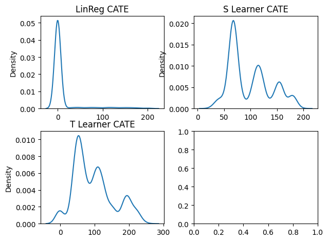
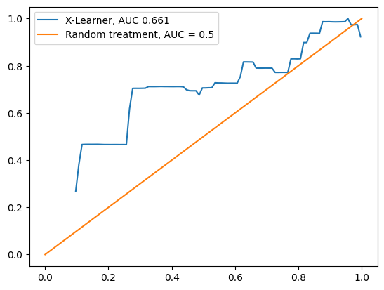

Photo by <a href="https://unsplash.com/@enginakyurt?utm_content=creditCopyText&utm_medium=referral&utm_source=unsplash">engin akyurt</a> on <a href="https://unsplash.com/photos/red-and-yellow-hand-tool-bPiuY2ZSlvU?utm_content=creditCopyText&utm_medium=referral&utm_source=unsplash">Unsplash</a>
  

#  **Giving Offer to Right User**

## Business Context 
In a ride-hailing company , keeping both customer and driver active is crucial important, because both form equilibrium. 

1. Lack of Driver Availability lead to scarcity and ride service cannot be provided, also can lead to extreme price, due to dynamic pricing mechanism 
2. Lack of Customer of course hurt a lot, driver, company, etc. 

To balance those several ways can be approached, for example by giving a promo or coupon 


### Business Metrics 
What is the suitable metrics for this? To help answer the question, we should answer  : 


1. What is the goal of promo ? One of the sign that user is active can be derive from **Gross Booking** 


Here is the relation with **Revenue** 


$$

\begin{align}
\text{Revenue from Service} &= \text{Average Revenue Per User}  \cdot  \text{Number of Active User} \\
\text{Revenue from Service} &= \text{Average Gross Booking Per User } \cdot \text{Take Rate} \cdot  (1-P(\text{Churn Rate})) \cdot 
\text{Total User} \\

\text{Revenue from Service} &= \cfrac{\text{ Gross Booking  }}{\text{Number of User }} \cdot \text{Take Rate} \cdot  (1-P(\text{Churn Rate})) \cdot\text{Total User} \\ 
\text{Revenue from Service} &= \cfrac{\text{ Gross Booking  }}{((1-P(\text{Churn Rate})) \cdot\text{Total User})} \cdot \text{Take Rate} \cdot  (1-P(\text{Churn Rate})) \cdot\text{Total User} \\ 
\end{align}


$$


- **Take Rate** : Similar to Net Profit Margin 

### Business Process 

To better understand the problem, we should understand the business process first 


### Problems 

The problem is we have limited budget constraint, let say called it **B** we cannot surpass. How can we maximize the benefit from giving promo and still within the constraint

$$
\begin{align*}
\text{max}  \textbf{GB} \\
\text w.r.t : \\
\text{Cost} \leq \textbf{B}
\end{align*}


$$


$$
\begin{align*}
\text{max} \sum_i w_i(IGB_i) \\
\text w.r.t : \\
\sum_i w_i(cost_i) \leq \textbf{B}
\end{align*}


$$

1. **GB** :  Gross Booking 
2. **w_i** : Binary **0/1** indicating whether user i receive promo or not
3. **IGB_i** : Incremental Gross Booking from promo 
4. **cost_i** : Cost of Promo (Homogen) from user i


So, how do we approach this problem ? 

## Candidate Solutions 

There are several ways to approach a problem , we can do some literature review, on how industry approach this 


### Solution 1 : Using Machine Learning

The first approach we can predict the outcome variable given treatment assign or not using any machine learning model. 

Data Looks : 


| userID | X_1 | .. | X_n | Treatment | Outcome (GB)  |
|--------|-----|----|-----|-----------|---------------|
| 1      |     |    |     |           |               |


Pros : 

Easy to do just like machine learning case with regression or classification

Cons : 

We cannot adding incrementality / the effect of treatment, hence it's biased to user which Outcome is the highest (for example user who are member )

### Solution 2 : Enter Causality

Instead of just using machine learning to predict outcome variable, we can leverage causality to measure the incrementality of each user if user receive treatment (promo)

Pros : 

Account for causality / incrementality factor

Cons : 

Each user only can be observed one potential outcome, receiving treatment or not. Don't worry we still can estimate the counterfactual. 

### Choosen Solution : 

Considering our need to measure incrementality we choose the **Solution 2**. 


Step by Step Solution : 

**1. Running Experiment**
 
First we need to design experiment by giving randomly coupon to user assign  , however we should be aware that people who offered coupon can either accept or do not accept their coupon 


The variable we can observe : 
1. Number of Bookings 
2. Membership 
3. Coupon Assignment 


**Planning Experiment**

The truth is this is that the assignment is random and the Coupon Claims is not random hence, this is suitable for **Causal Inference for Observational Data**


- Experiment Duration : 1 Week only 
- Randomization Unit : User Level 
- Chance of getting Treatment : 30% 
- Which User is candidate : User who still active in past week 
- Coupon Budget : $1 
- Number of Users Active in Past Week : 2000
- Hence, the cost of experiment : 2000 x $ 1 = $2000

**2. Estimating Treatment Effect** 

After we have obtained the experiment data we can train model to estimate the treatment effect 


**3. Choosing Whose to be Treated** 

After we have estimated the treatment effect on individual level, we can observe that treating all user is not good way, hence we need to choose what fraction of user to be treated

## Introduction to Causal Inference 

Sometimes we are interested in question such as "Does Implementing Minimum 9 Years Education impact GDP" and so on. That is study of Causal Inference 


The Gold Standard of Measuring Causality is by Randomized Control Trial / Experiment, however sometimes treatment assignment imposible to be random or it's unethical. 

There is another method , called Causal Inference with Observational Data. 

Before diving more, we often heard , **Correlation Does not Imply Causation**


But How do we can claim causality, here is several condition  to fullfil causality

1. **Temporal Sequencing** 
   
   If we have treatment (T) and Outcome Variable (Y). It means we do some treatment first then we observe the outcome variable. For example we want to measure the effect of rising price of commodity we want to measure the Demand. 


2. **Non Spurious Relationship**
   
   One meme about this 
   
   

3. **Removing alternate Causes (Confounding)**

   Previously we want to measure the effect of rising price of commodity on demand, however there are many factors affecting demand,such as seasonality 

   ```mermaid

      graph LR
         A(Commodity Price) -->B(Demand)
         C(Seasonality Confounding) --> B
   ```

   How to remove this bias ? 
   
   1. We could use randomization / random experiment such as **A/B Test** 
   2. Controlling the Confounder for example by adding the confounding variable to model 

**Potential Outcome**


The one who developed causality theory is Donald B Rubin, or called as **Rubin Causality** framework of **potential outcome** framework. 

So what is potential outcome, let say we have  a headache, how can we cure the headache, for example : we can take medicine. 

The outcome or result after taking medicine 


Taking Pills or Not Taking Pills is a form of treatment say we denote as **T** , each person only can take one treatment at a time (take pills or not ) and only observe one outcome say we denote **Y** (still headache or not)


those outcome, called potential outcome. 

Hence if we want to denote the outcome of each person, say $i$ after taking pills is $Y_{1i}$ 


The Treatment effect on individuals can be define as 

$\text{Individual Treatment Effect}_i = Y_{1i} - Y_{0i}$

However, again we can observe both at the same time then usually we come up with **Average Treatment Effect** 


which can be define as 

$\text{Average Treatment Effect} = \text{Average Outcome on Treated individual} - \text{Average Outcome on Not Treated individual}$

or 

$\text{Average Treatment Effect} = E[Y_1 - Y_0 ]$

with $E$ as expected value or simply average 


**Individual Treatment Effect** 


You said that estimating treatment effect is quite impossible, how could you over with this? Don't worry we'll talk about industry implementation


So why would you use individual treatment effects instead of Average Treatment Effect. 

Typical use of **Average Treatment Effect** : 
- Program Evaluation 
- Research 
- Decision 

The reason about using Individual Treatment Effect is **Personalization** , why ? 

Individuals may react differently in different degree , for example in ride hailing case : 

- We give discount offer to individual A --> one week after the discount the user keep using  / ordering to ride hailing apps 
- But that could be different in user Z --> offered discount but not reacting at all 


Again what's the company interest ? Gaining Maximum Shareholder value , How ? 
- Could from rising the revenue 
- Or from reducing the cost 

In case we choose the revenue, how could we give treatment such as offer so that we could maximize the revenue given budget constraint : 

- We select individual if we treat --> gain highest treatment effect / incremental value 


$\text{Individual Treatment Effect}_i = Y_{1i} - Y_{0i}$

We only have one outcome at a time, hence we need to estimate the other one using model 

Let's dive in 

Modelling Workflow 


### Data Preparation


```python
import pandas as pd 
import numpy as np 
import scipy.stats as st 
import matplotlib.pyplot as plt 
import seaborn as sns 

from IPython.display import display

import warnings

# Suppress all warnings
warnings.filterwarnings('ignore')
```

Here is the dataset definition

| Variable Name | Definition | Data Type |
|---------------|------------|-----------|
| PromoID       |       ID of Promos     | INT       |
| PromoType            |    Type of Promos Offered  to Treatment Effect      |     String      |
| PromoDate            |    Date of Promos Given to Treated User     |     String      |
| UserID            |   UserID     |     String      |
| Treatment            |    Binary Value (0/1) indicating user receive treatment or not   |     String      |
| GrossBooking            |   Outcome Variable , Gross Booking in 7 Days     |     String      |
| Age            |  Customer Age   |     String      |
| Gender            |  Customer Gender   |     String      |
| NumberOfBooking            |  Count of user Booking in Last 7 Days   |     String      |
| ResponseToPastPromo           |  Binary Value (0/1) indicating whether user responded / claim last offered promo   |     String      |
| LastBooking(Days)           |  Number of Days  from last booking, given experiment date cutoff    |     String      |
|  isMember       |  Binary Value (0/1) indicating whether user is a member    |     String      |
|  average_apps_open_week       | Number of user app open in 7 days    |     String      |


```python
data = pd.read_csv('dataset/promo_continous_outcome.csv')
```


```python
data
```


<div style="overflow-x: auto;">
<style scoped>
    .dataframe tbody tr th:only-of-type {
        vertical-align: middle;
    }

    .dataframe tbody tr th {
        vertical-align: top;
    }

    .dataframe thead th {
        text-align: right;
    }
    
</style>
<table border="1" class="dataframe">
  <thead>
    <tr style="text-align: right;">
      <th></th>
      <th>PromoID</th>
      <th>PromoType</th>
      <th>PromoDate</th>
      <th>UserID</th>
      <th>Treatment</th>
      <th>GrossBooking</th>
      <th>Age</th>
      <th>Gender</th>
      <th>NumberOfBooking</th>
      <th>ResponseToPastPromo</th>
      <th>LastBooking(Days)</th>
      <th>isMember</th>
      <th>average_apps_open_week</th>
    </tr>
  </thead>
  <tbody>
    <tr>
      <th>0</th>
      <td>1</td>
      <td>NaN</td>
      <td>NaN</td>
      <td>1</td>
      <td>0</td>
      <td>98.346167</td>
      <td>56</td>
      <td>male</td>
      <td>16</td>
      <td>1</td>
      <td>148</td>
      <td>0</td>
      <td>30.940793</td>
    </tr>
    <tr>
      <th>1</th>
      <td>1</td>
      <td>NaN</td>
      <td>NaN</td>
      <td>2</td>
      <td>0</td>
      <td>99.150442</td>
      <td>69</td>
      <td>male</td>
      <td>49</td>
      <td>1</td>
      <td>339</td>
      <td>0</td>
      <td>32.466263</td>
    </tr>
    <tr>
      <th>2</th>
      <td>1</td>
      <td>NaN</td>
      <td>NaN</td>
      <td>3</td>
      <td>0</td>
      <td>93.619220</td>
      <td>46</td>
      <td>male</td>
      <td>39</td>
      <td>0</td>
      <td>115</td>
      <td>0</td>
      <td>30.170032</td>
    </tr>
    <tr>
      <th>3</th>
      <td>1</td>
      <td>NaN</td>
      <td>NaN</td>
      <td>4</td>
      <td>0</td>
      <td>87.382590</td>
      <td>32</td>
      <td>female</td>
      <td>44</td>
      <td>0</td>
      <td>213</td>
      <td>0</td>
      <td>31.393513</td>
    </tr>
    <tr>
      <th>4</th>
      <td>1</td>
      <td>NaN</td>
      <td>NaN</td>
      <td>5</td>
      <td>0</td>
      <td>100.478985</td>
      <td>60</td>
      <td>male</td>
      <td>31</td>
      <td>1</td>
      <td>293</td>
      <td>0</td>
      <td>30.839952</td>
    </tr>
    <tr>
      <th>...</th>
      <td>...</td>
      <td>...</td>
      <td>...</td>
      <td>...</td>
      <td>...</td>
      <td>...</td>
      <td>...</td>
      <td>...</td>
      <td>...</td>
      <td>...</td>
      <td>...</td>
      <td>...</td>
      <td>...</td>
    </tr>
    <tr>
      <th>2995</th>
      <td>3</td>
      <td>NaN</td>
      <td>2024-01-07</td>
      <td>996</td>
      <td>1</td>
      <td>107.387370</td>
      <td>60</td>
      <td>female</td>
      <td>17</td>
      <td>0</td>
      <td>87</td>
      <td>0</td>
      <td>30.010098</td>
    </tr>
    <tr>
      <th>2996</th>
      <td>3</td>
      <td>NaN</td>
      <td>NaN</td>
      <td>997</td>
      <td>0</td>
      <td>97.674515</td>
      <td>64</td>
      <td>male</td>
      <td>36</td>
      <td>0</td>
      <td>302</td>
      <td>0</td>
      <td>30.216715</td>
    </tr>
    <tr>
      <th>2997</th>
      <td>3</td>
      <td>NaN</td>
      <td>NaN</td>
      <td>998</td>
      <td>0</td>
      <td>90.007692</td>
      <td>62</td>
      <td>female</td>
      <td>44</td>
      <td>1</td>
      <td>167</td>
      <td>0</td>
      <td>30.675957</td>
    </tr>
    <tr>
      <th>2998</th>
      <td>3</td>
      <td>NaN</td>
      <td>NaN</td>
      <td>999</td>
      <td>0</td>
      <td>108.604006</td>
      <td>35</td>
      <td>male</td>
      <td>31</td>
      <td>0</td>
      <td>169</td>
      <td>0</td>
      <td>33.005855</td>
    </tr>
    <tr>
      <th>2999</th>
      <td>3</td>
      <td>NaN</td>
      <td>NaN</td>
      <td>1000</td>
      <td>0</td>
      <td>94.680165</td>
      <td>55</td>
      <td>male</td>
      <td>35</td>
      <td>0</td>
      <td>134</td>
      <td>0</td>
      <td>30.483874</td>
    </tr>
  </tbody>
</table>
<p>3000 rows × 13 columns</p>
</div>


```python
input_col = ['Age', 'Gender', 'NumberOfBooking','ResponseToPastPromo','LastBooking(Days)', 
            'isMember','average_apps_open_week']
treatment_col = ['Treatment']
output_col = ['GrossBooking']
```


```python
X = data[input_col + treatment_col]
y = data[output_col]
```


```python
X.head()
```


<div>
<style scoped>
    .dataframe tbody tr th:only-of-type {
        vertical-align: middle;
    }

    .dataframe tbody tr th {
        vertical-align: top;
    }

    .dataframe thead th {
        text-align: right;
    }
</style>
<table border="1" class="dataframe">
  <thead>
    <tr style="text-align: right;">
      <th></th>
      <th>Age</th>
      <th>Gender</th>
      <th>NumberOfBooking</th>
      <th>ResponseToPastPromo</th>
      <th>LastBooking(Days)</th>
      <th>isMember</th>
      <th>average_apps_open_week</th>
      <th>Treatment</th>
    </tr>
  </thead>
  <tbody>
    <tr>
      <th>0</th>
      <td>56</td>
      <td>male</td>
      <td>16</td>
      <td>1</td>
      <td>148</td>
      <td>0</td>
      <td>30.940793</td>
      <td>0</td>
    </tr>
    <tr>
      <th>1</th>
      <td>69</td>
      <td>male</td>
      <td>49</td>
      <td>1</td>
      <td>339</td>
      <td>0</td>
      <td>32.466263</td>
      <td>0</td>
    </tr>
    <tr>
      <th>2</th>
      <td>46</td>
      <td>male</td>
      <td>39</td>
      <td>0</td>
      <td>115</td>
      <td>0</td>
      <td>30.170032</td>
      <td>0</td>
    </tr>
    <tr>
      <th>3</th>
      <td>32</td>
      <td>female</td>
      <td>44</td>
      <td>0</td>
      <td>213</td>
      <td>0</td>
      <td>31.393513</td>
      <td>0</td>
    </tr>
    <tr>
      <th>4</th>
      <td>60</td>
      <td>male</td>
      <td>31</td>
      <td>1</td>
      <td>293</td>
      <td>0</td>
      <td>30.839952</td>
      <td>0</td>
    </tr>
  </tbody>
</table>
</div>


```python
y.head()
```


<div>
<style scoped>
    .dataframe tbody tr th:only-of-type {
        vertical-align: middle;
    }

    .dataframe tbody tr th {
        vertical-align: top;
    }

    .dataframe thead th {
        text-align: right;
    }
</style>
<table border="1" class="dataframe">
  <thead>
    <tr style="text-align: right;">
      <th></th>
      <th>GrossBooking</th>
    </tr>
  </thead>
  <tbody>
    <tr>
      <th>0</th>
      <td>98.346167</td>
    </tr>
    <tr>
      <th>1</th>
      <td>99.150442</td>
    </tr>
    <tr>
      <th>2</th>
      <td>93.619220</td>
    </tr>
    <tr>
      <th>3</th>
      <td>87.382590</td>
    </tr>
    <tr>
      <th>4</th>
      <td>100.478985</td>
    </tr>
  </tbody>
</table>
</div>


Split data into training and testing 


```python
from sklearn.model_selection import train_test_split


X_train,X_test,y_train,y_test = train_test_split(X,y,test_size=0.2)
X_val,X_test,y_val,y_test = train_test_split(X_test,y_test,test_size=0.5)

```


```python
X_train
```


<div>
<style scoped>
    .dataframe tbody tr th:only-of-type {
        vertical-align: middle;
    }

    .dataframe tbody tr th {
        vertical-align: top;
    }

    .dataframe thead th {
        text-align: right;
    }
</style>
<table border="1" class="dataframe">
  <thead>
    <tr style="text-align: right;">
      <th></th>
      <th>Age</th>
      <th>Gender</th>
      <th>NumberOfBooking</th>
      <th>ResponseToPastPromo</th>
      <th>LastBooking(Days)</th>
      <th>isMember</th>
      <th>average_apps_open_week</th>
      <th>Treatment</th>
    </tr>
  </thead>
  <tbody>
    <tr>
      <th>970</th>
      <td>53</td>
      <td>male</td>
      <td>26</td>
      <td>0</td>
      <td>45</td>
      <td>0</td>
      <td>30.041950</td>
      <td>0</td>
    </tr>
    <tr>
      <th>159</th>
      <td>66</td>
      <td>male</td>
      <td>23</td>
      <td>1</td>
      <td>258</td>
      <td>0</td>
      <td>31.328888</td>
      <td>0</td>
    </tr>
    <tr>
      <th>2513</th>
      <td>31</td>
      <td>female</td>
      <td>4</td>
      <td>1</td>
      <td>103</td>
      <td>0</td>
      <td>30.189209</td>
      <td>0</td>
    </tr>
    <tr>
      <th>1604</th>
      <td>54</td>
      <td>male</td>
      <td>43</td>
      <td>0</td>
      <td>170</td>
      <td>0</td>
      <td>30.413598</td>
      <td>0</td>
    </tr>
    <tr>
      <th>436</th>
      <td>33</td>
      <td>female</td>
      <td>1</td>
      <td>1</td>
      <td>224</td>
      <td>1</td>
      <td>30.281640</td>
      <td>0</td>
    </tr>
    <tr>
      <th>...</th>
      <td>...</td>
      <td>...</td>
      <td>...</td>
      <td>...</td>
      <td>...</td>
      <td>...</td>
      <td>...</td>
      <td>...</td>
    </tr>
    <tr>
      <th>826</th>
      <td>23</td>
      <td>female</td>
      <td>15</td>
      <td>0</td>
      <td>178</td>
      <td>0</td>
      <td>30.325069</td>
      <td>0</td>
    </tr>
    <tr>
      <th>2839</th>
      <td>36</td>
      <td>male</td>
      <td>1</td>
      <td>1</td>
      <td>338</td>
      <td>1</td>
      <td>30.525431</td>
      <td>0</td>
    </tr>
    <tr>
      <th>1112</th>
      <td>34</td>
      <td>male</td>
      <td>31</td>
      <td>1</td>
      <td>25</td>
      <td>1</td>
      <td>30.312170</td>
      <td>0</td>
    </tr>
    <tr>
      <th>130</th>
      <td>41</td>
      <td>male</td>
      <td>31</td>
      <td>0</td>
      <td>162</td>
      <td>0</td>
      <td>30.799777</td>
      <td>0</td>
    </tr>
    <tr>
      <th>744</th>
      <td>54</td>
      <td>male</td>
      <td>45</td>
      <td>0</td>
      <td>16</td>
      <td>0</td>
      <td>30.807659</td>
      <td>0</td>
    </tr>
  </tbody>
</table>
<p>2400 rows × 8 columns</p>
</div>


```python
y_train
```


<div>
<style scoped>
    .dataframe tbody tr th:only-of-type {
        vertical-align: middle;
    }

    .dataframe tbody tr th {
        vertical-align: top;
    }

    .dataframe thead th {
        text-align: right;
    }
</style>
<table border="1" class="dataframe">
  <thead>
    <tr style="text-align: right;">
      <th></th>
      <th>GrossBooking</th>
    </tr>
  </thead>
  <tbody>
    <tr>
      <th>970</th>
      <td>101.384184</td>
    </tr>
    <tr>
      <th>159</th>
      <td>103.983185</td>
    </tr>
    <tr>
      <th>2513</th>
      <td>96.753668</td>
    </tr>
    <tr>
      <th>1604</th>
      <td>97.215699</td>
    </tr>
    <tr>
      <th>436</th>
      <td>103.875343</td>
    </tr>
    <tr>
      <th>...</th>
      <td>...</td>
    </tr>
    <tr>
      <th>826</th>
      <td>90.591134</td>
    </tr>
    <tr>
      <th>2839</th>
      <td>101.575794</td>
    </tr>
    <tr>
      <th>1112</th>
      <td>101.633420</td>
    </tr>
    <tr>
      <th>130</th>
      <td>107.497184</td>
    </tr>
    <tr>
      <th>744</th>
      <td>102.238127</td>
    </tr>
  </tbody>
</table>
<p>2400 rows × 1 columns</p>
</div>


Data Preprocessing

- Encoding Categorical Variable
- Creating Feature : Interaction between Treatment and other covariates

Encoding Categorical Variable


```python
categorical_columns = ['Gender']
```


```python
from sklearn.preprocessing import OneHotEncoder

encoder = OneHotEncoder(sparse_output=False)

encoder.fit(X_train[categorical_columns].values.reshape(-1,1))
```


<style>#sk-container-id-1 {color: black;}#sk-container-id-1 pre{padding: 0;}#sk-container-id-1 div.sk-toggleable {background-color: white;}#sk-container-id-1 label.sk-toggleable__label {cursor: pointer;display: block;width: 100%;margin-bottom: 0;padding: 0.3em;box-sizing: border-box;text-align: center;}#sk-container-id-1 label.sk-toggleable__label-arrow:before {content: "▸";float: left;margin-right: 0.25em;color: #696969;}#sk-container-id-1 label.sk-toggleable__label-arrow:hover:before {color: black;}#sk-container-id-1 div.sk-estimator:hover label.sk-toggleable__label-arrow:before {color: black;}#sk-container-id-1 div.sk-toggleable__content {max-height: 0;max-width: 0;overflow: hidden;text-align: left;background-color: #f0f8ff;}#sk-container-id-1 div.sk-toggleable__content pre {margin: 0.2em;color: black;border-radius: 0.25em;background-color: #f0f8ff;}#sk-container-id-1 input.sk-toggleable__control:checked~div.sk-toggleable__content {max-height: 200px;max-width: 100%;overflow: auto;}#sk-container-id-1 input.sk-toggleable__control:checked~label.sk-toggleable__label-arrow:before {content: "▾";}#sk-container-id-1 div.sk-estimator input.sk-toggleable__control:checked~label.sk-toggleable__label {background-color: #d4ebff;}#sk-container-id-1 div.sk-label input.sk-toggleable__control:checked~label.sk-toggleable__label {background-color: #d4ebff;}#sk-container-id-1 input.sk-hidden--visually {border: 0;clip: rect(1px 1px 1px 1px);clip: rect(1px, 1px, 1px, 1px);height: 1px;margin: -1px;overflow: hidden;padding: 0;position: absolute;width: 1px;}#sk-container-id-1 div.sk-estimator {font-family: monospace;background-color: #f0f8ff;border: 1px dotted black;border-radius: 0.25em;box-sizing: border-box;margin-bottom: 0.5em;}#sk-container-id-1 div.sk-estimator:hover {background-color: #d4ebff;}#sk-container-id-1 div.sk-parallel-item::after {content: "";width: 100%;border-bottom: 1px solid gray;flex-grow: 1;}#sk-container-id-1 div.sk-label:hover label.sk-toggleable__label {background-color: #d4ebff;}#sk-container-id-1 div.sk-serial::before {content: "";position: absolute;border-left: 1px solid gray;box-sizing: border-box;top: 0;bottom: 0;left: 50%;z-index: 0;}#sk-container-id-1 div.sk-serial {display: flex;flex-direction: column;align-items: center;background-color: white;padding-right: 0.2em;padding-left: 0.2em;position: relative;}#sk-container-id-1 div.sk-item {position: relative;z-index: 1;}#sk-container-id-1 div.sk-parallel {display: flex;align-items: stretch;justify-content: center;background-color: white;position: relative;}#sk-container-id-1 div.sk-item::before, #sk-container-id-1 div.sk-parallel-item::before {content: "";position: absolute;border-left: 1px solid gray;box-sizing: border-box;top: 0;bottom: 0;left: 50%;z-index: -1;}#sk-container-id-1 div.sk-parallel-item {display: flex;flex-direction: column;z-index: 1;position: relative;background-color: white;}#sk-container-id-1 div.sk-parallel-item:first-child::after {align-self: flex-end;width: 50%;}#sk-container-id-1 div.sk-parallel-item:last-child::after {align-self: flex-start;width: 50%;}#sk-container-id-1 div.sk-parallel-item:only-child::after {width: 0;}#sk-container-id-1 div.sk-dashed-wrapped {border: 1px dashed gray;margin: 0 0.4em 0.5em 0.4em;box-sizing: border-box;padding-bottom: 0.4em;background-color: white;}#sk-container-id-1 div.sk-label label {font-family: monospace;font-weight: bold;display: inline-block;line-height: 1.2em;}#sk-container-id-1 div.sk-label-container {text-align: center;}#sk-container-id-1 div.sk-container {/* jupyter's `normalize.less` sets `[hidden] { display: none; }` but bootstrap.min.css set `[hidden] { display: none !important; }` so we also need the `!important` here to be able to override the default hidden behavior on the sphinx rendered scikit-learn.org. See: https://github.com/scikit-learn/scikit-learn/issues/21755 */display: inline-block !important;position: relative;}#sk-container-id-1 div.sk-text-repr-fallback {display: none;}</style><div id="sk-container-id-1" class="sk-top-container"><div class="sk-text-repr-fallback"><pre>OneHotEncoder(sparse_output=False)</pre><b>In a Jupyter environment, please rerun this cell to show the HTML representation or trust the notebook. <br />On GitHub, the HTML representation is unable to render, please try loading this page with nbviewer.org.</b></div><div class="sk-container" hidden><div class="sk-item"><div class="sk-estimator sk-toggleable"><input class="sk-toggleable__control sk-hidden--visually" id="sk-estimator-id-1" type="checkbox" checked><label for="sk-estimator-id-1" class="sk-toggleable__label sk-toggleable__label-arrow">OneHotEncoder</label><div class="sk-toggleable__content"><pre>OneHotEncoder(sparse_output=False)</pre></div></div></div></div></div>


```python
from IPython.display import display
```


```python
def encode_categorical(X,categorical_columns, train=True,encoder=None) : 
    X = X.copy()
    X.index = [x for x in range(X.shape[0])]
    if train : 
        encoder = OneHotEncoder(sparse_output=False)

        encoder.fit(X[categorical_columns].values.reshape(-1,1))
        feature_names = encoder.categories_[0]
        encoded_values = encoder.transform(X[categorical_columns].values.reshape(-1,1))
        encoded_df  = pd.DataFrame(encoded_values, columns=feature_names)

        
        X.drop(categorical_columns,axis=1,inplace=True)
        
        X_encoded = pd.concat([X,encoded_df],axis=1)
        
        return X_encoded,encoder
    else : 
        if encoder is None : 
            raise ValueError('you should add fitted encoder for other than training data')
        feature_names = encoder.categories_[0]
        encoded_values = encoder.transform(X[categorical_columns].values.reshape(-1,1))
        encoded_df  = pd.DataFrame(encoded_values, columns=feature_names)
        
        X.drop(categorical_columns,axis=1,inplace=True)
        
        X_encoded = pd.concat([X,encoded_df],axis=1,join='inner')
        return X_encoded,_
```


```python
X_train_encoded,encoder = encode_categorical(X=X_train,categorical_columns=categorical_columns,
                                             train=True)
X_test_encoded,_ = encode_categorical(X=X_test,categorical_columns=categorical_columns,
                                             train=False,encoder=encoder)
X_val_encoded,_ = encode_categorical(X=X_val,categorical_columns=categorical_columns,
                                             train=False,encoder=encoder)
```


```python
X_train_encoded.shape
```


    (2400, 9)


```python
X_test_encoded.shape
```


    (300, 9)


```python
def generate_interaction(X,input_col,treatment_col) : 
    X = X.copy()
    for col in input_col : 
        for t in treatment_col : 
            X[f'{col}_{t}_interaction'] = X[col] * X[t]
    return X
```


```python
input_col = ['Age', 'female','male', 'NumberOfBooking','ResponseToPastPromo','LastBooking(Days)', 
            'isMember','average_apps_open_week']
treatment_col = ['Treatment']
output_col = ['GrossBooking']
```


```python
X_train_interaction = generate_interaction(X=X_train_encoded,input_col=input_col,treatment_col=treatment_col)
X_test_interaction = generate_interaction(X=X_test_encoded,input_col=input_col,treatment_col=treatment_col)
X_val_interaction = generate_interaction(X=X_val_encoded,input_col=input_col,treatment_col=treatment_col)

```

dropping column of non interaction column


```python
X_train_interaction = X_train_interaction.drop(input_col,axis=1)
X_test_interaction = X_test_interaction.drop(input_col,axis=1)
X_val_interaction = X_val_interaction.drop(input_col,axis=1)
```


```python
X_train_interaction.shape
```


    (2400, 9)


```python
X_test_interaction.shape
```


    (300, 9)


```python

data_train = pd.concat([X_train_encoded.reset_index(drop=True),y_train.reset_index(drop=True)],axis=1,ignore_index=False)
data_test = pd.concat([X_test_encoded.reset_index(drop=True),y_test.reset_index(drop=True)],axis=1,ignore_index=False)
data_val = pd.concat([X_val_encoded.reset_index(drop=True),y_val.reset_index(drop=True)],axis=1,ignore_index=False)

```

hence 
1. $X$ or Covariate : ``` 'GrossBookingValue', 'Age', 'Gender', 'NumberOfBooking','ResponseToPastPromo','LastBooking(Days)', 
            'isMember','average_apps_open_week'
        ```
2. $T$ or Treatment Variable  : ```Treatment```
3. $Y$ or Outcome Variable : ```GrossBookingValue```

### Modelling Phase 

### $1^{st}$ Linear Regression 


$$
\begin{align}
Y = \sum^{K-1}_{i=1} \beta_{i} \cdot X_i + \beta_K \cdot T \\

\dfrac{\partial Y}{\partial T} = \beta_K \\ 

\beta_K = \textbf{ATE}


\end{align}

$$

It produces the **ATE** however what we need is is persnalized effect, hence we can add **interaction term** with covariate
$$
\begin{align}
Y = \sum^{K-1}_{i=1} \beta_{i} \cdot X_i + \beta_K \cdot T +  \sum^{K-1}_{i=1} \beta_{i} \cdot X_i \cdot T \\

\dfrac{\partial Y}{\partial T} = \sum^{K-1}_{i=1} \beta_{i} \cdot X_i  \\ 

\sum^{K-1}_{i=1} \beta_{i} \cdot X_i = \textbf{CATE}


\end{align}

$$


However Linear Regression of course has limitation such as : 
- Linearity Assumption 


Can we use any estimator that can produce non linearity ? 

**Of Course** : We could take a look at another estimator


```python
from sklearn.linear_model import LinearRegression
```


```python
model_cate_lr = LinearRegression()

model_cate_lr.fit(X_train_interaction,y_train)
```


<style>#sk-container-id-2 {color: black;}#sk-container-id-2 pre{padding: 0;}#sk-container-id-2 div.sk-toggleable {background-color: white;}#sk-container-id-2 label.sk-toggleable__label {cursor: pointer;display: block;width: 100%;margin-bottom: 0;padding: 0.3em;box-sizing: border-box;text-align: center;}#sk-container-id-2 label.sk-toggleable__label-arrow:before {content: "▸";float: left;margin-right: 0.25em;color: #696969;}#sk-container-id-2 label.sk-toggleable__label-arrow:hover:before {color: black;}#sk-container-id-2 div.sk-estimator:hover label.sk-toggleable__label-arrow:before {color: black;}#sk-container-id-2 div.sk-toggleable__content {max-height: 0;max-width: 0;overflow: hidden;text-align: left;background-color: #f0f8ff;}#sk-container-id-2 div.sk-toggleable__content pre {margin: 0.2em;color: black;border-radius: 0.25em;background-color: #f0f8ff;}#sk-container-id-2 input.sk-toggleable__control:checked~div.sk-toggleable__content {max-height: 200px;max-width: 100%;overflow: auto;}#sk-container-id-2 input.sk-toggleable__control:checked~label.sk-toggleable__label-arrow:before {content: "▾";}#sk-container-id-2 div.sk-estimator input.sk-toggleable__control:checked~label.sk-toggleable__label {background-color: #d4ebff;}#sk-container-id-2 div.sk-label input.sk-toggleable__control:checked~label.sk-toggleable__label {background-color: #d4ebff;}#sk-container-id-2 input.sk-hidden--visually {border: 0;clip: rect(1px 1px 1px 1px);clip: rect(1px, 1px, 1px, 1px);height: 1px;margin: -1px;overflow: hidden;padding: 0;position: absolute;width: 1px;}#sk-container-id-2 div.sk-estimator {font-family: monospace;background-color: #f0f8ff;border: 1px dotted black;border-radius: 0.25em;box-sizing: border-box;margin-bottom: 0.5em;}#sk-container-id-2 div.sk-estimator:hover {background-color: #d4ebff;}#sk-container-id-2 div.sk-parallel-item::after {content: "";width: 100%;border-bottom: 1px solid gray;flex-grow: 1;}#sk-container-id-2 div.sk-label:hover label.sk-toggleable__label {background-color: #d4ebff;}#sk-container-id-2 div.sk-serial::before {content: "";position: absolute;border-left: 1px solid gray;box-sizing: border-box;top: 0;bottom: 0;left: 50%;z-index: 0;}#sk-container-id-2 div.sk-serial {display: flex;flex-direction: column;align-items: center;background-color: white;padding-right: 0.2em;padding-left: 0.2em;position: relative;}#sk-container-id-2 div.sk-item {position: relative;z-index: 1;}#sk-container-id-2 div.sk-parallel {display: flex;align-items: stretch;justify-content: center;background-color: white;position: relative;}#sk-container-id-2 div.sk-item::before, #sk-container-id-2 div.sk-parallel-item::before {content: "";position: absolute;border-left: 1px solid gray;box-sizing: border-box;top: 0;bottom: 0;left: 50%;z-index: -1;}#sk-container-id-2 div.sk-parallel-item {display: flex;flex-direction: column;z-index: 1;position: relative;background-color: white;}#sk-container-id-2 div.sk-parallel-item:first-child::after {align-self: flex-end;width: 50%;}#sk-container-id-2 div.sk-parallel-item:last-child::after {align-self: flex-start;width: 50%;}#sk-container-id-2 div.sk-parallel-item:only-child::after {width: 0;}#sk-container-id-2 div.sk-dashed-wrapped {border: 1px dashed gray;margin: 0 0.4em 0.5em 0.4em;box-sizing: border-box;padding-bottom: 0.4em;background-color: white;}#sk-container-id-2 div.sk-label label {font-family: monospace;font-weight: bold;display: inline-block;line-height: 1.2em;}#sk-container-id-2 div.sk-label-container {text-align: center;}#sk-container-id-2 div.sk-container {/* jupyter's `normalize.less` sets `[hidden] { display: none; }` but bootstrap.min.css set `[hidden] { display: none !important; }` so we also need the `!important` here to be able to override the default hidden behavior on the sphinx rendered scikit-learn.org. See: https://github.com/scikit-learn/scikit-learn/issues/21755 */display: inline-block !important;position: relative;}#sk-container-id-2 div.sk-text-repr-fallback {display: none;}</style><div id="sk-container-id-2" class="sk-top-container"><div class="sk-text-repr-fallback"><pre>LinearRegression()</pre><b>In a Jupyter environment, please rerun this cell to show the HTML representation or trust the notebook. <br />On GitHub, the HTML representation is unable to render, please try loading this page with nbviewer.org.</b></div><div class="sk-container" hidden><div class="sk-item"><div class="sk-estimator sk-toggleable"><input class="sk-toggleable__control sk-hidden--visually" id="sk-estimator-id-2" type="checkbox" checked><label for="sk-estimator-id-2" class="sk-toggleable__label sk-toggleable__label-arrow">LinearRegression</label><div class="sk-toggleable__content"><pre>LinearRegression()</pre></div></div></div></div></div>


```python
ate_prediction = model_cate_lr.coef_ @ X_train_interaction.to_numpy().T
```


```python
model_cate_lr.predict(X_train_interaction)
```


    array([[99.80225631],
           [99.80225631],
           [99.80225631],
           ...,
           [99.80225631],
           [99.80225631],
           [99.80225631]])


```python
def predict_cate_lr(model,X) : 
    ate_prediction = model.coef_ @ X.to_numpy().T
    return ate_prediction
```


```python
cate = X_train_interaction.copy()
cate['predicted_cate'] = predict_cate_lr(model=model_cate_lr,X=X_train_interaction).flatten()
cate = cate.sort_values('predicted_cate',ascending=False)
cate
```


<div>
<style scoped>
    .dataframe tbody tr th:only-of-type {
        vertical-align: middle;
    }

    .dataframe tbody tr th {
        vertical-align: top;
    }

    .dataframe thead th {
        text-align: right;
    }
</style>
<table border="1" class="dataframe">
  <thead>
    <tr style="text-align: right;">
      <th></th>
      <th>Treatment</th>
      <th>Age_Treatment_interaction</th>
      <th>female_Treatment_interaction</th>
      <th>male_Treatment_interaction</th>
      <th>NumberOfBooking_Treatment_interaction</th>
      <th>ResponseToPastPromo_Treatment_interaction</th>
      <th>LastBooking(Days)_Treatment_interaction</th>
      <th>isMember_Treatment_interaction</th>
      <th>average_apps_open_week_Treatment_interaction</th>
      <th>predicted_cate</th>
    </tr>
  </thead>
  <tbody>
    <tr>
      <th>1822</th>
      <td>1</td>
      <td>46</td>
      <td>0.0</td>
      <td>1.0</td>
      <td>47</td>
      <td>1</td>
      <td>148</td>
      <td>0</td>
      <td>31.044854</td>
      <td>202.942291</td>
    </tr>
    <tr>
      <th>576</th>
      <td>1</td>
      <td>47</td>
      <td>0.0</td>
      <td>1.0</td>
      <td>46</td>
      <td>1</td>
      <td>188</td>
      <td>0</td>
      <td>31.266090</td>
      <td>202.225657</td>
    </tr>
    <tr>
      <th>418</th>
      <td>1</td>
      <td>25</td>
      <td>0.0</td>
      <td>1.0</td>
      <td>40</td>
      <td>1</td>
      <td>194</td>
      <td>1</td>
      <td>31.692579</td>
      <td>200.104725</td>
    </tr>
    <tr>
      <th>513</th>
      <td>1</td>
      <td>25</td>
      <td>0.0</td>
      <td>1.0</td>
      <td>40</td>
      <td>1</td>
      <td>194</td>
      <td>1</td>
      <td>31.692579</td>
      <td>200.104725</td>
    </tr>
    <tr>
      <th>2039</th>
      <td>1</td>
      <td>59</td>
      <td>0.0</td>
      <td>1.0</td>
      <td>43</td>
      <td>1</td>
      <td>59</td>
      <td>0</td>
      <td>31.798532</td>
      <td>200.035397</td>
    </tr>
    <tr>
      <th>...</th>
      <td>...</td>
      <td>...</td>
      <td>...</td>
      <td>...</td>
      <td>...</td>
      <td>...</td>
      <td>...</td>
      <td>...</td>
      <td>...</td>
      <td>...</td>
    </tr>
    <tr>
      <th>840</th>
      <td>0</td>
      <td>0</td>
      <td>0.0</td>
      <td>0.0</td>
      <td>0</td>
      <td>0</td>
      <td>0</td>
      <td>0</td>
      <td>0.000000</td>
      <td>0.000000</td>
    </tr>
    <tr>
      <th>841</th>
      <td>0</td>
      <td>0</td>
      <td>0.0</td>
      <td>0.0</td>
      <td>0</td>
      <td>0</td>
      <td>0</td>
      <td>0</td>
      <td>0.000000</td>
      <td>0.000000</td>
    </tr>
    <tr>
      <th>842</th>
      <td>0</td>
      <td>0</td>
      <td>0.0</td>
      <td>0.0</td>
      <td>0</td>
      <td>0</td>
      <td>0</td>
      <td>0</td>
      <td>0.000000</td>
      <td>0.000000</td>
    </tr>
    <tr>
      <th>2328</th>
      <td>1</td>
      <td>47</td>
      <td>1.0</td>
      <td>0.0</td>
      <td>3</td>
      <td>0</td>
      <td>260</td>
      <td>0</td>
      <td>30.093732</td>
      <td>-0.619641</td>
    </tr>
    <tr>
      <th>2323</th>
      <td>1</td>
      <td>48</td>
      <td>1.0</td>
      <td>0.0</td>
      <td>1</td>
      <td>0</td>
      <td>272</td>
      <td>0</td>
      <td>30.298811</td>
      <td>-4.556660</td>
    </tr>
  </tbody>
</table>
<p>2400 rows × 10 columns</p>
</div>


```python
fig,ax = plt.subplots(nrows=2,ncols=2)
sns.kdeplot(cate['predicted_cate'].values,ax=ax[0][0],label='Linear Regression CATE')
ax[0][0].set_title('LinReg CATE')
plt.tight_layout()
fig
```


    

    


    

    


### $2^{nd}$ Meta Learners Models 

Previously, we learn about we can extract the interaction term and use it to extract **CATE**, however the relationship is **linear** , what if we can implement non linear model such as **Tree Based Method** 

####  Meta Learners Models : $S-Learners$

The approach is quite simple 

1. Train **any** machine learning model to all data 


2. During prediction phase : 
   1. Predict $Y_1$ by input  Covariate + `Treatment=1` 
   2. Predict $Y_0$ Covariate + `Treatment=0`
   3. Measure difference of  $Y_1$ and $Y_0$, That is our **CATE**

Let's use boosting model such as **AdaBoost** 


```python
X_train_encoded
```


<div>
<style scoped>
    .dataframe tbody tr th:only-of-type {
        vertical-align: middle;
    }

    .dataframe tbody tr th {
        vertical-align: top;
    }

    .dataframe thead th {
        text-align: right;
    }
</style>
<table border="1" class="dataframe">
  <thead>
    <tr style="text-align: right;">
      <th></th>
      <th>Age</th>
      <th>NumberOfBooking</th>
      <th>ResponseToPastPromo</th>
      <th>LastBooking(Days)</th>
      <th>isMember</th>
      <th>average_apps_open_week</th>
      <th>Treatment</th>
      <th>female</th>
      <th>male</th>
    </tr>
  </thead>
  <tbody>
    <tr>
      <th>0</th>
      <td>53</td>
      <td>26</td>
      <td>0</td>
      <td>45</td>
      <td>0</td>
      <td>30.041950</td>
      <td>0</td>
      <td>0.0</td>
      <td>1.0</td>
    </tr>
    <tr>
      <th>1</th>
      <td>66</td>
      <td>23</td>
      <td>1</td>
      <td>258</td>
      <td>0</td>
      <td>31.328888</td>
      <td>0</td>
      <td>0.0</td>
      <td>1.0</td>
    </tr>
    <tr>
      <th>2</th>
      <td>31</td>
      <td>4</td>
      <td>1</td>
      <td>103</td>
      <td>0</td>
      <td>30.189209</td>
      <td>0</td>
      <td>1.0</td>
      <td>0.0</td>
    </tr>
    <tr>
      <th>3</th>
      <td>54</td>
      <td>43</td>
      <td>0</td>
      <td>170</td>
      <td>0</td>
      <td>30.413598</td>
      <td>0</td>
      <td>0.0</td>
      <td>1.0</td>
    </tr>
    <tr>
      <th>4</th>
      <td>33</td>
      <td>1</td>
      <td>1</td>
      <td>224</td>
      <td>1</td>
      <td>30.281640</td>
      <td>0</td>
      <td>1.0</td>
      <td>0.0</td>
    </tr>
    <tr>
      <th>...</th>
      <td>...</td>
      <td>...</td>
      <td>...</td>
      <td>...</td>
      <td>...</td>
      <td>...</td>
      <td>...</td>
      <td>...</td>
      <td>...</td>
    </tr>
    <tr>
      <th>2395</th>
      <td>23</td>
      <td>15</td>
      <td>0</td>
      <td>178</td>
      <td>0</td>
      <td>30.325069</td>
      <td>0</td>
      <td>1.0</td>
      <td>0.0</td>
    </tr>
    <tr>
      <th>2396</th>
      <td>36</td>
      <td>1</td>
      <td>1</td>
      <td>338</td>
      <td>1</td>
      <td>30.525431</td>
      <td>0</td>
      <td>0.0</td>
      <td>1.0</td>
    </tr>
    <tr>
      <th>2397</th>
      <td>34</td>
      <td>31</td>
      <td>1</td>
      <td>25</td>
      <td>1</td>
      <td>30.312170</td>
      <td>0</td>
      <td>0.0</td>
      <td>1.0</td>
    </tr>
    <tr>
      <th>2398</th>
      <td>41</td>
      <td>31</td>
      <td>0</td>
      <td>162</td>
      <td>0</td>
      <td>30.799777</td>
      <td>0</td>
      <td>0.0</td>
      <td>1.0</td>
    </tr>
    <tr>
      <th>2399</th>
      <td>54</td>
      <td>45</td>
      <td>0</td>
      <td>16</td>
      <td>0</td>
      <td>30.807659</td>
      <td>0</td>
      <td>0.0</td>
      <td>1.0</td>
    </tr>
  </tbody>
</table>
<p>2400 rows × 9 columns</p>
</div>


```python
from sklearn.ensemble import AdaBoostRegressor

slearner = AdaBoostRegressor(n_estimators=500)

slearner.fit(data_train.drop(['GrossBooking'],axis=1),
             data_train['GrossBooking'])
```


<style>#sk-container-id-3 {color: black;}#sk-container-id-3 pre{padding: 0;}#sk-container-id-3 div.sk-toggleable {background-color: white;}#sk-container-id-3 label.sk-toggleable__label {cursor: pointer;display: block;width: 100%;margin-bottom: 0;padding: 0.3em;box-sizing: border-box;text-align: center;}#sk-container-id-3 label.sk-toggleable__label-arrow:before {content: "▸";float: left;margin-right: 0.25em;color: #696969;}#sk-container-id-3 label.sk-toggleable__label-arrow:hover:before {color: black;}#sk-container-id-3 div.sk-estimator:hover label.sk-toggleable__label-arrow:before {color: black;}#sk-container-id-3 div.sk-toggleable__content {max-height: 0;max-width: 0;overflow: hidden;text-align: left;background-color: #f0f8ff;}#sk-container-id-3 div.sk-toggleable__content pre {margin: 0.2em;color: black;border-radius: 0.25em;background-color: #f0f8ff;}#sk-container-id-3 input.sk-toggleable__control:checked~div.sk-toggleable__content {max-height: 200px;max-width: 100%;overflow: auto;}#sk-container-id-3 input.sk-toggleable__control:checked~label.sk-toggleable__label-arrow:before {content: "▾";}#sk-container-id-3 div.sk-estimator input.sk-toggleable__control:checked~label.sk-toggleable__label {background-color: #d4ebff;}#sk-container-id-3 div.sk-label input.sk-toggleable__control:checked~label.sk-toggleable__label {background-color: #d4ebff;}#sk-container-id-3 input.sk-hidden--visually {border: 0;clip: rect(1px 1px 1px 1px);clip: rect(1px, 1px, 1px, 1px);height: 1px;margin: -1px;overflow: hidden;padding: 0;position: absolute;width: 1px;}#sk-container-id-3 div.sk-estimator {font-family: monospace;background-color: #f0f8ff;border: 1px dotted black;border-radius: 0.25em;box-sizing: border-box;margin-bottom: 0.5em;}#sk-container-id-3 div.sk-estimator:hover {background-color: #d4ebff;}#sk-container-id-3 div.sk-parallel-item::after {content: "";width: 100%;border-bottom: 1px solid gray;flex-grow: 1;}#sk-container-id-3 div.sk-label:hover label.sk-toggleable__label {background-color: #d4ebff;}#sk-container-id-3 div.sk-serial::before {content: "";position: absolute;border-left: 1px solid gray;box-sizing: border-box;top: 0;bottom: 0;left: 50%;z-index: 0;}#sk-container-id-3 div.sk-serial {display: flex;flex-direction: column;align-items: center;background-color: white;padding-right: 0.2em;padding-left: 0.2em;position: relative;}#sk-container-id-3 div.sk-item {position: relative;z-index: 1;}#sk-container-id-3 div.sk-parallel {display: flex;align-items: stretch;justify-content: center;background-color: white;position: relative;}#sk-container-id-3 div.sk-item::before, #sk-container-id-3 div.sk-parallel-item::before {content: "";position: absolute;border-left: 1px solid gray;box-sizing: border-box;top: 0;bottom: 0;left: 50%;z-index: -1;}#sk-container-id-3 div.sk-parallel-item {display: flex;flex-direction: column;z-index: 1;position: relative;background-color: white;}#sk-container-id-3 div.sk-parallel-item:first-child::after {align-self: flex-end;width: 50%;}#sk-container-id-3 div.sk-parallel-item:last-child::after {align-self: flex-start;width: 50%;}#sk-container-id-3 div.sk-parallel-item:only-child::after {width: 0;}#sk-container-id-3 div.sk-dashed-wrapped {border: 1px dashed gray;margin: 0 0.4em 0.5em 0.4em;box-sizing: border-box;padding-bottom: 0.4em;background-color: white;}#sk-container-id-3 div.sk-label label {font-family: monospace;font-weight: bold;display: inline-block;line-height: 1.2em;}#sk-container-id-3 div.sk-label-container {text-align: center;}#sk-container-id-3 div.sk-container {/* jupyter's `normalize.less` sets `[hidden] { display: none; }` but bootstrap.min.css set `[hidden] { display: none !important; }` so we also need the `!important` here to be able to override the default hidden behavior on the sphinx rendered scikit-learn.org. See: https://github.com/scikit-learn/scikit-learn/issues/21755 */display: inline-block !important;position: relative;}#sk-container-id-3 div.sk-text-repr-fallback {display: none;}</style><div id="sk-container-id-3" class="sk-top-container"><div class="sk-text-repr-fallback"><pre>AdaBoostRegressor(n_estimators=500)</pre><b>In a Jupyter environment, please rerun this cell to show the HTML representation or trust the notebook. <br />On GitHub, the HTML representation is unable to render, please try loading this page with nbviewer.org.</b></div><div class="sk-container" hidden><div class="sk-item"><div class="sk-estimator sk-toggleable"><input class="sk-toggleable__control sk-hidden--visually" id="sk-estimator-id-3" type="checkbox" checked><label for="sk-estimator-id-3" class="sk-toggleable__label sk-toggleable__label-arrow">AdaBoostRegressor</label><div class="sk-toggleable__content"><pre>AdaBoostRegressor(n_estimators=500)</pre></div></div></div></div></div>


Time to estimate the cate 


```python
y_1_slearner = slearner.predict(data_train.drop(['GrossBooking'],axis=1).assign(Treatment=1))
y_0_slearner = slearner.predict(data_train.drop(['GrossBooking'],axis=1).assign(Treatment=0))

cate_slearner = y_1_slearner - y_0_slearner
cate_slearner
```


    array([110.78624859, 104.76189742,  66.05373313, ...,  70.98508093,
           110.78624859, 179.04466601])


```python
def predict_cate_slearner(data,model=slearner) : 
    y_1_slearner = model.predict(data.drop(['GrossBooking'],axis=1).assign(Treatment=1))
    y_0_slearner = model.predict(data.drop(['GrossBooking'],axis=1).assign(Treatment=0))

    cate_slearner = y_1_slearner - y_0_slearner
    return cate_slearner
```


```python
sns.kdeplot(cate_slearner,ax=ax[0][1],label='S learner CATE')
ax[0][1].set_title('S Learner CATE')
plt.tight_layout()
fig
```


    

    


    <Figure size 640x480 with 0 Axes>


####  Meta Learners Models : $T-Learners$

The difference from S Learner is that T Learner 
separately fit model to estimate $Y$ for both treatment and non treatment group 


1. Train each model to predict $Y$ for both treatment and control group


```python
tlearner_1 = AdaBoostRegressor(n_estimators=500)
tlearner_0 = AdaBoostRegressor(n_estimators=500)

X_treatment = (data_train.loc[data_train['Treatment']==1]
               .drop(treatment_col,axis=1)
               .drop(output_col,axis=1))

X_control = (data_train.loc[data_train['Treatment']==0]
               .drop(treatment_col,axis=1)
               .drop(output_col,axis=1))
display(X_treatment)
y_treatment = data_train.loc[X_treatment.index,output_col]
y_control = data_train.loc[X_control.index,output_col]


tlearner_1.fit(X_treatment,y_treatment)
tlearner_0.fit(X_control,y_control)
```


<div>
<style scoped>
    .dataframe tbody tr th:only-of-type {
        vertical-align: middle;
    }

    .dataframe tbody tr th {
        vertical-align: top;
    }

    .dataframe thead th {
        text-align: right;
    }
</style>
<table border="1" class="dataframe">
  <thead>
    <tr style="text-align: right;">
      <th></th>
      <th>Age</th>
      <th>NumberOfBooking</th>
      <th>ResponseToPastPromo</th>
      <th>LastBooking(Days)</th>
      <th>isMember</th>
      <th>average_apps_open_week</th>
      <th>female</th>
      <th>male</th>
    </tr>
  </thead>
  <tbody>
    <tr>
      <th>24</th>
      <td>18</td>
      <td>38</td>
      <td>1</td>
      <td>166</td>
      <td>0</td>
      <td>30.742873</td>
      <td>0.0</td>
      <td>1.0</td>
    </tr>
    <tr>
      <th>25</th>
      <td>29</td>
      <td>7</td>
      <td>0</td>
      <td>269</td>
      <td>1</td>
      <td>30.109229</td>
      <td>0.0</td>
      <td>1.0</td>
    </tr>
    <tr>
      <th>33</th>
      <td>21</td>
      <td>33</td>
      <td>1</td>
      <td>277</td>
      <td>0</td>
      <td>31.526687</td>
      <td>0.0</td>
      <td>1.0</td>
    </tr>
    <tr>
      <th>56</th>
      <td>59</td>
      <td>14</td>
      <td>0</td>
      <td>283</td>
      <td>0</td>
      <td>30.395622</td>
      <td>0.0</td>
      <td>1.0</td>
    </tr>
    <tr>
      <th>64</th>
      <td>45</td>
      <td>14</td>
      <td>0</td>
      <td>132</td>
      <td>0</td>
      <td>30.900356</td>
      <td>0.0</td>
      <td>1.0</td>
    </tr>
    <tr>
      <th>...</th>
      <td>...</td>
      <td>...</td>
      <td>...</td>
      <td>...</td>
      <td>...</td>
      <td>...</td>
      <td>...</td>
      <td>...</td>
    </tr>
    <tr>
      <th>2328</th>
      <td>47</td>
      <td>3</td>
      <td>0</td>
      <td>260</td>
      <td>0</td>
      <td>30.093732</td>
      <td>1.0</td>
      <td>0.0</td>
    </tr>
    <tr>
      <th>2329</th>
      <td>27</td>
      <td>17</td>
      <td>0</td>
      <td>352</td>
      <td>0</td>
      <td>31.272954</td>
      <td>0.0</td>
      <td>1.0</td>
    </tr>
    <tr>
      <th>2337</th>
      <td>45</td>
      <td>6</td>
      <td>0</td>
      <td>245</td>
      <td>0</td>
      <td>30.311971</td>
      <td>0.0</td>
      <td>1.0</td>
    </tr>
    <tr>
      <th>2349</th>
      <td>48</td>
      <td>3</td>
      <td>0</td>
      <td>98</td>
      <td>0</td>
      <td>33.666700</td>
      <td>1.0</td>
      <td>0.0</td>
    </tr>
    <tr>
      <th>2385</th>
      <td>28</td>
      <td>36</td>
      <td>0</td>
      <td>292</td>
      <td>1</td>
      <td>30.105533</td>
      <td>1.0</td>
      <td>0.0</td>
    </tr>
  </tbody>
</table>
<p>225 rows × 8 columns</p>
</div>


<style>#sk-container-id-4 {color: black;}#sk-container-id-4 pre{padding: 0;}#sk-container-id-4 div.sk-toggleable {background-color: white;}#sk-container-id-4 label.sk-toggleable__label {cursor: pointer;display: block;width: 100%;margin-bottom: 0;padding: 0.3em;box-sizing: border-box;text-align: center;}#sk-container-id-4 label.sk-toggleable__label-arrow:before {content: "▸";float: left;margin-right: 0.25em;color: #696969;}#sk-container-id-4 label.sk-toggleable__label-arrow:hover:before {color: black;}#sk-container-id-4 div.sk-estimator:hover label.sk-toggleable__label-arrow:before {color: black;}#sk-container-id-4 div.sk-toggleable__content {max-height: 0;max-width: 0;overflow: hidden;text-align: left;background-color: #f0f8ff;}#sk-container-id-4 div.sk-toggleable__content pre {margin: 0.2em;color: black;border-radius: 0.25em;background-color: #f0f8ff;}#sk-container-id-4 input.sk-toggleable__control:checked~div.sk-toggleable__content {max-height: 200px;max-width: 100%;overflow: auto;}#sk-container-id-4 input.sk-toggleable__control:checked~label.sk-toggleable__label-arrow:before {content: "▾";}#sk-container-id-4 div.sk-estimator input.sk-toggleable__control:checked~label.sk-toggleable__label {background-color: #d4ebff;}#sk-container-id-4 div.sk-label input.sk-toggleable__control:checked~label.sk-toggleable__label {background-color: #d4ebff;}#sk-container-id-4 input.sk-hidden--visually {border: 0;clip: rect(1px 1px 1px 1px);clip: rect(1px, 1px, 1px, 1px);height: 1px;margin: -1px;overflow: hidden;padding: 0;position: absolute;width: 1px;}#sk-container-id-4 div.sk-estimator {font-family: monospace;background-color: #f0f8ff;border: 1px dotted black;border-radius: 0.25em;box-sizing: border-box;margin-bottom: 0.5em;}#sk-container-id-4 div.sk-estimator:hover {background-color: #d4ebff;}#sk-container-id-4 div.sk-parallel-item::after {content: "";width: 100%;border-bottom: 1px solid gray;flex-grow: 1;}#sk-container-id-4 div.sk-label:hover label.sk-toggleable__label {background-color: #d4ebff;}#sk-container-id-4 div.sk-serial::before {content: "";position: absolute;border-left: 1px solid gray;box-sizing: border-box;top: 0;bottom: 0;left: 50%;z-index: 0;}#sk-container-id-4 div.sk-serial {display: flex;flex-direction: column;align-items: center;background-color: white;padding-right: 0.2em;padding-left: 0.2em;position: relative;}#sk-container-id-4 div.sk-item {position: relative;z-index: 1;}#sk-container-id-4 div.sk-parallel {display: flex;align-items: stretch;justify-content: center;background-color: white;position: relative;}#sk-container-id-4 div.sk-item::before, #sk-container-id-4 div.sk-parallel-item::before {content: "";position: absolute;border-left: 1px solid gray;box-sizing: border-box;top: 0;bottom: 0;left: 50%;z-index: -1;}#sk-container-id-4 div.sk-parallel-item {display: flex;flex-direction: column;z-index: 1;position: relative;background-color: white;}#sk-container-id-4 div.sk-parallel-item:first-child::after {align-self: flex-end;width: 50%;}#sk-container-id-4 div.sk-parallel-item:last-child::after {align-self: flex-start;width: 50%;}#sk-container-id-4 div.sk-parallel-item:only-child::after {width: 0;}#sk-container-id-4 div.sk-dashed-wrapped {border: 1px dashed gray;margin: 0 0.4em 0.5em 0.4em;box-sizing: border-box;padding-bottom: 0.4em;background-color: white;}#sk-container-id-4 div.sk-label label {font-family: monospace;font-weight: bold;display: inline-block;line-height: 1.2em;}#sk-container-id-4 div.sk-label-container {text-align: center;}#sk-container-id-4 div.sk-container {/* jupyter's `normalize.less` sets `[hidden] { display: none; }` but bootstrap.min.css set `[hidden] { display: none !important; }` so we also need the `!important` here to be able to override the default hidden behavior on the sphinx rendered scikit-learn.org. See: https://github.com/scikit-learn/scikit-learn/issues/21755 */display: inline-block !important;position: relative;}#sk-container-id-4 div.sk-text-repr-fallback {display: none;}</style><div id="sk-container-id-4" class="sk-top-container"><div class="sk-text-repr-fallback"><pre>AdaBoostRegressor(n_estimators=500)</pre><b>In a Jupyter environment, please rerun this cell to show the HTML representation or trust the notebook. <br />On GitHub, the HTML representation is unable to render, please try loading this page with nbviewer.org.</b></div><div class="sk-container" hidden><div class="sk-item"><div class="sk-estimator sk-toggleable"><input class="sk-toggleable__control sk-hidden--visually" id="sk-estimator-id-4" type="checkbox" checked><label for="sk-estimator-id-4" class="sk-toggleable__label sk-toggleable__label-arrow">AdaBoostRegressor</label><div class="sk-toggleable__content"><pre>AdaBoostRegressor(n_estimators=500)</pre></div></div></div></div></div>


```python
X_treatment
```


<div>
<style scoped>
    .dataframe tbody tr th:only-of-type {
        vertical-align: middle;
    }

    .dataframe tbody tr th {
        vertical-align: top;
    }

    .dataframe thead th {
        text-align: right;
    }
</style>
<table border="1" class="dataframe">
  <thead>
    <tr style="text-align: right;">
      <th></th>
      <th>Age</th>
      <th>NumberOfBooking</th>
      <th>ResponseToPastPromo</th>
      <th>LastBooking(Days)</th>
      <th>isMember</th>
      <th>average_apps_open_week</th>
      <th>female</th>
      <th>male</th>
    </tr>
  </thead>
  <tbody>
    <tr>
      <th>24</th>
      <td>18</td>
      <td>38</td>
      <td>1</td>
      <td>166</td>
      <td>0</td>
      <td>30.742873</td>
      <td>0.0</td>
      <td>1.0</td>
    </tr>
    <tr>
      <th>25</th>
      <td>29</td>
      <td>7</td>
      <td>0</td>
      <td>269</td>
      <td>1</td>
      <td>30.109229</td>
      <td>0.0</td>
      <td>1.0</td>
    </tr>
    <tr>
      <th>33</th>
      <td>21</td>
      <td>33</td>
      <td>1</td>
      <td>277</td>
      <td>0</td>
      <td>31.526687</td>
      <td>0.0</td>
      <td>1.0</td>
    </tr>
    <tr>
      <th>56</th>
      <td>59</td>
      <td>14</td>
      <td>0</td>
      <td>283</td>
      <td>0</td>
      <td>30.395622</td>
      <td>0.0</td>
      <td>1.0</td>
    </tr>
    <tr>
      <th>64</th>
      <td>45</td>
      <td>14</td>
      <td>0</td>
      <td>132</td>
      <td>0</td>
      <td>30.900356</td>
      <td>0.0</td>
      <td>1.0</td>
    </tr>
    <tr>
      <th>...</th>
      <td>...</td>
      <td>...</td>
      <td>...</td>
      <td>...</td>
      <td>...</td>
      <td>...</td>
      <td>...</td>
      <td>...</td>
    </tr>
    <tr>
      <th>2328</th>
      <td>47</td>
      <td>3</td>
      <td>0</td>
      <td>260</td>
      <td>0</td>
      <td>30.093732</td>
      <td>1.0</td>
      <td>0.0</td>
    </tr>
    <tr>
      <th>2329</th>
      <td>27</td>
      <td>17</td>
      <td>0</td>
      <td>352</td>
      <td>0</td>
      <td>31.272954</td>
      <td>0.0</td>
      <td>1.0</td>
    </tr>
    <tr>
      <th>2337</th>
      <td>45</td>
      <td>6</td>
      <td>0</td>
      <td>245</td>
      <td>0</td>
      <td>30.311971</td>
      <td>0.0</td>
      <td>1.0</td>
    </tr>
    <tr>
      <th>2349</th>
      <td>48</td>
      <td>3</td>
      <td>0</td>
      <td>98</td>
      <td>0</td>
      <td>33.666700</td>
      <td>1.0</td>
      <td>0.0</td>
    </tr>
    <tr>
      <th>2385</th>
      <td>28</td>
      <td>36</td>
      <td>0</td>
      <td>292</td>
      <td>1</td>
      <td>30.105533</td>
      <td>1.0</td>
      <td>0.0</td>
    </tr>
  </tbody>
</table>
<p>225 rows × 8 columns</p>
</div>


Estimate the CATE


```python

```


```python

tlearner_y1 = tlearner_1.predict(X_train_encoded.drop(treatment_col,axis=1))
tlearner_y0 = tlearner_0.predict(X_train_encoded.drop(treatment_col,axis=1))

cate_tlearner = tlearner_y1 - tlearner_y0
```


```python
def predict_cate_tlearner(data,model1=tlearner_1,model0=tlearner_0) : 

    tlearner_y1 = model1.predict(data.drop(['GrossBooking','Treatment'],axis=1))
    tlearner_y0 = model0.predict(data.drop(['GrossBooking','Treatment'],axis=1))

    cate_tlearner = tlearner_y1 - tlearner_y0
    return cate_tlearner
```


```python
sns.kdeplot(cate_tlearner,ax=ax[1][0],label='T learner CATE')
ax[1][0].set_title('T Learner CATE')
plt.tight_layout()
fig
```


    

    


    <Figure size 640x480 with 0 Axes>


####  Meta Learners Models : $X-Learners$

Previously we see progression from s learner to t learner

1. S - T Learner : Separating Model for Estimating Conterfactual depends on group 
   
However often the case that treatment assignment is not equal, leading to bad estimation of **CATE**. What should we do next ? 


Instead of Treating equally the treatment effect, we can utilize some weighting mechanism to weight CATE from treatment group and CATE from non treated group. That is the idea of **X- learner** 

Procedure : 
1. Train separate model to estimate **Y** for both treatment and control group 
   
   $Model 1_{\text{Stage 1}} = E[Y|X,T=1]$
   
   $Model 0_{\text{Stage 2}} = E[Y|X,T=0]$
2. For each group 
   
    - Estimate CATE from treatment group 

      $\tau_1 = Y_{T=1} - \text{Model 0}_{\text{Stage 1}}$

   - Estimate CATE from control group 

      $\tau_0 = \text{Model 1}_{\text{Stage 1}} - Y_{T=0}$ 

3. Fit Model to Estimate 

      $\text{Model 0}_{\text{Stage 2}} = E[\tau_0|X,T=0] $
      
      $\text{Model 1}_{\text{Stage 2}} = E[\tau_1|X,T=1] $

4. Fit Propensity Score Model 

      $\text{Propensity Model} = E[T=1|X] $

5. During Prediction 
   Given Input $X_i$ 

   $\tau_i = (E[T=1|X_i]) * E[\tau_1|X,T=1] + (1 - (E[T=1|X_i])) * E[\tau_0|X,T=0] $

   hence $\tau_i$ is **weighted prediction** , ensemble of ensemble, yeay!
   


1. Train separate model to estimate **Y** for both treatment and control group 
   
   $Model 1_{\text{Stage 1}} = E[Y|X,T=1]$
   
   $Model 0_{\text{Stage 2}} = E[Y|X,T=0]$


```python
xlearner_t0_s1 = AdaBoostRegressor(n_estimators=500)
xlearner_t1_s1 = AdaBoostRegressor(n_estimators=500)


X_treatment = (data_train.loc[data_train['Treatment']==1]
               .drop(treatment_col,axis=1)
               .drop(output_col,axis=1))

X_control = (data_train.loc[data_train['Treatment']==0]
               .drop(treatment_col,axis=1)
               .drop(output_col,axis=1))


y_treatment = data_train.loc[X_treatment.index,output_col]
y_control = data_train.loc[X_control.index,output_col]


xlearner_t1_s1.fit(X_treatment,y_treatment)
xlearner_t0_s1.fit(X_control,y_control)
```


<style>#sk-container-id-5 {color: black;}#sk-container-id-5 pre{padding: 0;}#sk-container-id-5 div.sk-toggleable {background-color: white;}#sk-container-id-5 label.sk-toggleable__label {cursor: pointer;display: block;width: 100%;margin-bottom: 0;padding: 0.3em;box-sizing: border-box;text-align: center;}#sk-container-id-5 label.sk-toggleable__label-arrow:before {content: "▸";float: left;margin-right: 0.25em;color: #696969;}#sk-container-id-5 label.sk-toggleable__label-arrow:hover:before {color: black;}#sk-container-id-5 div.sk-estimator:hover label.sk-toggleable__label-arrow:before {color: black;}#sk-container-id-5 div.sk-toggleable__content {max-height: 0;max-width: 0;overflow: hidden;text-align: left;background-color: #f0f8ff;}#sk-container-id-5 div.sk-toggleable__content pre {margin: 0.2em;color: black;border-radius: 0.25em;background-color: #f0f8ff;}#sk-container-id-5 input.sk-toggleable__control:checked~div.sk-toggleable__content {max-height: 200px;max-width: 100%;overflow: auto;}#sk-container-id-5 input.sk-toggleable__control:checked~label.sk-toggleable__label-arrow:before {content: "▾";}#sk-container-id-5 div.sk-estimator input.sk-toggleable__control:checked~label.sk-toggleable__label {background-color: #d4ebff;}#sk-container-id-5 div.sk-label input.sk-toggleable__control:checked~label.sk-toggleable__label {background-color: #d4ebff;}#sk-container-id-5 input.sk-hidden--visually {border: 0;clip: rect(1px 1px 1px 1px);clip: rect(1px, 1px, 1px, 1px);height: 1px;margin: -1px;overflow: hidden;padding: 0;position: absolute;width: 1px;}#sk-container-id-5 div.sk-estimator {font-family: monospace;background-color: #f0f8ff;border: 1px dotted black;border-radius: 0.25em;box-sizing: border-box;margin-bottom: 0.5em;}#sk-container-id-5 div.sk-estimator:hover {background-color: #d4ebff;}#sk-container-id-5 div.sk-parallel-item::after {content: "";width: 100%;border-bottom: 1px solid gray;flex-grow: 1;}#sk-container-id-5 div.sk-label:hover label.sk-toggleable__label {background-color: #d4ebff;}#sk-container-id-5 div.sk-serial::before {content: "";position: absolute;border-left: 1px solid gray;box-sizing: border-box;top: 0;bottom: 0;left: 50%;z-index: 0;}#sk-container-id-5 div.sk-serial {display: flex;flex-direction: column;align-items: center;background-color: white;padding-right: 0.2em;padding-left: 0.2em;position: relative;}#sk-container-id-5 div.sk-item {position: relative;z-index: 1;}#sk-container-id-5 div.sk-parallel {display: flex;align-items: stretch;justify-content: center;background-color: white;position: relative;}#sk-container-id-5 div.sk-item::before, #sk-container-id-5 div.sk-parallel-item::before {content: "";position: absolute;border-left: 1px solid gray;box-sizing: border-box;top: 0;bottom: 0;left: 50%;z-index: -1;}#sk-container-id-5 div.sk-parallel-item {display: flex;flex-direction: column;z-index: 1;position: relative;background-color: white;}#sk-container-id-5 div.sk-parallel-item:first-child::after {align-self: flex-end;width: 50%;}#sk-container-id-5 div.sk-parallel-item:last-child::after {align-self: flex-start;width: 50%;}#sk-container-id-5 div.sk-parallel-item:only-child::after {width: 0;}#sk-container-id-5 div.sk-dashed-wrapped {border: 1px dashed gray;margin: 0 0.4em 0.5em 0.4em;box-sizing: border-box;padding-bottom: 0.4em;background-color: white;}#sk-container-id-5 div.sk-label label {font-family: monospace;font-weight: bold;display: inline-block;line-height: 1.2em;}#sk-container-id-5 div.sk-label-container {text-align: center;}#sk-container-id-5 div.sk-container {/* jupyter's `normalize.less` sets `[hidden] { display: none; }` but bootstrap.min.css set `[hidden] { display: none !important; }` so we also need the `!important` here to be able to override the default hidden behavior on the sphinx rendered scikit-learn.org. See: https://github.com/scikit-learn/scikit-learn/issues/21755 */display: inline-block !important;position: relative;}#sk-container-id-5 div.sk-text-repr-fallback {display: none;}</style><div id="sk-container-id-5" class="sk-top-container"><div class="sk-text-repr-fallback"><pre>AdaBoostRegressor(n_estimators=500)</pre><b>In a Jupyter environment, please rerun this cell to show the HTML representation or trust the notebook. <br />On GitHub, the HTML representation is unable to render, please try loading this page with nbviewer.org.</b></div><div class="sk-container" hidden><div class="sk-item"><div class="sk-estimator sk-toggleable"><input class="sk-toggleable__control sk-hidden--visually" id="sk-estimator-id-5" type="checkbox" checked><label for="sk-estimator-id-5" class="sk-toggleable__label sk-toggleable__label-arrow">AdaBoostRegressor</label><div class="sk-toggleable__content"><pre>AdaBoostRegressor(n_estimators=500)</pre></div></div></div></div></div>


2. For each group 
   
    - Estimate CATE from treatment group 

      $\tau_1 = Y_{T=1} - \text{Model 0}_{\text{Stage 1}}$

   - Estimate CATE from control group 

      $\tau_0 = \text{Model 1}_{\text{Stage 1}} - Y_{T=0}$ 


```python
def estimate_partial_cate(data,model0,model1,Y,T) :
    data = data.copy()
    col_names = [x for x in data.index if x not in [Y,T]]
    
    
    if data['Treatment'] ==1 :
        
        counterfactual =  model0.predict(data[col_names].values.reshape(1,-1))
        
        partial_tau = data[Y] - counterfactual
        return partial_tau.item()
        
    elif data['Treatment'] ==0 :
        
        counterfactual =  model1.predict(data[col_names].values.reshape(1,-1))
        
        partial_tau = counterfactual - data[Y]
        
        return partial_tau.item()
        
```


```python
tau = data_train.apply(estimate_partial_cate,model0=xlearner_t0_s1,
                                     model1=xlearner_t1_s1,Y='GrossBooking',T='Treatment',axis=1)
```

3. Fit Model to Estimate 

      $\text{Model 0}_{\text{Stage 2}} = E[\tau_0|X,T=0] $
      
      $\text{Model 1}_{\text{Stage 2}} = E[\tau_1|X,T=1] $


```python
type(tau)
```


    pandas.core.series.Series


```python
xlearner_t1_s2 = AdaBoostRegressor(n_estimators=500)
xlearner_t0_s2 = AdaBoostRegressor(n_estimators=500)

col_to_exclude = ['GrossBooking','Treatment']

X_treatment = (data_train.loc[data_train['Treatment']==1]
               .drop(col_to_exclude,axis=1))

X_control = (data_train.loc[data_train['Treatment']==0]
               .drop(col_to_exclude,axis=1))


y_treatment = tau.loc[X_treatment.index]
y_control = tau.loc[X_control.index] 


xlearner_t1_s2.fit(X_treatment,y_treatment)
xlearner_t0_s2.fit(X_control,y_control)

```


<style>#sk-container-id-6 {color: black;}#sk-container-id-6 pre{padding: 0;}#sk-container-id-6 div.sk-toggleable {background-color: white;}#sk-container-id-6 label.sk-toggleable__label {cursor: pointer;display: block;width: 100%;margin-bottom: 0;padding: 0.3em;box-sizing: border-box;text-align: center;}#sk-container-id-6 label.sk-toggleable__label-arrow:before {content: "▸";float: left;margin-right: 0.25em;color: #696969;}#sk-container-id-6 label.sk-toggleable__label-arrow:hover:before {color: black;}#sk-container-id-6 div.sk-estimator:hover label.sk-toggleable__label-arrow:before {color: black;}#sk-container-id-6 div.sk-toggleable__content {max-height: 0;max-width: 0;overflow: hidden;text-align: left;background-color: #f0f8ff;}#sk-container-id-6 div.sk-toggleable__content pre {margin: 0.2em;color: black;border-radius: 0.25em;background-color: #f0f8ff;}#sk-container-id-6 input.sk-toggleable__control:checked~div.sk-toggleable__content {max-height: 200px;max-width: 100%;overflow: auto;}#sk-container-id-6 input.sk-toggleable__control:checked~label.sk-toggleable__label-arrow:before {content: "▾";}#sk-container-id-6 div.sk-estimator input.sk-toggleable__control:checked~label.sk-toggleable__label {background-color: #d4ebff;}#sk-container-id-6 div.sk-label input.sk-toggleable__control:checked~label.sk-toggleable__label {background-color: #d4ebff;}#sk-container-id-6 input.sk-hidden--visually {border: 0;clip: rect(1px 1px 1px 1px);clip: rect(1px, 1px, 1px, 1px);height: 1px;margin: -1px;overflow: hidden;padding: 0;position: absolute;width: 1px;}#sk-container-id-6 div.sk-estimator {font-family: monospace;background-color: #f0f8ff;border: 1px dotted black;border-radius: 0.25em;box-sizing: border-box;margin-bottom: 0.5em;}#sk-container-id-6 div.sk-estimator:hover {background-color: #d4ebff;}#sk-container-id-6 div.sk-parallel-item::after {content: "";width: 100%;border-bottom: 1px solid gray;flex-grow: 1;}#sk-container-id-6 div.sk-label:hover label.sk-toggleable__label {background-color: #d4ebff;}#sk-container-id-6 div.sk-serial::before {content: "";position: absolute;border-left: 1px solid gray;box-sizing: border-box;top: 0;bottom: 0;left: 50%;z-index: 0;}#sk-container-id-6 div.sk-serial {display: flex;flex-direction: column;align-items: center;background-color: white;padding-right: 0.2em;padding-left: 0.2em;position: relative;}#sk-container-id-6 div.sk-item {position: relative;z-index: 1;}#sk-container-id-6 div.sk-parallel {display: flex;align-items: stretch;justify-content: center;background-color: white;position: relative;}#sk-container-id-6 div.sk-item::before, #sk-container-id-6 div.sk-parallel-item::before {content: "";position: absolute;border-left: 1px solid gray;box-sizing: border-box;top: 0;bottom: 0;left: 50%;z-index: -1;}#sk-container-id-6 div.sk-parallel-item {display: flex;flex-direction: column;z-index: 1;position: relative;background-color: white;}#sk-container-id-6 div.sk-parallel-item:first-child::after {align-self: flex-end;width: 50%;}#sk-container-id-6 div.sk-parallel-item:last-child::after {align-self: flex-start;width: 50%;}#sk-container-id-6 div.sk-parallel-item:only-child::after {width: 0;}#sk-container-id-6 div.sk-dashed-wrapped {border: 1px dashed gray;margin: 0 0.4em 0.5em 0.4em;box-sizing: border-box;padding-bottom: 0.4em;background-color: white;}#sk-container-id-6 div.sk-label label {font-family: monospace;font-weight: bold;display: inline-block;line-height: 1.2em;}#sk-container-id-6 div.sk-label-container {text-align: center;}#sk-container-id-6 div.sk-container {/* jupyter's `normalize.less` sets `[hidden] { display: none; }` but bootstrap.min.css set `[hidden] { display: none !important; }` so we also need the `!important` here to be able to override the default hidden behavior on the sphinx rendered scikit-learn.org. See: https://github.com/scikit-learn/scikit-learn/issues/21755 */display: inline-block !important;position: relative;}#sk-container-id-6 div.sk-text-repr-fallback {display: none;}</style><div id="sk-container-id-6" class="sk-top-container"><div class="sk-text-repr-fallback"><pre>AdaBoostRegressor(n_estimators=500)</pre><b>In a Jupyter environment, please rerun this cell to show the HTML representation or trust the notebook. <br />On GitHub, the HTML representation is unable to render, please try loading this page with nbviewer.org.</b></div><div class="sk-container" hidden><div class="sk-item"><div class="sk-estimator sk-toggleable"><input class="sk-toggleable__control sk-hidden--visually" id="sk-estimator-id-6" type="checkbox" checked><label for="sk-estimator-id-6" class="sk-toggleable__label sk-toggleable__label-arrow">AdaBoostRegressor</label><div class="sk-toggleable__content"><pre>AdaBoostRegressor(n_estimators=500)</pre></div></div></div></div></div>


4. Fit Propensity Score Model 

      $\text{Propensity Model} = E[T=1|X] $


```python
from sklearn.linear_model import LogisticRegression

propensity_model = LogisticRegression()


propensity_model.fit(data_train.drop(['Treatment','GrossBooking'],axis=1),data_train['Treatment'])
```


<style>#sk-container-id-7 {color: black;}#sk-container-id-7 pre{padding: 0;}#sk-container-id-7 div.sk-toggleable {background-color: white;}#sk-container-id-7 label.sk-toggleable__label {cursor: pointer;display: block;width: 100%;margin-bottom: 0;padding: 0.3em;box-sizing: border-box;text-align: center;}#sk-container-id-7 label.sk-toggleable__label-arrow:before {content: "▸";float: left;margin-right: 0.25em;color: #696969;}#sk-container-id-7 label.sk-toggleable__label-arrow:hover:before {color: black;}#sk-container-id-7 div.sk-estimator:hover label.sk-toggleable__label-arrow:before {color: black;}#sk-container-id-7 div.sk-toggleable__content {max-height: 0;max-width: 0;overflow: hidden;text-align: left;background-color: #f0f8ff;}#sk-container-id-7 div.sk-toggleable__content pre {margin: 0.2em;color: black;border-radius: 0.25em;background-color: #f0f8ff;}#sk-container-id-7 input.sk-toggleable__control:checked~div.sk-toggleable__content {max-height: 200px;max-width: 100%;overflow: auto;}#sk-container-id-7 input.sk-toggleable__control:checked~label.sk-toggleable__label-arrow:before {content: "▾";}#sk-container-id-7 div.sk-estimator input.sk-toggleable__control:checked~label.sk-toggleable__label {background-color: #d4ebff;}#sk-container-id-7 div.sk-label input.sk-toggleable__control:checked~label.sk-toggleable__label {background-color: #d4ebff;}#sk-container-id-7 input.sk-hidden--visually {border: 0;clip: rect(1px 1px 1px 1px);clip: rect(1px, 1px, 1px, 1px);height: 1px;margin: -1px;overflow: hidden;padding: 0;position: absolute;width: 1px;}#sk-container-id-7 div.sk-estimator {font-family: monospace;background-color: #f0f8ff;border: 1px dotted black;border-radius: 0.25em;box-sizing: border-box;margin-bottom: 0.5em;}#sk-container-id-7 div.sk-estimator:hover {background-color: #d4ebff;}#sk-container-id-7 div.sk-parallel-item::after {content: "";width: 100%;border-bottom: 1px solid gray;flex-grow: 1;}#sk-container-id-7 div.sk-label:hover label.sk-toggleable__label {background-color: #d4ebff;}#sk-container-id-7 div.sk-serial::before {content: "";position: absolute;border-left: 1px solid gray;box-sizing: border-box;top: 0;bottom: 0;left: 50%;z-index: 0;}#sk-container-id-7 div.sk-serial {display: flex;flex-direction: column;align-items: center;background-color: white;padding-right: 0.2em;padding-left: 0.2em;position: relative;}#sk-container-id-7 div.sk-item {position: relative;z-index: 1;}#sk-container-id-7 div.sk-parallel {display: flex;align-items: stretch;justify-content: center;background-color: white;position: relative;}#sk-container-id-7 div.sk-item::before, #sk-container-id-7 div.sk-parallel-item::before {content: "";position: absolute;border-left: 1px solid gray;box-sizing: border-box;top: 0;bottom: 0;left: 50%;z-index: -1;}#sk-container-id-7 div.sk-parallel-item {display: flex;flex-direction: column;z-index: 1;position: relative;background-color: white;}#sk-container-id-7 div.sk-parallel-item:first-child::after {align-self: flex-end;width: 50%;}#sk-container-id-7 div.sk-parallel-item:last-child::after {align-self: flex-start;width: 50%;}#sk-container-id-7 div.sk-parallel-item:only-child::after {width: 0;}#sk-container-id-7 div.sk-dashed-wrapped {border: 1px dashed gray;margin: 0 0.4em 0.5em 0.4em;box-sizing: border-box;padding-bottom: 0.4em;background-color: white;}#sk-container-id-7 div.sk-label label {font-family: monospace;font-weight: bold;display: inline-block;line-height: 1.2em;}#sk-container-id-7 div.sk-label-container {text-align: center;}#sk-container-id-7 div.sk-container {/* jupyter's `normalize.less` sets `[hidden] { display: none; }` but bootstrap.min.css set `[hidden] { display: none !important; }` so we also need the `!important` here to be able to override the default hidden behavior on the sphinx rendered scikit-learn.org. See: https://github.com/scikit-learn/scikit-learn/issues/21755 */display: inline-block !important;position: relative;}#sk-container-id-7 div.sk-text-repr-fallback {display: none;}</style><div id="sk-container-id-7" class="sk-top-container"><div class="sk-text-repr-fallback"><pre>LogisticRegression()</pre><b>In a Jupyter environment, please rerun this cell to show the HTML representation or trust the notebook. <br />On GitHub, the HTML representation is unable to render, please try loading this page with nbviewer.org.</b></div><div class="sk-container" hidden><div class="sk-item"><div class="sk-estimator sk-toggleable"><input class="sk-toggleable__control sk-hidden--visually" id="sk-estimator-id-7" type="checkbox" checked><label for="sk-estimator-id-7" class="sk-toggleable__label sk-toggleable__label-arrow">LogisticRegression</label><div class="sk-toggleable__content"><pre>LogisticRegression()</pre></div></div></div></div></div>


5. During Prediction 
   Given Input $X_i$ 

   $\tau_i = (E[T=1|X_i]) * E[\tau_1|X,T=1] + (1 - (E[T=1|X_i])) * E[\tau_0|X,T=0] $

   hence $\tau_i$ is **weighted prediction** , ensemble of ensemble, yeay!
   


```python
propensity_score = propensity_model.predict_proba(data_train.drop(['Treatment','GrossBooking'],axis=1))

xlearner_final_cate = (xlearner_t1_s2.predict(data_train.drop(['Treatment','GrossBooking'],axis=1))*propensity_score[:,1]) \
                        + (xlearner_t0_s2.predict(data_train.drop(['Treatment','GrossBooking'],axis=1))*propensity_score[:,0])
```


```python
def predict_cate_xlearner(data,model1_s2=xlearner_t1_s2,model0_s2=xlearner_t0_s2,propensity_model=propensity_model) : 
    propensity_score = propensity_model.predict_proba(data.drop(['Treatment','GrossBooking'],axis=1))

    xlearner_final_cate = (model1_s2.predict(data.drop(['Treatment','GrossBooking'],axis=1))*propensity_score[:,1]) \
                        + (model0_s2.predict(data.drop(['Treatment','GrossBooking'],axis=1))*propensity_score[:,0])
    return xlearner_final_cate
```


```python
sns.kdeplot(xlearner_final_cate,ax=ax[1][1],label='X learner CATE')
ax[1][1].set_title('X Learner CATE')
plt.tight_layout()
fig
```


    

    


    <Figure size 640x480 with 0 Axes>


### $3^{rd}$  Modelling using target transformation 


the problem with CATE is that we cannot observe label of true CATE, only the estimate of it, can we a bit hackish so that we could estimate CATE on each individual observation ? **Yess** (Forcefully  ) we can use **Target Transformation** 


Why we need target transformation ? It's because in common machine learning problem , obtaining target variables mean : 
1. Easy for evaluation simply like Regression Metrics (MAE,MSE)
2. Optimization Solution (MSE Loss for example)


In [Matheus Facure Book](https://matheusfacure.github.io/python-causality-handbook/20-Plug-and-Play-Estimators.html) we can perform target transformation 

by first taking a look whether the experiment control and group are equal 50% : 50%, if so then : 


$Y_i^* = 2Y_i*T_i - 2Y_i*(1-T_i)$

$2Y_i*T_i$ = Outcome on Treatment $Y_i^1$

$2Y_i*(1-T_i)$ = Outcome on Treatment $Y_i^0$

to check its validity we can verify 
by checking whether 

$E[Y_i^*|X_i=x] = \tau(x)_i$


$$
\begin{align}
E[Y_i^*|X_i=x]  &= E[2Y_i*T_i - 2Y_i*(1-T_i)|X_i=x] \\
&= E[2Y_i*T_i] - E[2Y_i*(1-T_i)|X_i=x] \\
&= 2E[Y_i^1*T_i|X_i=x] - 2E[Y_i^0*(1-T_i)|X_i=x] \\
&= 2E[Y_i^1|X_i=x]*E[T_i|X_i=x] - 2E[Y_i^0|X_i=x]*E[(1-T_i)|X_i=x]  \\
&= 2E[Y_i^1|X_i=x]*0.5 - 2E[Y_i^0|X_i=x]*(1-0.5)  \\
&= E[Y_i^1|X_i=x]- E[Y_i^0|X_i=x]  \\
&= \tau(x)_i \\
\end{align}

$$

However in our condition we are not possible to do so ? It's because we don't have 50 : 50 proportion , we can use 

$Y_i^* = Y_i * \cfrac{T-e(X_i)}{e(X_i)(1-e(X_i))}$


with 
$e(X_i) $ is propensity model given $X_i$


```python
def transform_y_star(data,propensity_model=propensity_model,treatment_col='Treatment',outcome_col='GrossBooking') : 
    
    # predict propensity score 
    propensity_score = propensity_model.predict_proba(data.drop([treatment_col,outcome_col],axis=1))
    
    y_star = data[outcome_col] * (data[treatment_col] - propensity_score[:,1]) / (propensity_score[:,0]*propensity_score[:,1])
    return y_star
    
```


```python
Y_star_train = transform_y_star(data_train)
display(Y_star_train)
```


    0      -110.755648
    1      -113.294355
    2      -106.189810
    3      -106.571512
    4      -116.448215
               ...    
    2395   -101.712382
    2396   -116.399907
    2397   -111.188511
    2398   -119.168422
    2399   -110.466606
    Length: 2400, dtype: float64


```python
Y_star_val = transform_y_star(data_val)
display(Y_star_val)
```


    0      -119.085197
    1      -116.263022
    2       -99.919909
    3      -109.527690
    4      -117.176332
              ...     
    295    -114.648191
    296     -98.236654
    297    1400.780810
    298    -113.283261
    299    -114.136317
    Length: 300, dtype: float64


```python
Y_star_test = transform_y_star(data_test)
display(Y_star_test)
```


    0     -113.693352
    1     -117.231432
    2     -109.337136
    3     -106.225375
    4     -118.357761
              ...    
    295   -111.603392
    296   -120.213009
    297   -110.320215
    298    667.131541
    299   -105.251826
    Length: 300, dtype: float64


After this you can train those using any machine learning model 


```python
from sklearn.ensemble import RandomForestRegressor

model_target_transform = RandomForestRegressor()

model_target_transform.fit(data_train.drop(['GrossBooking','Treatment'],axis=1),Y_star_train)
```


<style>#sk-container-id-8 {color: black;}#sk-container-id-8 pre{padding: 0;}#sk-container-id-8 div.sk-toggleable {background-color: white;}#sk-container-id-8 label.sk-toggleable__label {cursor: pointer;display: block;width: 100%;margin-bottom: 0;padding: 0.3em;box-sizing: border-box;text-align: center;}#sk-container-id-8 label.sk-toggleable__label-arrow:before {content: "▸";float: left;margin-right: 0.25em;color: #696969;}#sk-container-id-8 label.sk-toggleable__label-arrow:hover:before {color: black;}#sk-container-id-8 div.sk-estimator:hover label.sk-toggleable__label-arrow:before {color: black;}#sk-container-id-8 div.sk-toggleable__content {max-height: 0;max-width: 0;overflow: hidden;text-align: left;background-color: #f0f8ff;}#sk-container-id-8 div.sk-toggleable__content pre {margin: 0.2em;color: black;border-radius: 0.25em;background-color: #f0f8ff;}#sk-container-id-8 input.sk-toggleable__control:checked~div.sk-toggleable__content {max-height: 200px;max-width: 100%;overflow: auto;}#sk-container-id-8 input.sk-toggleable__control:checked~label.sk-toggleable__label-arrow:before {content: "▾";}#sk-container-id-8 div.sk-estimator input.sk-toggleable__control:checked~label.sk-toggleable__label {background-color: #d4ebff;}#sk-container-id-8 div.sk-label input.sk-toggleable__control:checked~label.sk-toggleable__label {background-color: #d4ebff;}#sk-container-id-8 input.sk-hidden--visually {border: 0;clip: rect(1px 1px 1px 1px);clip: rect(1px, 1px, 1px, 1px);height: 1px;margin: -1px;overflow: hidden;padding: 0;position: absolute;width: 1px;}#sk-container-id-8 div.sk-estimator {font-family: monospace;background-color: #f0f8ff;border: 1px dotted black;border-radius: 0.25em;box-sizing: border-box;margin-bottom: 0.5em;}#sk-container-id-8 div.sk-estimator:hover {background-color: #d4ebff;}#sk-container-id-8 div.sk-parallel-item::after {content: "";width: 100%;border-bottom: 1px solid gray;flex-grow: 1;}#sk-container-id-8 div.sk-label:hover label.sk-toggleable__label {background-color: #d4ebff;}#sk-container-id-8 div.sk-serial::before {content: "";position: absolute;border-left: 1px solid gray;box-sizing: border-box;top: 0;bottom: 0;left: 50%;z-index: 0;}#sk-container-id-8 div.sk-serial {display: flex;flex-direction: column;align-items: center;background-color: white;padding-right: 0.2em;padding-left: 0.2em;position: relative;}#sk-container-id-8 div.sk-item {position: relative;z-index: 1;}#sk-container-id-8 div.sk-parallel {display: flex;align-items: stretch;justify-content: center;background-color: white;position: relative;}#sk-container-id-8 div.sk-item::before, #sk-container-id-8 div.sk-parallel-item::before {content: "";position: absolute;border-left: 1px solid gray;box-sizing: border-box;top: 0;bottom: 0;left: 50%;z-index: -1;}#sk-container-id-8 div.sk-parallel-item {display: flex;flex-direction: column;z-index: 1;position: relative;background-color: white;}#sk-container-id-8 div.sk-parallel-item:first-child::after {align-self: flex-end;width: 50%;}#sk-container-id-8 div.sk-parallel-item:last-child::after {align-self: flex-start;width: 50%;}#sk-container-id-8 div.sk-parallel-item:only-child::after {width: 0;}#sk-container-id-8 div.sk-dashed-wrapped {border: 1px dashed gray;margin: 0 0.4em 0.5em 0.4em;box-sizing: border-box;padding-bottom: 0.4em;background-color: white;}#sk-container-id-8 div.sk-label label {font-family: monospace;font-weight: bold;display: inline-block;line-height: 1.2em;}#sk-container-id-8 div.sk-label-container {text-align: center;}#sk-container-id-8 div.sk-container {/* jupyter's `normalize.less` sets `[hidden] { display: none; }` but bootstrap.min.css set `[hidden] { display: none !important; }` so we also need the `!important` here to be able to override the default hidden behavior on the sphinx rendered scikit-learn.org. See: https://github.com/scikit-learn/scikit-learn/issues/21755 */display: inline-block !important;position: relative;}#sk-container-id-8 div.sk-text-repr-fallback {display: none;}</style><div id="sk-container-id-8" class="sk-top-container"><div class="sk-text-repr-fallback"><pre>RandomForestRegressor()</pre><b>In a Jupyter environment, please rerun this cell to show the HTML representation or trust the notebook. <br />On GitHub, the HTML representation is unable to render, please try loading this page with nbviewer.org.</b></div><div class="sk-container" hidden><div class="sk-item"><div class="sk-estimator sk-toggleable"><input class="sk-toggleable__control sk-hidden--visually" id="sk-estimator-id-8" type="checkbox" checked><label for="sk-estimator-id-8" class="sk-toggleable__label sk-toggleable__label-arrow">RandomForestRegressor</label><div class="sk-toggleable__content"><pre>RandomForestRegressor()</pre></div></div></div></div></div>


```python
y_val_pred = model_target_transform.predict(data_val.drop(['GrossBooking','Treatment'],axis=1))
```


```python
from sklearn.metrics import mean_squared_error 


mean_squared_error(y_true=Y_star_val,y_pred=y_val_pred)

```


    1079896.9001854945


### Evaluating Model 

The   standard of machine learning evaluation : 

1. Split Data into 2 (Training, Test) / 3 (Training, Test, & Validation )
2. Train model on training data 
3. Evaluate on Test / Validation Data 

The problem is : We don't have label of **CATE** , above mentioned target transformation still can't reflect the true labels of **CATE** just like unknown function. 


In [this](https://proceedings.mlr.press/v67/gutierrez17a/gutierrez17a.pdf) survey paper highlight some strategies to evaluate uplift modelling 


1. Using Traditional Uplift Metrics
   
   Using Uplift Metrics in forms of bin / groups 

   Steps : 
   - Predict the uplift or **CATE** in both treatment and control groups 
   - Compute the average for each decile in each group 
   - Calculate the difference in each decile group (**gain**)
   
   


### Gain

1. Predict CATE in both groups 


```python
inference_train = data_train.copy()
inference_test = data_test.copy()


# slearner  
# inference_train['cate_lr'] = predict_cate_lr(model=model_cate_lr,X=inference_train\
#                             .drop(['GrossBooking','Treatment'],axis=1))
# inference_test['cate_lr'] = predict_cate_lr(model=model_cate_lr,X=inference_test\
#                             .drop(['GrossBooking','Treatment'],axis=1))


inference_train['cate_slearner'] = predict_cate_slearner(data=data_train.copy())
inference_test['cate_slearner'] = predict_cate_slearner(data=data_test.copy())


```

2. Compute Average CATE in each groups decile 


```python
# get groups 
cate_decile_treatment = inference_train.query('Treatment==1').assign(bin=pd.qcut(x=(inference_train.query('Treatment==1').\
                        loc[:,'cate_slearner']),q=10,labels=False ))\
                        .groupby('bin').agg({'cate_slearner':'mean'})
                        
cate_decile_control = inference_train.query('Treatment==0').assign(bin=pd.qcut(x=(inference_train.query('Treatment==0').\
                        loc[:,'cate_slearner']),q=10,labels=False ))\
                        .groupby('bin').agg({'cate_slearner':'mean'})
```


    ---------------------------------------------------------------------------

    ValueError                                Traceback (most recent call last)

    Cell In[59], line 2
          1 # get groups 
    ----> 2 cate_decile_treatment = inference_train.query('Treatment==1').assign(bin=pd.qcut(x=(inference_train.query('Treatment==1').\
          3                         loc[:,'cate_slearner']),q=10,labels=False ))\
          4                         .groupby('bin').agg({'cate_slearner':'mean'})
          6 cate_decile_control = inference_train.query('Treatment==0').assign(bin=pd.qcut(x=(inference_train.query('Treatment==0').\
          7                         loc[:,'cate_slearner']),q=10,labels=False ))\
          8                         .groupby('bin').agg({'cate_slearner':'mean'})
    

    File c:\Users\fakhr\AppData\Local\Programs\Python\Python311\Lib\site-packages\pandas\core\reshape\tile.py:340, in qcut(x, q, labels, retbins, precision, duplicates)
        336 quantiles = np.linspace(0, 1, q + 1) if is_integer(q) else q
        338 bins = x_idx.to_series().dropna().quantile(quantiles)
    --> 340 fac, bins = _bins_to_cuts(
        341     x_idx,
        342     Index(bins),
        343     labels=labels,
        344     precision=precision,
        345     include_lowest=True,
        346     duplicates=duplicates,
        347 )
        349 return _postprocess_for_cut(fac, bins, retbins, original)
    

    File c:\Users\fakhr\AppData\Local\Programs\Python\Python311\Lib\site-packages\pandas\core\reshape\tile.py:443, in _bins_to_cuts(x_idx, bins, right, labels, precision, include_lowest, duplicates, ordered)
        441 if len(unique_bins) < len(bins) and len(bins) != 2:
        442     if duplicates == "raise":
    --> 443         raise ValueError(
        444             f"Bin edges must be unique: {repr(bins)}.\n"
        445             f"You can drop duplicate edges by setting the 'duplicates' kwarg"
        446         )
        447     bins = unique_bins
        449 side: Literal["left", "right"] = "left" if right else "right"
    

    ValueError: Bin edges must be unique: Index([28.364680498458796,   65.0463209597256,  66.05373312568801,
            66.05373312568801,  69.18811402071225,  85.11635587044222,
           110.36429339664477, 117.96849741970071, 122.24310318631733,
            155.1510308498945, 191.09766778653574],
          dtype='float64', name='cate_slearner').
    You can drop duplicate edges by setting the 'duplicates' kwarg


```python
display(cate_decile_treatment)
display(cate_decile_control)
```


<div>
<style scoped>
    .dataframe tbody tr th:only-of-type {
        vertical-align: middle;
    }

    .dataframe tbody tr th {
        vertical-align: top;
    }

    .dataframe thead th {
        text-align: right;
    }
</style>
<table border="1" class="dataframe">
  <thead>
    <tr style="text-align: right;">
      <th></th>
      <th>cate_slearner</th>
    </tr>
    <tr>
      <th>bin</th>
      <th></th>
    </tr>
  </thead>
  <tbody>
    <tr>
      <th>0</th>
      <td>57.149450</td>
    </tr>
    <tr>
      <th>1</th>
      <td>65.328915</td>
    </tr>
    <tr>
      <th>2</th>
      <td>74.068734</td>
    </tr>
    <tr>
      <th>3</th>
      <td>87.726081</td>
    </tr>
    <tr>
      <th>4</th>
      <td>90.563524</td>
    </tr>
    <tr>
      <th>5</th>
      <td>95.141914</td>
    </tr>
    <tr>
      <th>6</th>
      <td>100.721393</td>
    </tr>
    <tr>
      <th>7</th>
      <td>107.287273</td>
    </tr>
    <tr>
      <th>8</th>
      <td>134.848450</td>
    </tr>
    <tr>
      <th>9</th>
      <td>164.555192</td>
    </tr>
  </tbody>
</table>
</div>


<div>
<style scoped>
    .dataframe tbody tr th:only-of-type {
        vertical-align: middle;
    }

    .dataframe tbody tr th {
        vertical-align: top;
    }

    .dataframe thead th {
        text-align: right;
    }
</style>
<table border="1" class="dataframe">
  <thead>
    <tr style="text-align: right;">
      <th></th>
      <th>cate_slearner</th>
    </tr>
    <tr>
      <th>bin</th>
      <th></th>
    </tr>
  </thead>
  <tbody>
    <tr>
      <th>0</th>
      <td>53.206568</td>
    </tr>
    <tr>
      <th>1</th>
      <td>65.003058</td>
    </tr>
    <tr>
      <th>2</th>
      <td>67.604734</td>
    </tr>
    <tr>
      <th>3</th>
      <td>86.066899</td>
    </tr>
    <tr>
      <th>4</th>
      <td>91.947500</td>
    </tr>
    <tr>
      <th>5</th>
      <td>96.878758</td>
    </tr>
    <tr>
      <th>6</th>
      <td>103.224171</td>
    </tr>
    <tr>
      <th>7</th>
      <td>121.331323</td>
    </tr>
    <tr>
      <th>8</th>
      <td>142.836045</td>
    </tr>
    <tr>
      <th>9</th>
      <td>172.046919</td>
    </tr>
  </tbody>
</table>
</div>


3. Measure the difference (**gain**) for CATE
   
   


```python
gain_ = cate_decile_treatment - cate_decile_control
```

Visualize 


```python
plot_slearner = sns.barplot(x=[x for x in range(10)],y=gain_.values.flatten())
plt.title('Gain of CATE by decile S Learner')

# Add data labels on the bars
for p in plot_slearner.patches:
    plot_slearner.annotate(format(p.get_height(), '.1f'), 
                (p.get_x() + p.get_width() / 2., p.get_height()), 
                ha = 'center', va = 'center', 
                xytext = (0, 9), 
                textcoords = 'offset points')

# Show the plot
plt.show()
```


    

    


```python
def evalute_uplift_bin(prediction_result,cate_column,t_col,model_name) : 
    cate_decile_treatment = prediction_result.query(f'{t_col}==1').assign(bin=pd.qcut(x=(prediction_result.query(f'{t_col}==1').\
                        loc[:,cate_column]),q=10,labels=False ))\
                        .groupby('bin').agg({cate_column:'mean'})
                        
    cate_decile_control = prediction_result.query(f'{t_col}==0').assign(bin=pd.qcut(x=(prediction_result.query(f'{t_col}==0').\
                            loc[:,cate_column]),q=10,labels=False ))\
                            .groupby('bin').agg({cate_column:'mean'})  
    
    gain_ = cate_decile_treatment - cate_decile_control
    
    
    plot_slearner = sns.barplot(x=[x for x in range(10)],y=gain_.values.flatten())
    
    plt.title(f'Gain of CATE by decile {model_name}')

    # Add data labels on the bars
    for p in plot_slearner.patches:
        plot_slearner.annotate(format(p.get_height(), '.1f'), 
                    (p.get_x() + p.get_width() / 2., p.get_height()), 
                    ha = 'center', va = 'center', 
                    xytext = (0, 9), 
                    textcoords = 'offset points')

    # Show the plot
    plt.show()
    
    return gain_
```


```python
evalute_uplift_bin(prediction_result=inference_test,
                   cate_column='cate_slearner',
                   t_col='Treatment',
                   model_name='Slearner')
```


    

    


<div>
<style scoped>
    .dataframe tbody tr th:only-of-type {
        vertical-align: middle;
    }

    .dataframe tbody tr th {
        vertical-align: top;
    }

    .dataframe thead th {
        text-align: right;
    }
</style>
<table border="1" class="dataframe">
  <thead>
    <tr style="text-align: right;">
      <th></th>
      <th>cate_slearner</th>
    </tr>
    <tr>
      <th>bin</th>
      <th></th>
    </tr>
  </thead>
  <tbody>
    <tr>
      <th>0</th>
      <td>-6.903539</td>
    </tr>
    <tr>
      <th>1</th>
      <td>-4.941637</td>
    </tr>
    <tr>
      <th>2</th>
      <td>-11.728246</td>
    </tr>
    <tr>
      <th>3</th>
      <td>-22.237055</td>
    </tr>
    <tr>
      <th>4</th>
      <td>-8.996468</td>
    </tr>
    <tr>
      <th>5</th>
      <td>-3.817163</td>
    </tr>
    <tr>
      <th>6</th>
      <td>-4.217261</td>
    </tr>
    <tr>
      <th>7</th>
      <td>-11.009020</td>
    </tr>
    <tr>
      <th>8</th>
      <td>5.488645</td>
    </tr>
    <tr>
      <th>9</th>
      <td>-4.999156</td>
    </tr>
  </tbody>
</table>
</div>


Let's Compare the models


```python
inference_train['cate_xlearner'] = predict_cate_xlearner(data=data_train)
inference_test['cate_xlearner'] = predict_cate_xlearner(data=data_test)


inference_train['cate_tlearner'] = predict_cate_tlearner(data=data_train)
inference_test['cate_tlearner'] = predict_cate_tlearner(data=data_test)


inference_train['cate_tlearner'] = predict_cate_tlearner(data=data_train)
inference_test['cate_tlearner'] = predict_cate_tlearner(data=data_test)

```


```python
_ = evalute_uplift_bin(prediction_result=inference_train,
                   cate_column='cate_xlearner',
                   t_col='Treatment',
                   model_name='Xlearner Training')

_ = evalute_uplift_bin(prediction_result=inference_train,
                   cate_column='cate_tlearner',
                   t_col='Treatment',
                   model_name='Tlearner Training')
```


    

    


    

    


We can also craft it in cumulative way 


If we can see it's hard to compare both models, the good models should can we use some sort of direct comparative that is similar to **AUC** in common machine learning method, yes we can 


**Uplift Curve** 


$f(t) = \left (    \cfrac{Y_t^T}{N_t^T} - \cfrac{Y_t^C}{N_t^C}    \right ) \left (  N_t^T + N_t^C\right )$

with : 
1. $Y_t^T$ : Cumulative Outcome Variable for **Treatment Group** up to $t^{th}$ observation 
2. $Y_t^C$ : Cumulative Outcome Variable for **Control Group** up to $t^{th}$ observation
3. $N_t^T$ : Number of Observation for **Treatment Group** up to $t^{th}$ observation
4. $N_t^C$ : Number of Observation for **Control Group** up to $t^{th}$ observation

Essence : If we have good causal model then it will sort the same as the real outcome data 
Procedure 
1. Sort the data based on `uplift` or `cate columns`
2. Create Running Cumulation


```python
def calculate_uplift_curve(data,treatment_col,outcome_col,uplift_col,min_periods=30, steps=100,normalize=True) : 
    size = data.shape[0]
    data = data.copy()
    
    # sort based on uplift_col
    data = data.sort_values(uplift_col,ascending=False)
    encoded_treatment = pd.get_dummies(data[treatment_col]).astype(int)
    encoded_treatment.columns = [f'{treatment_col}_0',f'{treatment_col}_1']
    data = data.drop(treatment_col,axis=1)
    data = pd.concat([data,encoded_treatment],axis=1)
    
    # multiply f'{treatment_col}_0',f'{treatment_col}_1' to outcome column 
    data[f'{outcome_col}_{treatment_col}_0'] = data[f'{treatment_col}_0'] * data[outcome_col] # our $Y_t^T$
    data[f'{outcome_col}_{treatment_col}_1'] = data[f'{treatment_col}_1'] * data[outcome_col] # our $Y_t^C$
    
    # calculate cumsum 
    data['Y_T'] = data[f'{outcome_col}_{treatment_col}_1'].cumsum()
    data['Y_C'] = data[f'{outcome_col}_{treatment_col}_0'].cumsum()
    
    
    data['N_T'] = data[f'{treatment_col}_1'].cumsum()
    data['N_C'] = data[f'{treatment_col}_0'].cumsum()
    
    
    
    # calculate f_t 
    
    # uplift =  ( ( (data['Y_T']/data['N_T']) \
    #                     - (data['Y_C']/data['N_C']) ) * (data['N_T'] + data['N_C']) ).values
    # if normalize : 
    #     max_value = uplift.max()
    #     uplift = uplift/max_value
        
    # instead of calculating uplift for each row / observation calculate at each step 
    # inspired from https://matheusfacure.github.io/python-causality-handbook/19-Evaluating-Causal-Models.html#references
    n_rows = list(range(min_periods, size, size // steps)) + [size] 
    n_rows = [x-1 for x in n_rows]
    print('n rows',n_rows)
    cumulative_uplifts = np.zeros(len(n_rows))
    for idx,rows in enumerate(n_rows) : 
        data_at = data.iloc[rows,:]

        uplift =   ( (data_at['Y_T']/data_at['N_T']) \
                                - (data_at['Y_C']/data_at['N_C']) ) * (data_at['N_T'] + data_at['N_C']) 

        cumulative_uplifts[idx] = uplift

    
    pct = [rows/size for rows in n_rows]
    
    if normalize : 
        # normalizing the uplift into 0 to 1 scale so that comparable, 
        max_value = cumulative_uplifts.max()
        cumulative_uplifts = cumulative_uplifts/max_value
        

    return pct, cumulative_uplifts
    
    


```


```python
pct,slearner_gain = calculate_uplift_curve(data=inference_train,
                       treatment_col='Treatment',
                       outcome_col='GrossBooking',
                       uplift_col='cate_slearner',normalize=True)
pct,xlearner_gain = calculate_uplift_curve(data=inference_train,
                       treatment_col='Treatment',
                       outcome_col='GrossBooking',
                       uplift_col='cate_xlearner',normalize=True)
pct,tlearner_gain =   calculate_uplift_curve(data=inference_train,
                       treatment_col='Treatment',
                       outcome_col='GrossBooking',
                       uplift_col='cate_tlearner',normalize=True)
```

    n rows [29, 53, 77, 101, 125, 149, 173, 197, 221, 245, 269, 293, 317, 341, 365, 389, 413, 437, 461, 485, 509, 533, 557, 581, 605, 629, 653, 677, 701, 725, 749, 773, 797, 821, 845, 869, 893, 917, 941, 965, 989, 1013, 1037, 1061, 1085, 1109, 1133, 1157, 1181, 1205, 1229, 1253, 1277, 1301, 1325, 1349, 1373, 1397, 1421, 1445, 1469, 1493, 1517, 1541, 1565, 1589, 1613, 1637, 1661, 1685, 1709, 1733, 1757, 1781, 1805, 1829, 1853, 1877, 1901, 1925, 1949, 1973, 1997, 2021, 2045, 2069, 2093, 2117, 2141, 2165, 2189, 2213, 2237, 2261, 2285, 2309, 2333, 2357, 2381, 2399]
    n rows [29, 53, 77, 101, 125, 149, 173, 197, 221, 245, 269, 293, 317, 341, 365, 389, 413, 437, 461, 485, 509, 533, 557, 581, 605, 629, 653, 677, 701, 725, 749, 773, 797, 821, 845, 869, 893, 917, 941, 965, 989, 1013, 1037, 1061, 1085, 1109, 1133, 1157, 1181, 1205, 1229, 1253, 1277, 1301, 1325, 1349, 1373, 1397, 1421, 1445, 1469, 1493, 1517, 1541, 1565, 1589, 1613, 1637, 1661, 1685, 1709, 1733, 1757, 1781, 1805, 1829, 1853, 1877, 1901, 1925, 1949, 1973, 1997, 2021, 2045, 2069, 2093, 2117, 2141, 2165, 2189, 2213, 2237, 2261, 2285, 2309, 2333, 2357, 2381, 2399]
    n rows [29, 53, 77, 101, 125, 149, 173, 197, 221, 245, 269, 293, 317, 341, 365, 389, 413, 437, 461, 485, 509, 533, 557, 581, 605, 629, 653, 677, 701, 725, 749, 773, 797, 821, 845, 869, 893, 917, 941, 965, 989, 1013, 1037, 1061, 1085, 1109, 1133, 1157, 1181, 1205, 1229, 1253, 1277, 1301, 1325, 1349, 1373, 1397, 1421, 1445, 1469, 1493, 1517, 1541, 1565, 1589, 1613, 1637, 1661, 1685, 1709, 1733, 1757, 1781, 1805, 1829, 1853, 1877, 1901, 1925, 1949, 1973, 1997, 2021, 2045, 2069, 2093, 2117, 2141, 2165, 2189, 2213, 2237, 2261, 2285, 2309, 2333, 2357, 2381, 2399]
    


```python

```


```python
from sklearn.metrics import auc

sns.lineplot(x =pct,y=xlearner_gain,label=f'X-learner, AUC {auc(pct,xlearner_gain).round(3)}')
sns.lineplot(x =pct,y=slearner_gain,label=f'S-learner, AUC {auc(pct,slearner_gain).round(3)}')
sns.lineplot(x =pct,y=tlearner_gain,label=f'T-learner, AUC {auc(pct,tlearner_gain).round(3)}')
sns.lineplot(x=[0, 1],y= [0, 1],markers='--',label='Random treatment, AUC = 0.5')
plt.title('Cumulative Gain Curve in Training Data')

```


    Text(0.5, 1.0, 'Cumulative Gain Curve in Training Data')


    

    


In uplift curve still there are limitation, where if not in randomized experiment it fails to make group in cumulative comparable. Hence we need other solution

### Qini Curve

The next one to eva


According to Radcliffe (2007) qini curve can be defined as : 
$g(t) = \left (    Y_t^T - \cfrac{Y_t^C N_t^T} {N_t^C}    \right )$

if we dig up little bit 

$g(t) = \left (   \cfrac{ Y_t^T N_t^C}{N_t^C} - \cfrac{Y_t^C N_t^T} {N_t^C}    \right )$

to make it comparable outcome for both treatment and control are scaled / multiplied by their counterpart

with : 
1. $Y_t^T$ : Cumulative Outcome Variable for **Treatment Group** up to $t^{th}$ observation 
2. $Y_t^C$ : Cumulative Outcome Variable for **Control Group** up to $t^{th}$ observation
3. $N_t^T$ : Number of Observation for **Treatment Group** up to $t^{th}$ observation
4. $N_t^C$ : Number of Observation for **Control Group** up to $t^{th}$ observation


```python
def calculate_qini_curve(data,treatment_col,outcome_col,uplift_col,min_periods=30, steps=100,normalize=True) : 
    size = data.shape[0]
    data = data.copy()
    
    # sort based on uplift_col
    data = data.sort_values(uplift_col,ascending=False)
    encoded_treatment = pd.get_dummies(data[treatment_col]).astype(int)
    encoded_treatment.columns = [f'{treatment_col}_0',f'{treatment_col}_1']
    data = data.drop(treatment_col,axis=1)
    data = pd.concat([data,encoded_treatment],axis=1)
    
    # multiply f'{treatment_col}_0',f'{treatment_col}_1' to outcome column 
    data[f'{outcome_col}_{treatment_col}_0'] = data[f'{treatment_col}_0'] * data[outcome_col] # our $Y_t^T$
    data[f'{outcome_col}_{treatment_col}_1'] = data[f'{treatment_col}_1'] * data[outcome_col] # our $Y_t^C$
    
    # calculate cumsum 
    data['Y_T'] = data[f'{outcome_col}_{treatment_col}_1'].cumsum()
    data['Y_C'] = data[f'{outcome_col}_{treatment_col}_0'].cumsum()
    
    
    data['N_T'] = data[f'{treatment_col}_1'].cumsum()
    data['N_C'] = data[f'{treatment_col}_0'].cumsum()
    
    
    
    # calculate f_t 
    
    # uplift =  ( ( (data['Y_T']/data['N_T']) \
    #                     - (data['Y_C']/data['N_C']) ) * (data['N_T'] + data['N_C']) ).values
    # if normalize : 
    #     max_value = uplift.max()
    #     uplift = uplift/max_value
        
    # instead of calculating uplift for each row / observation calculate at each step 
    # inspired from https://matheusfacure.github.io/python-causality-handbook/19-Evaluating-Causal-Models.html#references
    n_rows = list(range(min_periods, size, size // steps)) + [size] 
    n_rows = [x-1 for x in n_rows]
    print('n rows',n_rows)
    cumulative_uplifts = np.zeros(len(n_rows))
    for idx,rows in enumerate(n_rows) : 
        data_at = data.iloc[rows,:]

        uplift =    (data_at['Y_T']) \
                                - ( (data_at['Y_C']*data_at['N_T']) / data_at['N_C'] ) 

        cumulative_uplifts[idx] = uplift

    
    pct = [rows/size for rows in n_rows]
    
    if normalize : 
        # normalizing the uplift into 0 to 1 scale so that comparable, 
        max_value = cumulative_uplifts.max()
        cumulative_uplifts = cumulative_uplifts/max_value
        

    return pct, cumulative_uplifts
    
    


```


```python
pct,slearner_qini = calculate_qini_curve(data=inference_train,
                       treatment_col='Treatment',
                       outcome_col='GrossBooking',
                       uplift_col='cate_slearner',normalize=True)
pct,xlearner_qini = calculate_qini_curve(data=inference_train,
                       treatment_col='Treatment',
                       outcome_col='GrossBooking',
                       uplift_col='cate_xlearner',normalize=True)
pct,tlearner_qini =   calculate_qini_curve(data=inference_train,
                       treatment_col='Treatment',
                       outcome_col='GrossBooking',
                       uplift_col='cate_tlearner',normalize=True)
```

    n rows [29, 53, 77, 101, 125, 149, 173, 197, 221, 245, 269, 293, 317, 341, 365, 389, 413, 437, 461, 485, 509, 533, 557, 581, 605, 629, 653, 677, 701, 725, 749, 773, 797, 821, 845, 869, 893, 917, 941, 965, 989, 1013, 1037, 1061, 1085, 1109, 1133, 1157, 1181, 1205, 1229, 1253, 1277, 1301, 1325, 1349, 1373, 1397, 1421, 1445, 1469, 1493, 1517, 1541, 1565, 1589, 1613, 1637, 1661, 1685, 1709, 1733, 1757, 1781, 1805, 1829, 1853, 1877, 1901, 1925, 1949, 1973, 1997, 2021, 2045, 2069, 2093, 2117, 2141, 2165, 2189, 2213, 2237, 2261, 2285, 2309, 2333, 2357, 2381, 2399]
    n rows [29, 53, 77, 101, 125, 149, 173, 197, 221, 245, 269, 293, 317, 341, 365, 389, 413, 437, 461, 485, 509, 533, 557, 581, 605, 629, 653, 677, 701, 725, 749, 773, 797, 821, 845, 869, 893, 917, 941, 965, 989, 1013, 1037, 1061, 1085, 1109, 1133, 1157, 1181, 1205, 1229, 1253, 1277, 1301, 1325, 1349, 1373, 1397, 1421, 1445, 1469, 1493, 1517, 1541, 1565, 1589, 1613, 1637, 1661, 1685, 1709, 1733, 1757, 1781, 1805, 1829, 1853, 1877, 1901, 1925, 1949, 1973, 1997, 2021, 2045, 2069, 2093, 2117, 2141, 2165, 2189, 2213, 2237, 2261, 2285, 2309, 2333, 2357, 2381, 2399]
    n rows [29, 53, 77, 101, 125, 149, 173, 197, 221, 245, 269, 293, 317, 341, 365, 389, 413, 437, 461, 485, 509, 533, 557, 581, 605, 629, 653, 677, 701, 725, 749, 773, 797, 821, 845, 869, 893, 917, 941, 965, 989, 1013, 1037, 1061, 1085, 1109, 1133, 1157, 1181, 1205, 1229, 1253, 1277, 1301, 1325, 1349, 1373, 1397, 1421, 1445, 1469, 1493, 1517, 1541, 1565, 1589, 1613, 1637, 1661, 1685, 1709, 1733, 1757, 1781, 1805, 1829, 1853, 1877, 1901, 1925, 1949, 1973, 1997, 2021, 2045, 2069, 2093, 2117, 2141, 2165, 2189, 2213, 2237, 2261, 2285, 2309, 2333, 2357, 2381, 2399]
    


```python
from sklearn.metrics import auc

sns.lineplot(x =pct,y=xlearner_qini,label=f'X-learner , AUC {auc(pct,xlearner_qini).round(3)}')
sns.lineplot(x =pct,y=slearner_qini,label=f'S-learner, AUC {auc(pct,slearner_qini).round(3)}')
sns.lineplot(x =pct,y=tlearner_qini,label=f'T-learner, AUC {auc(pct,tlearner_qini).round(3)}')
sns.lineplot(x=[0, 1],y= [0, 1],markers='--',label='Random treatment, AUC = 0.5')
plt.title('Cumulative Qini Curve in Training Data')

```


    Text(0.5, 1.0, 'Cumulative Qini Curve in Training Data')


    

    


2. Evaluation Metrics Based on Target Transformation $(Y^*)$

The problem we have when estimating CATE is based on our target transformation $Y_i^*$

our goal is to minimize 

$\text{min } E[(\tau_i - \hat{\tau_i})^2]$

$\text{min } E[(Y_i^* - \hat{\tau_i})^2]$

easy task right? you find often in common machine learning 


```python
train_xlearner_cate = predict_cate_xlearner(data=data_train)
train_slearner_cate = predict_cate_slearner(data=data_train)
train_tlearner_cate = predict_cate_tlearner(data=data_train)

train_target_transformation = model_target_transform.predict(data_train.drop(['GrossBooking','Treatment'],axis=1))
```


```python
train_target_transformation
```


    array([-112.40042316,  -58.37587738,  -81.14681886, ..., -108.8789247 ,
           -103.30859488,  -94.30339274])


```python
mse_xlearner = mean_squared_error(Y_star_train,train_xlearner_cate)
mse_slearner = mean_squared_error(Y_star_train,train_slearner_cate)
mse_tlearner = mean_squared_error(Y_star_train,train_tlearner_cate)
mse_target_transform = mean_squared_error(Y_star_train,train_target_transformation)

```


```python
pd.DataFrame({
    'model_name' : ['X Learner','S Learner',
                    'T Learner','Target Transformation'] , 
    'mse' : [mse_xlearner,mse_slearner,mse_tlearner,mse_target_transform]
})
```


<div>
<style scoped>
    .dataframe tbody tr th:only-of-type {
        vertical-align: middle;
    }

    .dataframe tbody tr th {
        vertical-align: top;
    }

    .dataframe thead th {
        text-align: right;
    }
</style>
<table border="1" class="dataframe">
  <thead>
    <tr style="text-align: right;">
      <th></th>
      <th>model_name</th>
      <th>mse</th>
    </tr>
  </thead>
  <tbody>
    <tr>
      <th>0</th>
      <td>X Learner</td>
      <td>617944.724506</td>
    </tr>
    <tr>
      <th>1</th>
      <td>S Learner</td>
      <td>618012.490589</td>
    </tr>
    <tr>
      <th>2</th>
      <td>T Learner</td>
      <td>617297.753014</td>
    </tr>
    <tr>
      <th>3</th>
      <td>Target Transformation</td>
      <td>374992.073824</td>
    </tr>
  </tbody>
</table>
</div>


### Finding Best Model 

Common ways to pick best model in machine learning can be done by 
1. Cross Validation 
2. Finding Model that has the best metrics in Validation Set 

Both are good, but now we will try second approach as it simple. 


Steps : 

1. Choose Metrics 

    If we see the that target transformation rely on propensity model, since then when we estimate the error it would be biased to the model fit 

    Hence for now we will use **Qini** score as metrics 


2. Predict on Validation Data 


```python
inference_val = data_val.copy()
```


```python
inference_val['cate_xlearner'] = predict_cate_xlearner(data=data_val)
inference_val['cate_slearner'] = predict_cate_slearner(data=data_val)
inference_val['cate_tlearner'] = predict_cate_tlearner(data=data_val)

inference_val['cate_targettransform'] = model_target_transform.predict(data_val.drop(['GrossBooking','Treatment'],axis=1))
```


3. Evalute 


```python
pct,slearner_qini_val = calculate_qini_curve(data=inference_val,
                       treatment_col='Treatment',
                       outcome_col='GrossBooking',
                       uplift_col='cate_slearner',normalize=True)
pct,xlearner_qini_val = calculate_qini_curve(data=inference_val,
                       treatment_col='Treatment',
                       outcome_col='GrossBooking',
                       uplift_col='cate_xlearner',normalize=True)
pct,tlearner_qini_val =   calculate_qini_curve(data=inference_val,
                       treatment_col='Treatment',
                       outcome_col='GrossBooking',
                       uplift_col='cate_tlearner',normalize=True)
pct,target_transform_qini_val =   calculate_qini_curve(data=inference_val,
                       treatment_col='Treatment',
                       outcome_col='GrossBooking',
                       uplift_col='cate_targettransform',normalize=True)
```

    n rows [29, 32, 35, 38, 41, 44, 47, 50, 53, 56, 59, 62, 65, 68, 71, 74, 77, 80, 83, 86, 89, 92, 95, 98, 101, 104, 107, 110, 113, 116, 119, 122, 125, 128, 131, 134, 137, 140, 143, 146, 149, 152, 155, 158, 161, 164, 167, 170, 173, 176, 179, 182, 185, 188, 191, 194, 197, 200, 203, 206, 209, 212, 215, 218, 221, 224, 227, 230, 233, 236, 239, 242, 245, 248, 251, 254, 257, 260, 263, 266, 269, 272, 275, 278, 281, 284, 287, 290, 293, 296, 299]
    n rows [29, 32, 35, 38, 41, 44, 47, 50, 53, 56, 59, 62, 65, 68, 71, 74, 77, 80, 83, 86, 89, 92, 95, 98, 101, 104, 107, 110, 113, 116, 119, 122, 125, 128, 131, 134, 137, 140, 143, 146, 149, 152, 155, 158, 161, 164, 167, 170, 173, 176, 179, 182, 185, 188, 191, 194, 197, 200, 203, 206, 209, 212, 215, 218, 221, 224, 227, 230, 233, 236, 239, 242, 245, 248, 251, 254, 257, 260, 263, 266, 269, 272, 275, 278, 281, 284, 287, 290, 293, 296, 299]
    n rows [29, 32, 35, 38, 41, 44, 47, 50, 53, 56, 59, 62, 65, 68, 71, 74, 77, 80, 83, 86, 89, 92, 95, 98, 101, 104, 107, 110, 113, 116, 119, 122, 125, 128, 131, 134, 137, 140, 143, 146, 149, 152, 155, 158, 161, 164, 167, 170, 173, 176, 179, 182, 185, 188, 191, 194, 197, 200, 203, 206, 209, 212, 215, 218, 221, 224, 227, 230, 233, 236, 239, 242, 245, 248, 251, 254, 257, 260, 263, 266, 269, 272, 275, 278, 281, 284, 287, 290, 293, 296, 299]
    n rows [29, 32, 35, 38, 41, 44, 47, 50, 53, 56, 59, 62, 65, 68, 71, 74, 77, 80, 83, 86, 89, 92, 95, 98, 101, 104, 107, 110, 113, 116, 119, 122, 125, 128, 131, 134, 137, 140, 143, 146, 149, 152, 155, 158, 161, 164, 167, 170, 173, 176, 179, 182, 185, 188, 191, 194, 197, 200, 203, 206, 209, 212, 215, 218, 221, 224, 227, 230, 233, 236, 239, 242, 245, 248, 251, 254, 257, 260, 263, 266, 269, 272, 275, 278, 281, 284, 287, 290, 293, 296, 299]
    

4. Summarize


```python
from sklearn.metrics import auc

sns.lineplot(x =pct,y=xlearner_qini_val,label=f'X-learner , AUC {auc(pct,xlearner_qini_val).round(3)}')
sns.lineplot(x =pct,y=slearner_qini_val,label=f'S-learner, AUC {auc(pct,slearner_qini_val).round(3)}')
sns.lineplot(x =pct,y=tlearner_qini_val,label=f'T-learner, AUC {auc(pct,tlearner_qini_val).round(3)}')
sns.lineplot(x =pct,y=target_transform_qini_val,label=f'Target Transformation, AUC {auc(pct,target_transform_qini_val).round(3)}')
sns.lineplot(x=[0, 1],y= [0, 1],markers='--',label='Random treatment, AUC = 0.5')
plt.title('Cumulative Qini Curve in Validation Data')

```


    Text(0.5, 1.0, 'Cumulative Qini Curve in Validation Data')


    

    


Wee see that the best model is **Target Transformation**

Next we evaluate on test data


```python
inference_test = data_test.copy()
```


```python


inference_test['cate_xlearner'] = predict_cate_xlearner(data=data_test)

pct,xlearner_qini_test =   calculate_qini_curve(data=inference_test,
                       treatment_col='Treatment',
                       outcome_col='GrossBooking',
                       uplift_col='cate_xlearner',normalize=True)

sns.lineplot(x =pct,y=xlearner_qini_test,label=f'X-Learner, AUC {auc(pct,xlearner_qini_test).round(3)}')
sns.lineplot(x=[0, 1],y= [0, 1],markers='--',label='Random treatment, AUC = 0.5')
```

    n rows [29, 32, 35, 38, 41, 44, 47, 50, 53, 56, 59, 62, 65, 68, 71, 74, 77, 80, 83, 86, 89, 92, 95, 98, 101, 104, 107, 110, 113, 116, 119, 122, 125, 128, 131, 134, 137, 140, 143, 146, 149, 152, 155, 158, 161, 164, 167, 170, 173, 176, 179, 182, 185, 188, 191, 194, 197, 200, 203, 206, 209, 212, 215, 218, 221, 224, 227, 230, 233, 236, 239, 242, 245, 248, 251, 254, 257, 260, 263, 266, 269, 272, 275, 278, 281, 284, 287, 290, 293, 296, 299]
    


    <Axes: >


    

    


```python
inference_test.sort_values('cate_targettransform',ascending=False)
```


<div>
<style scoped>
    .dataframe tbody tr th:only-of-type {
        vertical-align: middle;
    }

    .dataframe tbody tr th {
        vertical-align: top;
    }

    .dataframe thead th {
        text-align: right;
    }
</style>
<table border="1" class="dataframe">
  <thead>
    <tr style="text-align: right;">
      <th></th>
      <th>Age</th>
      <th>NumberOfBooking</th>
      <th>ResponseToPastPromo</th>
      <th>LastBooking(Days)</th>
      <th>isMember</th>
      <th>average_apps_open_week</th>
      <th>Treatment</th>
      <th>female</th>
      <th>male</th>
      <th>GrossBooking</th>
      <th>cate_targettransform</th>
    </tr>
  </thead>
  <tbody>
    <tr>
      <th>86</th>
      <td>46</td>
      <td>47</td>
      <td>1</td>
      <td>148</td>
      <td>0</td>
      <td>31.044854</td>
      <td>1</td>
      <td>0.0</td>
      <td>1.0</td>
      <td>360.935582</td>
      <td>3885.275750</td>
    </tr>
    <tr>
      <th>222</th>
      <td>46</td>
      <td>48</td>
      <td>1</td>
      <td>147</td>
      <td>0</td>
      <td>30.330558</td>
      <td>1</td>
      <td>0.0</td>
      <td>1.0</td>
      <td>390.989137</td>
      <td>3410.578766</td>
    </tr>
    <tr>
      <th>159</th>
      <td>67</td>
      <td>43</td>
      <td>1</td>
      <td>108</td>
      <td>0</td>
      <td>30.298712</td>
      <td>1</td>
      <td>0.0</td>
      <td>1.0</td>
      <td>338.279315</td>
      <td>3311.544684</td>
    </tr>
    <tr>
      <th>256</th>
      <td>47</td>
      <td>44</td>
      <td>1</td>
      <td>163</td>
      <td>1</td>
      <td>31.468509</td>
      <td>1</td>
      <td>1.0</td>
      <td>0.0</td>
      <td>302.332050</td>
      <td>3279.984190</td>
    </tr>
    <tr>
      <th>32</th>
      <td>21</td>
      <td>33</td>
      <td>1</td>
      <td>277</td>
      <td>0</td>
      <td>31.526687</td>
      <td>1</td>
      <td>0.0</td>
      <td>1.0</td>
      <td>320.412054</td>
      <td>3180.702677</td>
    </tr>
    <tr>
      <th>...</th>
      <td>...</td>
      <td>...</td>
      <td>...</td>
      <td>...</td>
      <td>...</td>
      <td>...</td>
      <td>...</td>
      <td>...</td>
      <td>...</td>
      <td>...</td>
      <td>...</td>
    </tr>
    <tr>
      <th>127</th>
      <td>26</td>
      <td>9</td>
      <td>1</td>
      <td>25</td>
      <td>0</td>
      <td>30.465704</td>
      <td>0</td>
      <td>1.0</td>
      <td>0.0</td>
      <td>99.805883</td>
      <td>-120.504732</td>
    </tr>
    <tr>
      <th>118</th>
      <td>36</td>
      <td>5</td>
      <td>0</td>
      <td>330</td>
      <td>0</td>
      <td>30.113201</td>
      <td>0</td>
      <td>0.0</td>
      <td>1.0</td>
      <td>103.206083</td>
      <td>-120.914619</td>
    </tr>
    <tr>
      <th>135</th>
      <td>54</td>
      <td>29</td>
      <td>1</td>
      <td>357</td>
      <td>1</td>
      <td>30.346237</td>
      <td>0</td>
      <td>0.0</td>
      <td>1.0</td>
      <td>101.282853</td>
      <td>-121.138202</td>
    </tr>
    <tr>
      <th>81</th>
      <td>24</td>
      <td>45</td>
      <td>0</td>
      <td>285</td>
      <td>0</td>
      <td>31.675850</td>
      <td>0</td>
      <td>1.0</td>
      <td>0.0</td>
      <td>98.896170</td>
      <td>-122.740248</td>
    </tr>
    <tr>
      <th>124</th>
      <td>33</td>
      <td>1</td>
      <td>1</td>
      <td>224</td>
      <td>1</td>
      <td>30.281640</td>
      <td>0</td>
      <td>1.0</td>
      <td>0.0</td>
      <td>107.618674</td>
      <td>-125.771994</td>
    </tr>
  </tbody>
</table>
<p>300 rows × 11 columns</p>
</div>


# References 
1. Fascure M. (2020), "Causal Inference for the Brave and True", https://matheusfacure.github.io/python-causality-handbook
2. Double Machine Learning for Treatment and Causal Parameters
3. Radcliffe, N. J., 2007a. Using Control Groups to Target on Predicted Lift: Building and Assessing Uplift Models. Direct Marketing Journal, Direct Marketing Asso-ciation Analytics Council (1), pp. 14-21.
4. Houssam Nassif, Finn Kuusisto, Elizabeth S Burnside, and Jude W Shavlik. Uplift modeling
with roc: An srl case study. In ILP (Late Breaking Papers), pages 40–45, 2013.
   

